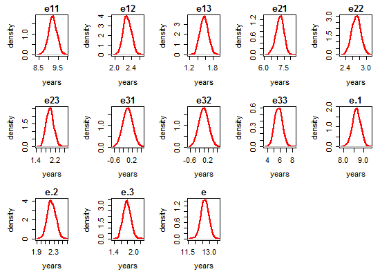
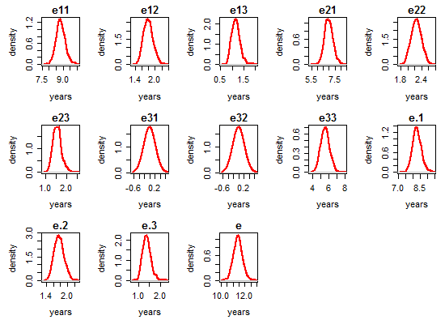
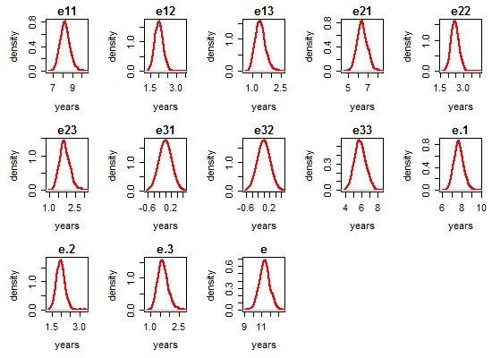

# Model A : Estimation Results

<!-- These two chunks should be added in the beginning of every .Rmd that you want to source an .R script -->
<!--  The 1st mandatory chunck  -->
<!--  Set the working directory to the repository's base directory -->


<!--  The 2nd mandatory chunck  -->
<!-- Set the report-wide options, and point to the external code file. -->


Estimation results of **Model A**, specified by the following input:

```r
q <- .01
# transition matrix
Q <- rbind( c(0, q, 0, q), 
            c(q, 0, q, q),
            c(0, q, 0, q), 
            c(0, 0, 0, 0)) 
# misclassification matrix
E <- rbind( c( 0,  0,  0, 0),  
            c( 0,  0,  0, 0), 
            c( 0,  0,  0, 0),
            c( 0,  0,  0, 0) )
# transition names
qnames = c(
  "Healthy - Mild",   # q12
  # "Healthy - Severe", # q13
  "Healthy - Dead",  # q14
  "Mild - Healthy",  # q21  
  "Mild - Severe",   # q23
  "Mild - Dead",     # q24
  # "Severe - Healthy",# q31
  "Severe - Mild",   # q32
  "Severe - Dead"    # q34
)
```


# Load environmet
<!-- Load the sources.  Suppress the output when loading sources. --> 

```r
base::source("http://www.ucl.ac.uk/~ucakadl/ELECT/ELECT.r") # load  ELECT functions
base::source("./scripts/ELECT-utility-functions.R") # ELECT utility functions
```

<!-- Load 'sourced' R files.  Suppress the output when loading packages. --> 

```r
library(magrittr) #Pipes
library(msm)
requireNamespace("ggplot2", quietly=TRUE)
requireNamespace("dplyr", quietly=TRUE) 
requireNamespace("testit", quietly=TRUE)
```

<!-- Load any Global functions and variables declared in the R file.  Suppress the output. --> 

```

 Save fitted models here : 
```

```
[1] "./data/shared/derived/models/model-a/"
```

# Load data
<!-- Load the datasets.   -->

```r
# first, the script `0-ellis-island.R` imports and cleans the raw data
# second, the script `1-encode-multistate.R` augments the data with multi-states
# load this data transfer object (dto)
dto <- readRDS("./data/unshared/derived/dto.rds")
```

<!-- Inspect the datasets.   -->

```r
names(dto)
names(dto[["unitData"]])       # 1st element - unit(person) level data
names(dto[["metaData"]])       # 2nd element - meta data, info about variables
names(dto[["ms_mmse"]])        # 3rd element - data for MMSE outcome
ds_miss <- dto$ms_mmse$missing # data after encoding missing states (-1, -2)
ds_ms <- dto$ms_mmse$multi     # data after encoding multistates (1,2,3,4)
```


```r
# compare before and after ms encoding
view_id <- function(ds1,ds2,id){
  cat("Before ms encoding:","\n")
  print(ds1[ds1$id==id,])
  cat("\nAfter ms encoding","\n")
  print(ds2[ds2$id==id,])
}
ids <- sample(unique(ds_miss$id),1) # view a random person for sporadic inspections
# 50402431 , 37125649, 50101073, 6804844, 83001827 , 56751351, 13485298, 56751351, 75507759)
ids <- c(50402431)
view_id(ds_miss, ds_ms, ids)
```

```
Before ms encoding: 
           id fu_year died   age_bl  male edu age_death age_at_visit mmse presumed_alive
5120 50402431       0    1 91.41136 FALSE  16  94.82272     91.41136   19          FALSE
5121 50402431       1    1 91.41136 FALSE  16  94.82272     92.33402   12          FALSE
5122 50402431       2    1 91.41136 FALSE  16  94.82272     93.34702    5          FALSE
5123 50402431       3    1 91.41136 FALSE  16  94.82272     94.34634    0          FALSE

After ms encoding 
            id fu_year died   age_bl  male edu      age state presumed_alive mmse firstobs
5120  50402431       0    1 91.41136 FALSE  16 91.41136     3          FALSE   19        1
5121  50402431       1    1 91.41136 FALSE  16 92.33402     3          FALSE   12        0
5122  50402431       2    1 91.41136 FALSE  16 93.34702     3          FALSE    5        0
5123  50402431       3    1 91.41136 FALSE  16 94.34634     3          FALSE    0        0
51201 50402431      NA    1 91.41136 FALSE  16 94.82272     4          FALSE   NA        0
```

# Remove cases

```r
#### 1) Remove observations with missing age
# Initial number of observations with missing age : 
sum(is.na(ds_ms$age))
```

```
[1] 1
```

```r
ds_clean <- ds_ms %>% 
  dplyr::filter(!is.na(age))
# Resultant number of observations with missing age
sum(is.na(ds_clean$age))
```

```
[1] 0
```

```r
#### 3) Remove subjects with only ONE observed data point
# Initial number of subjects who have *n* observed data points
ds_clean %>% 
  dplyr::group_by(id) %>% 
  dplyr::summarize(n_data_points = n()) %>% 
  dplyr::group_by(n_data_points) %>% 
  dplyr::summarize(n_people=n()) %>% 
  print()
```

```
# A tibble: 17 × 2
   n_data_points n_people
           <int>    <int>
1              1      119
2              2      205
3              3      184
4              4      180
5              5      190
6              6      104
7              7      108
8              8      113
9              9      127
10            10      116
11            11      110
12            12       71
13            13       21
14            14       14
15            15       13
16            16       17
17            17        3
```

```r
# Determine which ids have only a single observation
remove_ids <- ds_clean %>% 
  dplyr::group_by(id) %>% 
  dplyr::summarize(n_data_points = n()) %>% 
  dplyr::arrange(n_data_points) %>% 
  dplyr::filter(n_data_points==1) %>% 
  dplyr::select(id)
remove_ids <- remove_ids$id
# How many subjects to be removed from the data set: 
length(remove_ids)
```

```
[1] 119
```

```r
ds_clean <- ds_clean %>% 
  dplyr::filter(!(id %in% remove_ids))
# Resultant number of subjects who have *n* observed data points
ds_clean %>% 
  dplyr::group_by(id) %>% 
  dplyr::summarize(n_data_points = n()) %>% 
  dplyr::group_by(n_data_points) %>% 
  dplyr::summarize(n_people=n()) %>% 
  print()
```

```
# A tibble: 16 × 2
   n_data_points n_people
           <int>    <int>
1              2      205
2              3      184
3              4      180
4              5      190
5              6      104
6              7      108
7              8      113
8              9      127
9             10      116
10            11      110
11            12       71
12            13       21
13            14       14
14            15       13
15            16       17
16            17        3
```

```r
#### 3) Remove subjects with IMS at the first observation
# Initial view of subjects with intermediate missing state at first observation:
ids_firstobs_ims <- ds_clean %>% 
  dplyr::filter(firstobs == TRUE & state == -1) %>% 
  dplyr::select(id) %>% print()
```

```
        id
1 80333458
2 90214403
3 90447310
4 91804757
```

```r
ids_firstobs_ims <- ids_firstobs_ims[,"id"]
ds_clean <- ds_clean %>% 
  dplyr::filter(!id %in% ids_firstobs_ims)
# Resultant view of subjects with intermediate missing state at first observation:
ds_clean %>% 
  dplyr::filter(firstobs == TRUE & state == -1) %>% 
  dplyr::select(id) %>% print()
```

```
[1] id
<0 rows> (or 0-length row.names)
```

# Categorize covariates

```r
ds_clean$educat <- car::Recode(ds_clean$edu,
                               " 0:9   = '-1'; 
                               10:11 = '0';
                               12:30 = '1';
                               ")
ds_clean$educatF <- factor(
  ds_clean$educat, 
  levels = c(-1,             0,             1), 
  labels = c("0-9 years", "10-11 years", ">11 years"))
cat("\n How education was categorized: \n")
```

```

 How education was categorized: 
```

```r
ds_clean %>% 
  dplyr::group_by(educatF, edu) %>% 
  dplyr::summarize(n = n()) %>% 
  as.data.frame() %>% 
  print(nrow=100)
```

```
       educatF edu    n
1    0-9 years   0    4
2    0-9 years   2    6
3    0-9 years   3   10
4    0-9 years   4   17
5    0-9 years   5   20
6    0-9 years   6   48
7    0-9 years   7   27
8    0-9 years   8  178
9    0-9 years   9   76
10 10-11 years  10  167
11 10-11 years  11  225
12   >11 years  12 2400
13   >11 years  13  862
14   >11 years  14 1199
15   >11 years  15  554
16   >11 years  16 2132
17   >11 years  17  486
18   >11 years  18  942
19   >11 years  19  255
20   >11 years  20  286
21   >11 years  21  207
22   >11 years  22   61
23   >11 years  23   37
24   >11 years  24   26
25   >11 years  25   11
26   >11 years  28   21
```

```r
cat("\n Frequencies of categorized education :")
```

```

 Frequencies of categorized education :
```

```r
ds_clean %>% 
  dplyr::group_by(educatF) %>% 
  dplyr::summarize(n = n())
```

```
# A tibble: 3 × 2
      educatF     n
       <fctr> <int>
1   0-9 years   386
2 10-11 years   392
3   >11 years  9479
```

```r
# save clean data object for records and faster access
saveRDS(ds_clean, "./data/unshared/ds_clean.rds")
```

# Age diagnostic

```r
# Time intervals in data:
# the age difference between timepoint for each individual
intervals <- matrix(NA,nrow(ds_clean),2)
for(i in 2:nrow(ds_clean)){
  if(ds_clean$id[i]==ds_clean$id[i-1]){
    intervals[i,1] <- ds_clean$id[i]
    intervals[i,2] <- ds_clean$age[i]-ds_clean$age[i-1]
  }
  intervals <- as.data.frame(intervals)
  colnames(intervals) <- c("id", "interval")
}
cat("\n Minimum interval length : ",min(intervals[,2], na.rm=T)) 
```

```

 Minimum interval length :  0.00273785
```

```r
cat("\n Maximum interval length : ", max(intervals[,2], na.rm=T))
```

```

 Maximum interval length :  11.86858
```

```r
# the age difference between timepoint for each individual
intervals <- intervals[!is.na(intervals[,2]),] # Remove NAs:
cat("\nTime intervals between observations within individuals:\n")
```

```

Time intervals between observations within individuals:
```

```r
print(round(quantile(intervals[,2]),digits))
```

```
   0%   25%   50%   75%  100% 
 0.00  0.96  1.00  1.03 11.87 
```

```r
# Info on age and time between observations:
cat("\n Graphs of age distribution :\n")
```

```

 Graphs of age distribution :
```

```r
opar<-par(mfrow=c(1,3), mex=0.8,mar=c(5,5,3,1))
hist(ds_clean$age[ds_clean$firstobs==1],col="red",xlab="Age at baseline in years",main="")
hist(ds_clean$age,col="blue",xlab="Age in data in years",main="")
hist(intervals[,2],col="green",xlab="Time intervals in data in years",main="")
```


```r
opar<-par(mfrow=c(1,1), mex=0.8,mar=c(5,5,2,1))
```

# Estimation prep

```r
# list ids with intermidiate missing (im) or right censored (rc) states
ids_with_im    <- unique(ds_clean[ds_clean$state == -1, "id"]) 
cat("\n Number of subjects with intermediate missing state (-1) : ",length(ids_with_im) )
```

```

 Number of subjects with intermediate missing state (-1) :  104
```

```r
ids_with_rc     <- unique(ds_clean[ds_clean$state == -2, "id"])
cat("\n Number of subjects with right censored state (-2) : ",length(ids_with_rc) )
```

```

 Number of subjects with right censored state (-2) :  46
```

```r
ids_with_either <- unique(c(ids_with_im, ids_with_rc))
cat("\n Number of subjects with either IMS or RC state(s) : ",length(ids_with_either) )
```

```

 Number of subjects with either IMS or RC state(s) :  149
```

```r
ids_with_both   <- dplyr::intersect(ids_with_im, ids_with_rc)
cat("\n Number of subjects with both IMS and RC state(s) : ",length(ids_with_both) )
```

```

 Number of subjects with both IMS and RC state(s) :  1
```

```r
# subset a random sample of individuals if needed
set.seed(42)
ids <- sample(unique(ds_clean$id), 100)


# centering decisions
cat("\n Centering decisions :")
```

```

 Centering decisions :
```

```r
age_center = 75
age_bl_center = 75

cat("\n The variable `age` is centered at :", age_center)
```

```

 The variable `age` is centered at : 75
```

```r
cat("\n The variable `age_bl` is centered at :", age_bl_center)
```

```

 The variable `age_bl` is centered at : 75
```

```r
cat("\n\n The following dataset will be passed to msm call (view for one person): \n")
```

```


 The following dataset will be passed to msm call (view for one person): 
```

```r
# define the data object to be passed to the estimation call
ds <- ds_clean %>% 
  # dplyr::filter(id %in% ids) %>% # make sample smaller if needed 
  # exclude individuals with missing states
  # dplyr::filter(!id %in% ids_with_im) %>%
  # dplyr::filter(!id %in% ids_with_rc) %>%
  dplyr::mutate(
    male = as.numeric(male), 
    age    = (age - 75), # centering
    age_bl = (age_bl - 75) # centering
) %>% 
  dplyr::select(id, age_bl,male, edu, educat, educatF,firstobs, fu_year, age, state)
# view data object to be passed to the estimation call
set.seed(42)
ids <- sample(unique(ds$id), 1)
ds %>% dplyr::filter(id %in% ids)
```

```
         id   age_bl male edu educat   educatF firstobs fu_year       age state
1  90544686 7.696783    0  12      1 >11 years        1       0  7.696783     1
2  90544686 7.696783    0  12      1 >11 years        0       1  8.682409     1
3  90544686 7.696783    0  12      1 >11 years        0       2  9.731006     1
4  90544686 7.696783    0  12      1 >11 years        0       3 10.689254     1
5  90544686 7.696783    0  12      1 >11 years        0       4 11.691307     1
6  90544686 7.696783    0  12      1 >11 years        0       5 12.709788     1
7  90544686 7.696783    0  12      1 >11 years        0       6 13.665298     1
8  90544686 7.696783    0  12      1 >11 years        0       7 14.678303     2
9  90544686 7.696783    0  12      1 >11 years        0       8 15.680356     1
10 90544686 7.696783    0  12      1 >11 years        0       9 16.709788     1
```

```r
cat("\n Subject count : ",length(unique(ds$id)),"\n")
```

```

 Subject count :  1572 
```

```r
cat("\n Frequency of states at baseline\n")
```

```

 Frequency of states at baseline
```

```r
sf <- ds %>% 
  dplyr::filter(firstobs==TRUE) %>% 
  dplyr::group_by(state) %>% 
  dplyr::summarize(count = n()) %>%  # basic frequiencies
  dplyr::mutate(pct = round(count/sum(count),2)) %>%  # percentages, use for starter values
  print()
```

```
# A tibble: 3 × 3
  state count   pct
  <dbl> <int> <dbl>
1     1  1189  0.76
2     2   281  0.18
3     3   102  0.06
```

```r
cat("\n State table: \n") 
```

```

 State table: 
```

```r
print(msm::statetable.msm(state,id,data=ds)) # transition frequencies
```

```
    to
from   -2   -1    1    2    3    4
  -2   32    0    0    0    0    0
  -1    0   25   27   13   26   47
  1    32   59 4855  715  120  251
  2     8   20  534  478  256  146
  3     6   34   24   96  649  232
```

```r
# these will be passed as starting values
initial_probabilities <- as.numeric(as.data.frame(sf[!sf$state %in% c(-1,-2),"pct"])$pct) 
initial_probabilities <- c(initial_probabilities,0) # no death state at first observation
cat('\n The inital values for estimation : ', initial_probabilities)
```

```

 The inital values for estimation :  0.76 0.18 0.06 0
```

```r
# save the object to be used during estimation
saveRDS(ds, "./data/unshared/ds_estimation.rds")
```

# Specifications

## Fitting functions

```r
estimate_multistate <- function(
  model_name 
  ,ds                   # data object 
  ,Q                    # Q-matrix of transitions
  ,E                    # misspecification matrix
  ,qnames               # names of the rows in the Q matrix
  ,cov_names            # string with covariate names
){
  covariates_ <- as.formula(paste0("~",cov_names))
  model <- msm(
    formula       = state ~ age,
    subject       = id,
    data          = ds,
    center        = FALSE,
    qmatrix       = Q,
    ematrix       = E,
    death         = TRUE,
    covariates    = covariates_,
    censor        = c(-1,-2),
    censor.states = list(c(1,2,3), c(1,2,3)),
    method        = method_,
    constraint    = constraint_,
    fixedpars     = fixedpars_,
    initprobs     = initprobs_,
    est.initprobs = TRUE,
    control       = list(trace=0,REPORT=1,maxit=1000,fnscale=10000)
  )
  # model <- paste0("test", covariates_)
  saveRDS(model, paste0(pathSaveFolder,model_name,".rds"))
  return(model)
} 
```

## Support functions

```r
get_crude_Q <- function(ds, Q, cov_names){
  formula_ <- as.formula(paste0("state ~ ",cov_names))
  Q_crude <- crudeinits.msm(
    formula = formula_, 
    subject = id, 
    qmatrix = Q, 
    data = ds,     
    censor        = c(-1,-2),
    censor.states = list(c(1,2,3), c(1,2,3)) 
  )
  return(Q_crude)
}

msm_summary <- function(model){
cat("\n-2loglik =", model$minus2loglik,"\n")
cat("Convergence code =", model$opt$convergence,"\n")
p    <- model$opt$par
p.se <- sqrt(diag(solve(1/2*model$opt$hessian)))
print(cbind(p=round(p,digits),
            se=round(p.se,digits),"Wald ChiSq"=round((p/p.se)^2,digits),
            "Pr>ChiSq"=round(1-pchisq((p/p.se)^2,df=1),digits)),
      quote=FALSE)
}
```

## Model

```r
q <- .01
# transition matrix
Q <- rbind( c(0, q, 0, q), 
            c(q, 0, q, q),
            c(0, q, 0, q), 
            c(0, 0, 0, 0)) 
# misclassification matrix
E <- rbind( c( 0,  0,  0, 0),  
            c( 0,  0,  0, 0), 
            c( 0,  0,  0, 0),
            c( 0,  0,  0, 0) )
# transition names
qnames = c(
  "Healthy - Mild",   # q12
  # "Healthy - Severe", # q13
  "Healthy - Dead",  # q14
  "Mild - Healthy",  # q21  
  "Mild - Severe",   # q23
  "Mild - Dead",     # q24
  # "Severe - Healthy",# q31
  "Severe - Mild",   # q32
  "Severe - Dead"    # q34
)
```

## `msm` options

```r
digits = 2
method_  = "BFGS"     # alternatively, if does not converge "Nedler-Mead" 
constraint_ = NULL    # additional model constraints
fixedpars_ = NULL     # fixed parameters
initprobs_ = initial_probabilities 
```


```r
# turn this chunk OFF when printing the report
# compile model objects with msm() call
# each model will be saved in the specified folder, namely pathSaveFolder
(Q_crude <- get_crude_Q(ds, Q, "age"))
```

```
           [,1]        [,2]       [,3]       [,4]
[1,] -0.1569916  0.11414700  0.0000000 0.04284465
[2,]  0.3504402 -0.62126448  0.1696731 0.10115125
[3,]  0.0000000  0.09542096 -0.3388418 0.24342081
[4,]  0.0000000  0.00000000  0.0000000 0.00000000
```

```r
# estimate_multistate("mA1", ds, Q_crude, E, qnames,cov_names = "age")
# (Q_crude <- get_crude_Q(ds, Q, "age +  age_bl"))
# estimate_multistate("mA2", ds, Q_crude, E, qnames,cov_names = "age + age_bl")
# (Q_crude <- get_crude_Q(ds, Q, "age +  age_bl + male"))
# estimate_multistate("mA3", ds, Q_crude, E, qnames,cov_names = "age + age_bl + male")
# (Q_crude <- get_crude_Q(ds, Q, "age +  age_bl + male + educat"))
# estimate_multistate("mA4", ds, Q_crude, E, qnames,cov_names = "age + age_bl + male + educat")
```


```r
# assemble the list object with the results of msm estimation
models <- list()
models[["age"]][["msm"]]    <- readRDS(paste0(pathSaveFolder,'mA1.rds'))
models[["age_bl"]][["msm"]] <- readRDS(paste0(pathSaveFolder,'mA2.rds'))
models[["male"]][["msm"]]   <- readRDS(paste0(pathSaveFolder,'mA3.rds'))
models[["educat"]][["msm"]] <- readRDS(paste0(pathSaveFolder,'mA4.rds'))
```

## `elect` options

```r
alive_states <- c(1,2,3)
ds_alive <- ds[ds$state %in% alive_states,]
fixedpars <- fixedpars_
age_min <- 0
age_max <- 35
age_bl <- 0
male <- 0
educat <- 0


replication_n <- 1000
time_scale <- "years"
grid_par <- .5
```


```r
# turn this chunk OFF when printing the report
# for(model_ in names(models) ){
#   # determine covariate list
#   if(model_=="age"){covar_list    = list(age=age_min)}
#   if(model_=="age_bl"){covar_list = list(age=age_min, age_bl=age_bl)}
#   if(model_=="male"){covar_list   = list(age=age_min, age_bl=age_bl, male=male)}
#   if(model_=="educat"){covar_list = list(age=age_min, age_bl=age_bl, male=male, educat=educat)}
#   # compute LE
#   models[[model_]][["LE"]] <- elect(
#     model          = models[[model_]][["msm"]], # fitted msm model
#     b.covariates   = covar_list, # list with specified covarites values
#     statedistdata  = ds_alive, # data for distribution of living states
#     time.scale.msm = time_scale, # time scale in multi-state model ("years", ...)
#     h              = grid_par, # grid parameter for integration
#     age.max        = age_max, # assumed maximum age in years
#     S              = replication_n # number of simulation cycles
#   )
#   # models[[model_]][["LE"]] <- models[["msm"]][[model_]]
# }
# #save models estimated by elect() in a external object for faster access in the future
# saveRDS(models, paste0(pathSaveFolder,"models.rds"))

models <- readRDS(paste0(pathSaveFolder,"models.rds"))
# inspect created object
lapply(models, names)
```

```
$age
[1] "msm" "LE" 

$age_bl
[1] "msm" "LE" 

$male
[1] "msm" "LE" 

$educat
[1] "msm" "LE" 
```


# Model results

## age

### summary

```r
model <- models[["age"]]
msm_summary(model$msm)
```

```

-2loglik = 12957.91 
Convergence code = 0 
          p   se Wald ChiSq Pr>ChiSq
qbase -2.09 0.07     809.86     0.00
qbase -4.11 0.17     571.54     0.00
qbase -0.15 0.08       3.35     0.07
qbase -1.44 0.12     144.96     0.00
qbase -3.21 0.42      59.32     0.00
qbase -1.72 0.19      84.83     0.00
qbase -2.16 0.18     148.85     0.00
qcov   0.08 0.01     153.88     0.00
qcov   0.08 0.01      30.50     0.00
qcov  -0.02 0.01       5.85     0.02
qcov   0.04 0.01      20.34     0.00
qcov   0.07 0.03       5.76     0.02
qcov  -0.01 0.01       0.47     0.49
qcov   0.06 0.01      32.95     0.00
```

### solution

```r
print(model$msm, showEnv= F)
```

```

Call:
msm(formula = state ~ age, subject = id, data = ds, qmatrix = Q,     ematrix = E, covariates = covariates_, constraint = constraint_,     initprobs = initprobs_, est.initprobs = TRUE, death = TRUE,     censor = c(-1, -2), censor.states = list(c(1, 2, 3), c(1,         2, 3)), fixedpars = fixedpars_, center = FALSE, method = method_,     control = list(trace = 0, REPORT = 1, maxit = 1000, fnscale = 10000))

Maximum likelihood estimates
Baselines are with covariates set to 0

Transition intensities with hazard ratios for each covariate
                  Baseline                     age                   
State 1 - State 1 -0.13968 (-0.15896,-0.12274)                       
State 1 - State 2  0.12330 ( 0.10675, 0.14242) 1.0814 (1.0681,1.0949)
State 1 - State 4  0.01638 ( 0.01169, 0.02294) 1.0845 (1.0537,1.1161)
State 2 - State 1  0.85673 ( 0.72591, 1.01113) 0.9819 (0.9674,0.9965)
State 2 - State 2 -1.13455 (-1.29911,-0.99084)                       
State 2 - State 3  0.23763 ( 0.18806, 0.30026) 1.0419 (1.0235,1.0607)
State 2 - State 4  0.04019 ( 0.01774, 0.09105) 1.0695 (1.0124,1.1298)
State 3 - State 2  0.17967 ( 0.12469, 0.25889) 0.9903 (0.9629,1.0184)
State 3 - State 3 -0.29459 (-0.38071,-0.22795)                       
State 3 - State 4  0.11492 ( 0.08118, 0.16269) 1.0658 (1.0429,1.0893)

-2 * log-likelihood:  12957.91 
[Note, to obtain old print format, use "printold.msm"]
```

### ELECT summary 

```r
summary.elect(
  model$LE, # life expectancy estimated by elect()
  probs = c(.025, .5, .975), # numeric vector of probabilities for quantiles
  digits=2, # number of decimals places in output
  print = TRUE # print toggle
)
```

```

-----------------------------
ELECT summary
-----------------------------
Covariates values in the multi-state model:
age 
  0 
Covariates in the state-distribution model:
   age 

Life expectancies:Using simulation with  1000 replications

Point estimates, and mean, SEs, and quantiles from simulation:
      pnt    mn   se 0.025q  0.5q 0.975q
e11  9.27  9.24 0.21   8.83  9.23   9.65
e12  2.12  2.10 0.08   1.95  2.10   2.28
e13  1.81  1.80 0.10   1.61  1.80   2.01
e21  7.37  7.32 0.29   6.76  7.34   7.89
e22  2.50  2.49 0.11   2.28  2.48   2.71
e23  2.25  2.24 0.14   1.98  2.24   2.54
e31  3.30  3.30 0.39   2.62  3.28   4.09
e32  1.42  1.42 0.16   1.11  1.41   1.75
e33  4.14  4.14 0.32   3.51  4.14   4.79
e.1  8.83  8.80 0.21   8.40  8.79   9.21
e.2  2.13  2.11 0.08   1.95  2.11   2.29
e.3  1.95  1.94 0.11   1.74  1.94   2.16
e   12.91 12.85 0.27  12.31 12.85  13.38
-----------------------------
```

### plots

```r
plot.elect(
  model$LE, # life expectancy estimated by elect()
  kernel = "gaussian", #character string for smoothing kernal ("gaussian",...)
  col = "red", # color of the curve
  lwd = 2, # line width of the curve
  cex.lab = 1 # magnification to be used for axis-labels
)
```




## age at baseline

### summary

```r
model <- models[["age_bl"]]
msm_summary(model$msm)
```

```

-2loglik = 12897.55 
Convergence code = 0 
          p   se Wald ChiSq Pr>ChiSq
qbase -1.99 0.08     636.11     0.00
qbase -4.25 0.20     449.40     0.00
qbase -0.05 0.09       0.32     0.57
qbase -1.40 0.12     128.95     0.00
qbase -3.23 0.41      61.63     0.00
qbase -1.35 0.20      45.32     0.00
qbase -2.29 0.19     152.10     0.00
qcov   0.03 0.01       6.02     0.01
qcov   0.12 0.03      14.03     0.00
qcov  -0.07 0.02      18.23     0.00
qcov   0.03 0.02       2.20     0.14
qcov   0.11 0.05       4.65     0.03
qcov  -0.16 0.04      19.83     0.00
qcov   0.10 0.02      26.12     0.00
qcov   0.05 0.01      13.85     0.00
qcov  -0.04 0.03       1.72     0.19
qcov   0.07 0.02      12.95     0.00
qcov   0.02 0.02       0.64     0.43
qcov  -0.06 0.06       1.18     0.28
qcov   0.18 0.04      22.02     0.00
qcov  -0.05 0.02       5.20     0.02
```

### solution

```r
print(model$msm, showEnv= F)
```

```

Call:
msm(formula = state ~ age, subject = id, data = ds, qmatrix = Q,     ematrix = E, covariates = covariates_, constraint = constraint_,     initprobs = initprobs_, est.initprobs = TRUE, death = TRUE,     censor = c(-1, -2), censor.states = list(c(1, 2, 3), c(1,         2, 3)), fixedpars = fixedpars_, center = FALSE, method = method_,     control = list(trace = 0, REPORT = 1, maxit = 1000, fnscale = 10000))

Maximum likelihood estimates
Baselines are with covariates set to 0

Transition intensities with hazard ratios for each covariate
                  Baseline                      age                    age_bl                
State 1 - State 1 -0.15093 (-0.173499,-0.13130)                                              
State 1 - State 2  0.13664 ( 0.117059, 0.15950) 1.0341 (1.0068,1.0622) 1.0545 (1.0254,1.0843)
State 1 - State 4  0.01429 ( 0.009649, 0.02117) 1.1286 (1.0594,1.2024) 0.9570 (0.8961,1.0220)
State 2 - State 1  0.95105 ( 0.798785, 1.13233) 0.9280 (0.8967,0.9604) 1.0706 (1.0316,1.1112)
State 2 - State 2 -1.23614 (-1.427789,-1.07022)                                              
State 2 - State 3  0.24552 ( 0.192670, 0.31286) 1.0280 (0.9911,1.0663) 1.0158 (0.9774,1.0559)
State 2 - State 4  0.03958 ( 0.017674, 0.08864) 1.1182 (1.0102,1.2378) 0.9418 (0.8454,1.0492)
State 3 - State 2  0.25832 ( 0.174191, 0.38309) 0.8504 (0.7918,0.9133) 1.1954 (1.1095,1.2880)
State 3 - State 3 -0.35976 (-0.484268,-0.26727)                                              
State 3 - State 4  0.10144 ( 0.070513, 0.14593) 1.1084 (1.0655,1.1530) 0.9532 (0.9146,0.9933)

-2 * log-likelihood:  12897.55 
[Note, to obtain old print format, use "printold.msm"]
```

### ELECT summary 

```r
summary.elect(
  model$LE, # life expectancy estimated by elect()
  probs = c(.025, .5, .975), # numeric vector of probabilities for quantiles
  digits=2, # number of decimals places in output
  print = TRUE # print toggle
)
```

```

-----------------------------
ELECT summary
-----------------------------
Covariates values in the multi-state model:
   age age_bl 
     0      0 
Covariates in the state-distribution model:
   age 

Life expectancies:Using simulation with  1000 replications

Point estimates, and mean, SEs, and quantiles from simulation:
      pnt    mn   se 0.025q  0.5q 0.975q
e11  8.79  8.72 0.33   8.13  8.73   9.34
e12  1.67  1.64 0.14   1.40  1.64   1.93
e13  1.33  1.31 0.16   1.04  1.31   1.65
e21  7.00  6.93 0.36   6.24  6.93   7.64
e22  2.05  2.03 0.14   1.78  2.02   2.30
e23  1.81  1.79 0.18   1.49  1.78   2.18
e31  3.13  3.12 0.42   2.36  3.10   3.96
e32  1.18  1.17 0.15   0.89  1.16   1.51
e33  3.82  3.79 0.34   3.15  3.79   4.51
e.1  8.37  8.31 0.32   7.71  8.31   8.91
e.2  1.69  1.66 0.13   1.42  1.65   1.93
e.3  1.48  1.47 0.16   1.19  1.46   1.80
e   11.54 11.44 0.39  10.71 11.45  12.17
-----------------------------
```

### plots

```r
plot.elect(
  model$LE, # life expectancy estimated by elect()
  kernel = "gaussian", #character string for smoothing kernal ("gaussian",...)
  col = "red", # color of the curve
  lwd = 2, # line width of the curve
  cex.lab = 1 # magnification to be used for axis-labels
)
```




## male

### summary

```r
model <- models[["male"]]
msm_summary(model$msm)
```

```

-2loglik = 12831.67 
Convergence code = 0 
          p   se Wald ChiSq Pr>ChiSq
qbase -2.07 0.08     624.51     0.00
qbase -4.36 0.21     451.61     0.00
qbase -0.06 0.10       0.47     0.49
qbase -1.28 0.13      97.24     0.00
qbase -3.51 0.48      52.42     0.00
qbase -1.09 0.21      26.60     0.00
qbase -2.55 0.21     151.49     0.00
qcov   0.03 0.01       5.62     0.02
qcov   0.13 0.03      15.76     0.00
qcov  -0.07 0.02      18.00     0.00
qcov   0.03 0.02       2.52     0.11
qcov   0.09 0.06       2.58     0.11
qcov  -0.19 0.04      25.17     0.00
qcov   0.12 0.02      36.50     0.00
qcov   0.05 0.01      14.36     0.00
qcov  -0.05 0.03       2.47     0.12
qcov   0.07 0.02      12.64     0.00
qcov   0.01 0.02       0.33     0.56
qcov  -0.02 0.06       0.16     0.68
qcov   0.20 0.04      26.84     0.00
qcov  -0.07 0.02      10.29     0.00
qcov   0.33 0.09      12.58     0.00
qcov   0.47 0.23       4.29     0.04
qcov   0.08 0.11       0.54     0.46
qcov  -0.41 0.13      10.00     0.00
qcov   0.67 0.34       3.81     0.05
qcov  -0.67 0.23       8.38     0.00
qcov   0.48 0.14      12.34     0.00
```

### solution

```r
print(model$msm, showEnv= F)
```

```

Call:
msm(formula = state ~ age, subject = id, data = ds, qmatrix = Q,     ematrix = E, covariates = covariates_, constraint = constraint_,     initprobs = initprobs_, est.initprobs = TRUE, death = TRUE,     censor = c(-1, -2), censor.states = list(c(1, 2, 3), c(1,         2, 3)), fixedpars = fixedpars_, center = FALSE, method = method_,     control = list(trace = 0, REPORT = 1, maxit = 1000, fnscale = 10000))

Maximum likelihood estimates
Baselines are with covariates set to 0

Transition intensities with hazard ratios for each covariate
                  Baseline                      age                    age_bl                 male                  
State 1 - State 1 -0.13857 (-0.160549,-0.11960)                                                                     
State 1 - State 2  0.12579 ( 0.106913, 0.14800) 1.0331 (1.0057,1.0612) 1.0557 (1.0265,1.0857) 1.3911 (1.1592,1.6693)
State 1 - State 4  0.01278 ( 0.008548, 0.01911) 1.1337 (1.0656,1.2062) 0.9492 (0.8894,1.0130) 1.5952 (1.0256,2.4812)
State 2 - State 1  0.93719 ( 0.777969, 1.12900) 0.9280 (0.8966,0.9606) 1.0700 (1.0308,1.1107) 1.0832 (0.8757,1.3399)
State 2 - State 2 -1.24628 (-1.451895,-1.06978)                                                                     
State 2 - State 3  0.27923 ( 0.216696, 0.35982) 1.0305 (0.9930,1.0693) 1.0115 (0.9728,1.0518) 0.6647 (0.5161,0.8562)
State 2 - State 4  0.02986 ( 0.011540, 0.07724) 1.0936 (0.9806,1.2197) 0.9758 (0.8671,1.0982) 1.9515 (0.9975,3.8179)
State 3 - State 2  0.33722 ( 0.223111, 0.50970) 0.8288 (0.7702,0.8919) 1.2270 (1.1356,1.3257) 0.5098 (0.3231,0.8045)
State 3 - State 3 -0.41516 (-0.583920,-0.29517)                                                                     
State 3 - State 4  0.07794 ( 0.051911, 0.11701) 1.1313 (1.0869,1.1775) 0.9354 (0.8979,0.9743) 1.6221 (1.2384,2.1247)

-2 * log-likelihood:  12831.67 
[Note, to obtain old print format, use "printold.msm"]
```

### ELECT summary 

```r
summary.elect(
  model$LE, # life expectancy estimated by elect()
  probs = c(.025, .5, .975), # numeric vector of probabilities for quantiles
  digits=2, # number of decimals places in output
  print = TRUE # print toggle
)
```

```

-----------------------------
ELECT summary
-----------------------------
Covariates values in the multi-state model:
   age age_bl   male 
     0      0      0 
Covariates in the state-distribution model:
   age 

Life expectancies:Using simulation with  1000 replications

Point estimates, and mean, SEs, and quantiles from simulation:
      pnt    mn   se 0.025q  0.5q 0.975q
e11  9.24  9.19 0.39   8.49  9.17  10.03
e12  1.66  1.62 0.15   1.34  1.61   1.92
e13  1.51  1.49 0.18   1.16  1.48   1.88
e21  7.39  7.33 0.42   6.53  7.31   8.21
e22  2.08  2.04 0.15   1.75  2.03   2.35
e23  2.07  2.04 0.21   1.65  2.03   2.49
e31  3.93  3.89 0.51   2.94  3.88   4.89
e32  1.40  1.37 0.17   1.07  1.36   1.69
e33  3.98  3.94 0.39   3.26  3.92   4.78
e.1  8.83  8.78 0.38   8.10  8.76   9.59
e.2  1.69  1.65 0.14   1.38  1.64   1.95
e.3  1.67  1.65 0.19   1.31  1.64   2.03
e   12.19 12.08 0.46  11.16 12.06  13.00
-----------------------------
```

### plots

```r
plot.elect(
  model$LE, # life expectancy estimated by elect()
  kernel = "gaussian", #character string for smoothing kernal ("gaussian",...)
  col = "red", # color of the curve
  lwd = 2, # line width of the curve
  cex.lab = 1 # magnification to be used for axis-labels
)
```


## education

### summary

```r
model <- models[["educat"]]
msm_summary(model$msm)
```

```

-2loglik = 12820 
Convergence code = 0 
          p   se Wald ChiSq Pr>ChiSq
qbase -1.84 0.12     249.77     0.00
qbase -4.37 0.35     159.38     0.00
qbase -0.06 0.12       0.25     0.62
qbase -1.18 0.15      59.31     0.00
qbase -3.55 0.56      40.17     0.00
qbase -1.04 0.23      20.25     0.00
qbase -2.48 0.22     128.50     0.00
qcov   0.03 0.01       5.78     0.02
qcov   0.13 0.03      15.98     0.00
qcov  -0.07 0.02      17.51     0.00
qcov   0.03 0.02       2.70     0.10
qcov   0.09 0.06       2.59     0.11
qcov  -0.18 0.04      23.14     0.00
qcov   0.12 0.02      36.06     0.00
qcov   0.05 0.01      13.27     0.00
qcov  -0.05 0.03       2.45     0.12
qcov   0.07 0.02      12.08     0.00
qcov   0.01 0.02       0.35     0.56
qcov  -0.03 0.06       0.17     0.68
qcov   0.20 0.04      25.81     0.00
qcov  -0.07 0.02       9.98     0.00
qcov   0.33 0.09      12.53     0.00
qcov   0.47 0.23       4.05     0.04
qcov   0.07 0.11       0.44     0.51
qcov  -0.39 0.13       8.59     0.00
qcov   0.66 0.38       2.98     0.08
qcov  -0.65 0.23       7.79     0.01
qcov   0.48 0.14      11.91     0.00
qcov  -0.26 0.10       7.22     0.01
qcov   0.00 0.31       0.00     1.00
qcov   0.00 0.11       0.00     0.99
qcov  -0.14 0.12       1.45     0.23
qcov   0.04 0.47       0.01     0.94
qcov  -0.12 0.16       0.49     0.49
qcov  -0.09 0.13       0.48     0.49
```

### solution

```r
print(model$msm, showEnv= F)
```

```

Call:
msm(formula = state ~ age, subject = id, data = ds, qmatrix = Q,     ematrix = E, covariates = covariates_, constraint = constraint_,     initprobs = initprobs_, est.initprobs = TRUE, death = TRUE,     censor = c(-1, -2), censor.states = list(c(1, 2, 3), c(1,         2, 3)), fixedpars = fixedpars_, center = FALSE, method = method_,     control = list(trace = 0, REPORT = 1, maxit = 1000, fnscale = 10000))

Maximum likelihood estimates
Baselines are with covariates set to 0

Transition intensities with hazard ratios for each covariate
                  Baseline                      age                    age_bl                 male                  
State 1 - State 1 -0.17153 (-0.211198,-0.13931)                                                                     
State 1 - State 2  0.15887 ( 0.126458, 0.19958) 1.0338 (1.0062,1.0622) 1.0539 (1.0245,1.0841) 1.3922 (1.1591,1.6721)
State 1 - State 4  0.01266 ( 0.006426, 0.02495) 1.1353 (1.0668,1.2082) 0.9487 (0.8882,1.0133) 1.5924 (1.0120,2.5057)
State 2 - State 1  0.94394 ( 0.751364, 1.18588) 0.9284 (0.8967,0.9613) 1.0686 (1.0294,1.1094) 1.0752 (0.8677,1.3324)
State 2 - State 2 -1.27987 (-1.543360,-1.06137)                                                                     
State 2 - State 3  0.30709 ( 0.227398, 0.41472) 1.0316 (0.9940,1.0707) 1.0120 (0.9727,1.0529) 0.6804 (0.5260,0.8802)
State 2 - State 4  0.02884 ( 0.009633, 0.08633) 1.0953 (0.9803,1.2239) 0.9738 (0.8581,1.1050) 1.9254 (0.9152,4.0504)
State 3 - State 2  0.35289 ( 0.224187, 0.55548) 0.8336 (0.7741,0.8978) 1.2225 (1.1314,1.3211) 0.5231 (0.3319,0.8244)
State 3 - State 3 -0.43663 (-0.634371,-0.30053)                                                                     
State 3 - State 4  0.08374 ( 0.054539, 0.12857) 1.1314 (1.0867,1.1780) 0.9356 (0.8978,0.9751) 1.6177 (1.2310,2.1259)
                  educat                
State 1 - State 1                       
State 1 - State 2 0.7741 (0.6422,0.9331)
State 1 - State 4 1.0007 (0.5475,1.8290)
State 2 - State 1 1.0016 (0.8095,1.2394)
State 2 - State 2                       
State 2 - State 3 0.8686 (0.6907,1.0923)
State 2 - State 4 1.0380 (0.4100,2.6279)
State 3 - State 2 0.8913 (0.6453,1.2312)
State 3 - State 3                       
State 3 - State 4 0.9157 (0.7143,1.1738)

-2 * log-likelihood:  12820 
[Note, to obtain old print format, use "printold.msm"]
```

### ELECT summary 

```r
summary.elect(
  model$LE, # life expectancy estimated by elect()
  probs = c(.025, .5, .975), # numeric vector of probabilities for quantiles
  digits=2, # number of decimals places in output
  print = TRUE # print toggle
)
```

```

-----------------------------
ELECT summary
-----------------------------
Covariates values in the multi-state model:
   age age_bl   male educat 
     0      0      0      0 
Covariates in the state-distribution model:
   age 

Life expectancies:Using simulation with  1000 replications

Point estimates, and mean, SEs, and quantiles from simulation:
      pnt    mn   se 0.025q  0.5q 0.975q
e11  8.25  8.15 0.52   7.16  8.13   9.20
e12  1.77  1.72 0.20   1.36  1.71   2.14
e13  1.72  1.68 0.26   1.24  1.66   2.22
e21  6.55  6.44 0.51   5.50  6.39   7.51
e22  2.15  2.09 0.20   1.74  2.07   2.52
e23  2.24  2.21 0.29   1.68  2.18   2.83
e31  3.52  3.46 0.52   2.50  3.46   4.48
e32  1.44  1.41 0.21   1.05  1.39   1.85
e33  3.91  3.90 0.44   3.14  3.87   4.83
e.1  7.88  7.78 0.51   6.85  7.76   8.84
e.2  1.80  1.74 0.20   1.39  1.73   2.16
e.3  1.86  1.83 0.26   1.37  1.81   2.37
e   11.54 11.36 0.64  10.12 11.36  12.57
-----------------------------
```

### plots

```r
plot.elect(
  model$LE, # life expectancy estimated by elect()
  kernel = "gaussian", #character string for smoothing kernal ("gaussian",...)
  col = "red", # color of the curve
  lwd = 2, # line width of the curve
  cex.lab = 1 # magnification to be used for axis-labels
)
```




# Session Info

```r
sessionInfo()
```

```
R version 3.3.1 (2016-06-21)
Platform: x86_64-w64-mingw32/x64 (64-bit)
Running under: Windows 10 x64 (build 14393)

locale:
[1] LC_COLLATE=English_United States.1252  LC_CTYPE=English_United States.1252    LC_MONETARY=English_United States.1252
[4] LC_NUMERIC=C                           LC_TIME=English_United States.1252    

attached base packages:
[1] stats     graphics  grDevices utils     datasets  methods   base     

other attached packages:
[1] msm_1.6.1    magrittr_1.5 nnet_7.3-12  knitr_1.14  

loaded via a namespace (and not attached):
 [1] Rcpp_0.12.6        formatR_1.4        nloptr_1.0.4       plyr_1.8.4         tools_3.3.1        digest_0.6.10     
 [7] lme4_1.1-12        evaluate_0.9       tibble_1.2         gtable_0.2.0       nlme_3.1-128       lattice_0.20-33   
[13] mgcv_1.8-14        Matrix_1.2-7.1     DBI_0.5            yaml_2.1.13        parallel_3.3.1     SparseM_1.7       
[19] mvtnorm_1.0-5      expm_0.999-0       dplyr_0.5.0        stringr_1.1.0      MatrixModels_0.4-1 grid_3.3.1        
[25] R6_2.1.3           survival_2.39-5    rmarkdown_1.0      minqa_1.2.4        ggplot2_2.1.0      car_2.1-3         
[31] scales_0.4.0       htmltools_0.3.5    splines_3.3.1      MASS_7.3-45        assertthat_0.1     pbkrtest_0.4-6    
[37] testit_0.5         colorspace_1.2-6   quantreg_5.26      stringi_1.1.1      lazyeval_0.2.0     munsell_0.4.3     
```


