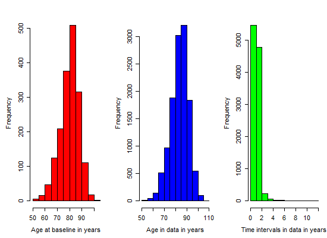

# Model B : Estimation Results

<!-- These two chunks should be added in the beginning of every .Rmd that you want to source an .R script -->
<!--  The 1st mandatory chunck  -->
<!--  Set the working directory to the repository's base directory -->


<!--  The 2nd mandatory chunck  -->
<!-- Set the report-wide options, and point to the external code file. -->


Estimation results of **Model B**, specified by the following input:

```r
q <- .01
# transition matrix
Q <- rbind( c(0, q, 0, q), 
            c(q, 0, q, q),
            c(0, 0, 0, q), 
            c(0, 0, 0, 0)) 
# misclassification matrix
E <- rbind( c( 0,  0,  0, 0),  
            c( 0,  0, .1, 0), 
            c( 0,  0,  0, 0),
            c( 0,  0,  0, 0) )
# transition names
qnames = c(
  "Healthy - Mild",   # q12
  # "Healthy - Severe", # q13
  "Healthy - Dead",  # q14
  "Mild - Healthy",  # q21  
  "Mild - Severe",   # q23
  "Mild - Dead",     # q24
  # "Severe - Healthy",# q31
  # "Severe - Mild",   # q32
  "Severe - Dead"    # q34
)
```


# Load environmet
<!-- Load the sources.  Suppress the output when loading sources. --> 

```r
base::source("http://www.ucl.ac.uk/~ucakadl/ELECT/ELECT.r") # load  ELECT functions
base::source("./scripts/ELECT-utility-functions.R") # ELECT utility functions
```

<!-- Load 'sourced' R files.  Suppress the output when loading packages. --> 

```r
library(magrittr) #Pipes
library(msm)
requireNamespace("ggplot2", quietly=TRUE)
requireNamespace("dplyr", quietly=TRUE) 
requireNamespace("testit", quietly=TRUE)
```

<!-- Load any Global functions and variables declared in the R file.  Suppress the output. --> 

```

 Save fitted models here : 
```

```
[1] "./data/shared/derived/models/model-b-mod-2/"
```

# Load data
<!-- Load the datasets.   -->

```r
# first, the script `0-ellis-island.R` imports and cleans the raw data
# second, the script `1-encode-multistate.R` augments the data with multi-states
# load this data transfer object (dto)
dto <- readRDS("./data/unshared/derived/dto.rds")
```

<!-- Inspect the datasets.   -->

```r
names(dto)
names(dto[["unitData"]])       # 1st element - unit(person) level data
names(dto[["metaData"]])       # 2nd element - meta data, info about variables
names(dto[["ms_mmse"]])        # 3rd element - data for MMSE outcome
ds_miss <- dto$ms_mmse$missing # data after encoding missing states (-1, -2)
ds_ms <- dto$ms_mmse$multi     # data after encoding multistates (1,2,3,4)
```


```r
# compare before and after ms encoding
view_id <- function(ds1,ds2,id){
  cat("Before ms encoding:","\n")
  print(ds1[ds1$id==id,])
  cat("\nAfter ms encoding","\n")
  print(ds2[ds2$id==id,])
}
ids <- sample(unique(ds_miss$id),1) # view a random person for sporadic inspections
# 50402431 , 37125649, 50101073, 6804844, 83001827 , 56751351, 13485298, 56751351, 75507759)
ids <- c(50402431)
view_id(ds_miss, ds_ms, ids)
```

```
Before ms encoding: 
           id fu_year died   age_bl  male edu age_death age_at_visit mmse presumed_alive
5120 50402431       0    1 91.41136 FALSE  16  94.82272     91.41136   19          FALSE
5121 50402431       1    1 91.41136 FALSE  16  94.82272     92.33402   12          FALSE
5122 50402431       2    1 91.41136 FALSE  16  94.82272     93.34702    5          FALSE
5123 50402431       3    1 91.41136 FALSE  16  94.82272     94.34634    0          FALSE

After ms encoding 
            id fu_year died   age_bl  male edu      age state presumed_alive mmse firstobs
5120  50402431       0    1 91.41136 FALSE  16 91.41136     3          FALSE   19        1
5121  50402431       1    1 91.41136 FALSE  16 92.33402     3          FALSE   12        0
5122  50402431       2    1 91.41136 FALSE  16 93.34702     3          FALSE    5        0
5123  50402431       3    1 91.41136 FALSE  16 94.34634     3          FALSE    0        0
51201 50402431      NA    1 91.41136 FALSE  16 94.82272     4          FALSE   NA        0
```

# Remove cases

```r
#### 1) Remove observations with missing age
# Initial number of observations with missing age : 
sum(is.na(ds_ms$age))
```

```
[1] 1
```

```r
ds_clean <- ds_ms %>% 
  dplyr::filter(!is.na(age))
# Resultant number of observations with missing age
sum(is.na(ds_clean$age))
```

```
[1] 0
```

```r
#### 3) Remove subjects with only ONE observed data point
# Initial number of subjects who have *n* observed data points
ds_clean %>% 
  dplyr::group_by(id) %>% 
  dplyr::summarize(n_data_points = n()) %>% 
  dplyr::group_by(n_data_points) %>% 
  dplyr::summarize(n_people=n()) %>% 
  print()
```

```
# A tibble: 17 × 2
   n_data_points n_people
           <int>    <int>
1              1      119
2              2      205
3              3      184
4              4      180
5              5      190
6              6      104
7              7      108
8              8      113
9              9      127
10            10      116
11            11      110
12            12       71
13            13       21
14            14       14
15            15       13
16            16       17
17            17        3
```

```r
# Determine which ids have only a single observation
remove_ids <- ds_clean %>% 
  dplyr::group_by(id) %>% 
  dplyr::summarize(n_data_points = n()) %>% 
  dplyr::arrange(n_data_points) %>% 
  dplyr::filter(n_data_points==1) %>% 
  dplyr::select(id)
remove_ids <- remove_ids$id
# How many subjects to be removed from the data set: 
length(remove_ids)
```

```
[1] 119
```

```r
ds_clean <- ds_clean %>% 
  dplyr::filter(!(id %in% remove_ids))
# Resultant number of subjects who have *n* observed data points
ds_clean %>% 
  dplyr::group_by(id) %>% 
  dplyr::summarize(n_data_points = n()) %>% 
  dplyr::group_by(n_data_points) %>% 
  dplyr::summarize(n_people=n()) %>% 
  print()
```

```
# A tibble: 16 × 2
   n_data_points n_people
           <int>    <int>
1              2      205
2              3      184
3              4      180
4              5      190
5              6      104
6              7      108
7              8      113
8              9      127
9             10      116
10            11      110
11            12       71
12            13       21
13            14       14
14            15       13
15            16       17
16            17        3
```

```r
#### 3) Remove subjects with IMS at the first observation
# Initial view of subjects with intermediate missing state at first observation:
ids_firstobs_ims <- ds_clean %>% 
  dplyr::filter(firstobs == TRUE & state == -1) %>% 
  dplyr::select(id) %>% print()
```

```
        id
1 80333458
2 90214403
3 90447310
4 91804757
```

```r
ids_firstobs_ims <- ids_firstobs_ims[,"id"]
ds_clean <- ds_clean %>% 
  dplyr::filter(!id %in% ids_firstobs_ims)
# Resultant view of subjects with intermediate missing state at first observation:
ds_clean %>% 
  dplyr::filter(firstobs == TRUE & state == -1) %>% 
  dplyr::select(id) %>% print()
```

```
[1] id
<0 rows> (or 0-length row.names)
```

# Categorize covariates

```r
ds_clean$educat <- car::Recode(ds_clean$edu,
                               " 0:9   = '-1'; 
                               10:11 = '0';
                               12:30 = '1';
                               ")
ds_clean$educatF <- factor(
  ds_clean$educat, 
  levels = c(-1,             0,             1), 
  labels = c("0-9 years", "10-11 years", ">11 years"))
cat("\n How education was categorized: \n")
```

```

 How education was categorized: 
```

```r
ds_clean %>% 
  dplyr::group_by(educatF, edu) %>% 
  dplyr::summarize(n = n()) %>% 
  as.data.frame() %>% 
  print(nrow=100)
```

```
       educatF edu    n
1    0-9 years   0    4
2    0-9 years   2    6
3    0-9 years   3   10
4    0-9 years   4   17
5    0-9 years   5   20
6    0-9 years   6   48
7    0-9 years   7   27
8    0-9 years   8  178
9    0-9 years   9   76
10 10-11 years  10  167
11 10-11 years  11  225
12   >11 years  12 2400
13   >11 years  13  862
14   >11 years  14 1199
15   >11 years  15  554
16   >11 years  16 2132
17   >11 years  17  486
18   >11 years  18  942
19   >11 years  19  255
20   >11 years  20  286
21   >11 years  21  207
22   >11 years  22   61
23   >11 years  23   37
24   >11 years  24   26
25   >11 years  25   11
26   >11 years  28   21
```

```r
cat("\n Frequencies of categorized education :")
```

```

 Frequencies of categorized education :
```

```r
ds_clean %>% 
  dplyr::group_by(educatF) %>% 
  dplyr::summarize(n = n())
```

```
# A tibble: 3 × 2
      educatF     n
       <fctr> <int>
1   0-9 years   386
2 10-11 years   392
3   >11 years  9479
```

```r
cat("\n Create dummy variables for testing effects of education: \n")
```

```

 Create dummy variables for testing effects of education: 
```

```r
table(ds_clean$educat, useNA = "always")
```

```

  -1    0    1 <NA> 
 386  392 9479    0 
```

```r
# ref  D1  D2
#  -1  0   0
#  0   1   0
#  1   0   1
ds_clean <- ds_clean %>% 
  dplyr::mutate(
    edu_low_med  = ifelse(educat == 0, 1, 0 ), 
    edu_low_high = ifelse(educat == 1, 1, 0 ) 
  )
table(ds_clean$educat, ds_clean$edu_low_med)
```

```
    
        0    1
  -1  386    0
  0     0  392
  1  9479    0
```

```r
table(ds_clean$educat, ds_clean$edu_low_high)
```

```
    
        0    1
  -1  386    0
  0   392    0
  1     0 9479
```

```r
# save clean data object for records and faster access
saveRDS(ds_clean, "./data/unshared/ds_clean.rds")
```

# Age diagnostic

```r
# Time intervals in data:
# the age difference between timepoint for each individual
intervals <- matrix(NA,nrow(ds_clean),2)
for(i in 2:nrow(ds_clean)){
  if(ds_clean$id[i]==ds_clean$id[i-1]){
    intervals[i,1] <- ds_clean$id[i]
    intervals[i,2] <- ds_clean$age[i]-ds_clean$age[i-1]
  }
  intervals <- as.data.frame(intervals)
  colnames(intervals) <- c("id", "interval")
}
cat("\n Minimum interval length : ",min(intervals[,2], na.rm=T)) 
```

```

 Minimum interval length :  0.00273785
```

```r
cat("\n Maximum interval length : ", max(intervals[,2], na.rm=T))
```

```

 Maximum interval length :  11.86858
```

```r
# the age difference between timepoint for each individual
intervals <- intervals[!is.na(intervals[,2]),] # Remove NAs:
cat("\nTime intervals between observations within individuals:\n")
```

```

Time intervals between observations within individuals:
```

```r
print(round(quantile(intervals[,2]),digits))
```

```
   0%   25%   50%   75%  100% 
 0.00  0.96  1.00  1.03 11.87 
```

```r
# Info on age and time between observations:
cat("\n Graphs of age distribution :\n")
```

```

 Graphs of age distribution :
```

```r
opar<-par(mfrow=c(1,3), mex=0.8,mar=c(5,5,3,1))
hist(ds_clean$age[ds_clean$firstobs==1],col="red",xlab="Age at baseline in years",main="")
hist(ds_clean$age,col="blue",xlab="Age in data in years",main="")
hist(intervals[,2],col="green",xlab="Time intervals in data in years",main="")
```



```r
opar<-par(mfrow=c(1,1), mex=0.8,mar=c(5,5,2,1))
```

# Estimation prep

```r
# list ids with intermidiate missing (im) or right censored (rc) states
ids_with_im    <- unique(ds_clean[ds_clean$state == -1, "id"]) 
cat("\n Number of subjects with intermediate missing state (-1) : ",length(ids_with_im) )
```

```

 Number of subjects with intermediate missing state (-1) :  104
```

```r
ids_with_rc     <- unique(ds_clean[ds_clean$state == -2, "id"])
cat("\n Number of subjects with right censored state (-2) : ",length(ids_with_rc) )
```

```

 Number of subjects with right censored state (-2) :  46
```

```r
ids_with_either <- unique(c(ids_with_im, ids_with_rc))
cat("\n Number of subjects with either IMS or RC state(s) : ",length(ids_with_either) )
```

```

 Number of subjects with either IMS or RC state(s) :  149
```

```r
ids_with_both   <- dplyr::intersect(ids_with_im, ids_with_rc)
cat("\n Number of subjects with both IMS and RC state(s) : ",length(ids_with_both) )
```

```

 Number of subjects with both IMS and RC state(s) :  1
```

```r
# subset a random sample of individuals if needed
set.seed(42)
ids <- sample(unique(ds_clean$id), 100)


# centering decisions
cat("\n Centering decisions :")
```

```

 Centering decisions :
```

```r
age_center = 75
age_bl_center = 75

cat("\n The variable `age` is centered at :", age_center)
```

```

 The variable `age` is centered at : 75
```

```r
cat("\n The variable `age_bl` is centered at :", age_bl_center)
```

```

 The variable `age_bl` is centered at : 75
```

```r
cat("\n\n The following dataset will be passed to msm call (view for one person): \n")
```

```


 The following dataset will be passed to msm call (view for one person): 
```

```r
# define the data object to be passed to the estimation call
ds <- ds_clean %>% 
  # dplyr::filter(id %in% ids) %>% # make sample smaller if needed 
  # exclude individuals with missing states
  # dplyr::filter(!id %in% ids_with_im) %>%
  # dplyr::filter(!id %in% ids_with_rc) %>%
  dplyr::mutate(
    male = as.numeric(male), 
    age    = (age - 75), # centering
    age_bl = (age_bl - 75) # centering
) %>% 
  dplyr::select(id, age_bl,male, edu, educat, educatF, edu_low_med, edu_low_high, firstobs, fu_year, age, state)
# view data object to be passed to the estimation call
set.seed(42)
ids <- sample(unique(ds$id), 1)
ds %>% dplyr::filter(id %in% ids)
```

```
         id   age_bl male edu educat   educatF edu_low_med edu_low_high firstobs fu_year       age state
1  90544686 7.696783    0  12      1 >11 years           0            1        1       0  7.696783     1
2  90544686 7.696783    0  12      1 >11 years           0            1        0       1  8.682409     1
3  90544686 7.696783    0  12      1 >11 years           0            1        0       2  9.731006     1
4  90544686 7.696783    0  12      1 >11 years           0            1        0       3 10.689254     1
5  90544686 7.696783    0  12      1 >11 years           0            1        0       4 11.691307     1
6  90544686 7.696783    0  12      1 >11 years           0            1        0       5 12.709788     1
7  90544686 7.696783    0  12      1 >11 years           0            1        0       6 13.665298     1
8  90544686 7.696783    0  12      1 >11 years           0            1        0       7 14.678303     2
9  90544686 7.696783    0  12      1 >11 years           0            1        0       8 15.680356     1
10 90544686 7.696783    0  12      1 >11 years           0            1        0       9 16.709788     1
```

```r
cat("\n Subject count : ",length(unique(ds$id)),"\n")
```

```

 Subject count :  1572 
```

```r
cat("\n Frequency of states at baseline\n")
```

```

 Frequency of states at baseline
```

```r
sf <- ds %>% 
  dplyr::filter(firstobs==TRUE) %>% 
  dplyr::group_by(state) %>% 
  dplyr::summarize(count = n()) %>%  # basic frequiencies
  dplyr::mutate(pct = round(count/sum(count),2)) %>%  # percentages, use for starter values
  print()
```

```
# A tibble: 3 × 3
  state count   pct
  <dbl> <int> <dbl>
1     1  1189  0.76
2     2   281  0.18
3     3   102  0.06
```

```r
cat("\n State table: \n") 
```

```

 State table: 
```

```r
print(msm::statetable.msm(state,id,data=ds)) # transition frequencies
```

```
    to
from   -2   -1    1    2    3    4
  -2   32    0    0    0    0    0
  -1    0   25   27   13   26   47
  1    32   59 4855  715  120  251
  2     8   20  534  478  256  146
  3     6   34   24   96  649  232
```

```r
# these will be passed as starting values
initial_probabilities <- as.numeric(as.data.frame(sf[!sf$state %in% c(-1,-2),"pct"])$pct) 
initial_probabilities <- c(initial_probabilities,0) # no death state at first observation
cat('\n The inital values for estimation : ', initial_probabilities)
```

```

 The inital values for estimation :  0.76 0.18 0.06 0
```

```r
# save the object to be used during estimation
saveRDS(ds, "./data/unshared/ds_estimation.rds")
```

# Specifications

## Fitting functions

```r
estimate_multistate <- function(
  model_name 
  ,ds                   # data object 
  ,Q                    # Q-matrix of transitions
  ,E                    # misspecification matrix
  ,qnames               # names of the rows in the Q matrix
  ,cf                   # string with covariate names for forward transitions
  ,cb                   # string with covariate names for backward transitions
  ,cd                   # string with covariate names for death transitions
){
  cov_forward  <- as.formula(paste0("~",cf))
  cov_backward <- as.formula(paste0("~",cb))
  cov_death    <- as.formula(paste0("~",cd))
  # covariates_ <- as.formula(paste0("~",cov_names))
  covariates_    = list(
    "1-2"       = cov_forward,
    "2-3"       = cov_forward,
    "2-1"       = cov_backward,
    "1-4"       = cov_death,
    "2-4"       = cov_death,
    "3-4"       = cov_death
  )  
  model <- msm(
    formula       = state ~ age,
    subject       = id,
    data          = ds,
    center        = FALSE,
    qmatrix       = Q,
    ematrix       = E,
    death         = TRUE,
    covariates    = covariates_,
    censor        = c(-1,-2),
    censor.states = list(c(1,2,3), c(1,2,3)),
    method        = method_,
    constraint    = constraint_,
    fixedpars     = fixedpars_,
    initprobs     = initprobs_,
    est.initprobs = TRUE,
    control       = list(trace=0,REPORT=1,maxit=1000,fnscale=10000)
  )
  # model <- paste0("test", covariates_)
  saveRDS(model, paste0(pathSaveFolder,model_name,".rds"))
  return(model)
} 
```

## Support functions

```r
get_crude_Q <- function(ds, Q, cov_names){
  formula_ <- as.formula(paste0("state ~ ",cov_names))
  Q_crude <- crudeinits.msm(
    formula = formula_, 
    subject = id, 
    qmatrix = Q, 
    data = ds,     
    censor        = c(-1,-2),
    censor.states = list(c(1,2,3), c(1,2,3)) 
  )
  return(Q_crude)
}

msm_summary <- function(model){
cat("\n-2loglik =", model$minus2loglik,"\n")
cat("Convergence code =", model$opt$convergence,"\n")
p    <- model$opt$par
p.se <- sqrt(diag(solve(1/2*model$opt$hessian)))
print(cbind(p=round(p,digits),
            se=round(p.se,digits),"Wald ChiSq"=round((p/p.se)^2,digits),
            "Pr>ChiSq"=round(1-pchisq((p/p.se)^2,df=1),digits)),
      quote=FALSE)
}

msm_details <- function(model){ 
  # intensity matrix
  cat("\n Intensity matrix : \n")
  print(qmatrix.msm(model)) 
  # qmatrix.msm(model, covariates = list(male = 0))
  # transition probability matrix
  t_ <- 2
  cat("\n Transition probability matrix for t = ", t_," : \n")
  print(pmatrix.msm(model, t = t_)) # t = time, in original metric
  # misclassification matrix
  cat("\n Misclassification matrix : \n")
  suppressWarnings(print(ematrix.msm(model), warnings=F))
  # hazard ratios
  cat("\n Hazard ratios : \n")
  print(hazard.msm(model))
  # mean sojourn times
  cat("\n Mean sojourn times : \n")
  print(sojourn.msm(model))
  # probability that each state is next
  cat("\n Probability that each state is next : \n")
  suppressWarnings(print(pnext.msm(model)))
  # total length of stay
  cat("\n  Total length of stay : \n")
  print(totlos.msm(model))
  # expected number of visits to the state
  cat("\n Expected number of visits to the state : \n")
  suppressWarnings(print(envisits.msm(model)))
  # ratio of transition intensities
  # qratio.msm(model,ind1 = c(2,1), ind2 = c(1,2))
}
```

## Model

```r
q <- .01
# transition matrix
Q <- rbind( c(0, q, 0, q), 
            c(q, 0, q, q),
            c(0, 0, 0, q), 
            c(0, 0, 0, 0)) 
# misclassification matrix
E <- rbind( c( 0,  0,  0, 0),  
            c( 0,  0, .1, 0), 
            c( 0,  0,  0, 0),
            c( 0,  0,  0, 0) )
# transition names
qnames = c(
  "Healthy - Mild",   # q12
  # "Healthy - Severe", # q13
  "Healthy - Dead",  # q14
  "Mild - Healthy",  # q21  
  "Mild - Severe",   # q23
  "Mild - Dead",     # q24
  # "Severe - Healthy",# q31
  # "Severe - Mild",   # q32
  "Severe - Dead"    # q34
)
```

## `msm` options

```r
digits = 2
method_  = "BFGS"     # alternatively, if does not converge "Nedler-Mead" 
constraint_ = NULL    # additional model constraints
fixedpars_ = NULL     # fixed parameters
initprobs_ = initial_probabilities 
```


```r
# turn this chunk OFF when printing the report
# compile model objects with msm() call
# each model will be saved in the specified folder, namely pathSaveFolder
(Q_crude <- get_crude_Q(ds, Q, "age"))
```

```
           [,1]       [,2]       [,3]       [,4]
[1,] -0.1569916  0.1141470  0.0000000 0.04284465
[2,]  0.3504402 -0.6212645  0.1696731 0.10115125
[3,]  0.0000000  0.0000000 -0.2434208 0.24342081
[4,]  0.0000000  0.0000000  0.0000000 0.00000000
```

```r
# estimate_multistate("mB_mod2_1", ds, Q_crude, E, qnames,
#                     cf = "age + male + edu_low_med + edu_low_high",
#                     cb = "age",
#                     cd = "age + male")
#                     
# (Q_crude <- get_crude_Q(ds, Q, "age"))
# m2 <- estimate_multistate("mB_mod2_2", ds, Q_crude, E, qnames,
#                     cf = "age + male + edu_low_med + edu_low_high",
#                     cb = "age",
#                     cd = "age + male + edu_low_med + edu_low_high")
#  
```


<!-- ## `elect` options -->


# Model results

## model 1

The model was fitted using the following specification of covariates:
```
# Forward transitions:
  "1-2"       = "age + male + edu_low_med + edu_low_high"
  "2-3"       = "age + male + edu_low_med + edu_low_high"
# Backward transitions:
  "2-1"       = "age"
# Death transitions: 
  "1-4"       = "age + male"
  "2-4"       = "age + male"
  "3-4"       = "age + male"
```

### summary

```r
model <- readRDS(paste0(pathSaveFolder,'mB_mod2_1.rds'))
msm_summary(model)
```

```

-2loglik = 15002.66 
Convergence code = 0 
          p   se Wald ChiSq Pr>ChiSq
qbase -1.66 0.19      77.54     0.00
qbase -4.21 0.18     525.29     0.00
qbase -0.27 0.08      10.87     0.00
qbase -1.98 0.30      42.46     0.00
qbase -3.40 0.42      67.10     0.00
qbase -2.28 0.20     132.11     0.00
qcov   0.08 0.01     157.07     0.00
qcov   0.08 0.01      31.02     0.00
qcov  -0.02 0.01       7.70     0.01
qcov   0.05 0.01      23.00     0.00
qcov   0.06 0.03       6.42     0.01
qcov   0.07 0.01      35.21     0.00
qcov   0.29 0.08      13.10     0.00
qcov   0.42 0.22       3.67     0.06
qcov  -0.18 0.16       1.38     0.24
qcov   0.72 0.28       6.50     0.01
qcov   0.36 0.14       6.65     0.01
qcov  -0.27 0.24       1.32     0.25
qcov  -0.12 0.40       0.10     0.75
qcov  -0.56 0.18       9.90     0.00
qcov  -0.17 0.29       0.33     0.56
p     -2.15 0.09     590.61     0.00
initp -1.33 0.06     432.47     0.00
initp -2.84 0.13     481.41     0.00
```

### details

```r
msm_details(model)
```

```

 Intensity matrix : 
        State 1                      State 2                      State 3                     
State 1 -0.25700 (-0.27608,-0.23925)  0.22532 ( 0.20772, 0.24440) 0                           
State 2  0.64404 ( 0.58426, 0.70994) -0.88548 (-0.95896,-0.81763)  0.17435 ( 0.14811, 0.20524)
State 3 0                            0                            -0.19402 (-0.23913,-0.15743)
State 4 0                            0                            0                           
        State 4                     
State 1  0.03169 ( 0.02583, 0.03888)
State 2  0.06708 ( 0.04373, 0.10290)
State 3  0.19402 ( 0.15743, 0.23913)
State 4 0                           

 Transition probability matrix for t =  2  : 
          State 1   State 2    State 3   State 4
State 1 0.7224079 0.1683030 0.03522663 0.0740625
State 2 0.4810716 0.2529645 0.14008255 0.1258814
State 3 0.0000000 0.0000000 0.67838075 0.3216193
State 4 0.0000000 0.0000000 0.00000000 1.0000000

 Misclassification matrix : 
        State 1 State 2 State 3                 State 4
State 1 1.0000  0       0                       0      
State 2 0       0       0.1039 (0.08881,0.1212) 0      
State 3 0       0       1.0000                  0      
State 4 0       0       0                       1.0000 

 Hazard ratios : 
$age
                        HR         L         U
State 1 - State 2 1.080777 1.0677267 1.0939862
State 1 - State 4 1.085146 1.0543871 1.1168023
State 2 - State 1 0.979584 0.9654133 0.9939627
State 2 - State 3 1.055787 1.0326212 1.0794722
State 2 - State 4 1.066975 1.0148080 1.1218231
State 3 - State 4 1.071141 1.0470990 1.0957349

$male
                         HR         L        U
State 1 - State 2 1.3383578 1.1429501 1.567174
State 1 - State 4 1.5254411 0.9901823 2.350043
State 2 - State 1 1.0000000 1.0000000 1.000000
State 2 - State 3 0.8325447 0.6129781 1.130759
State 2 - State 4 2.0610765 1.1822137 3.593290
State 3 - State 4 1.4287728 1.0892843 1.874067

$edu_low_med
                         HR         L        U
State 1 - State 2 0.7596424 0.4753863 1.213869
State 1 - State 4 1.0000000 1.0000000 1.000000
State 2 - State 1 1.0000000 1.0000000 1.000000
State 2 - State 3 0.8827809 0.4036470 1.930653
State 2 - State 4 1.0000000 1.0000000 1.000000
State 3 - State 4 1.0000000 1.0000000 1.000000

$edu_low_high
                         HR         L         U
State 1 - State 2 0.5719336 0.4038369 0.8100003
State 1 - State 4 1.0000000 1.0000000 1.0000000
State 2 - State 1 1.0000000 1.0000000 1.0000000
State 2 - State 3 0.8474639 0.4823419 1.4889749
State 2 - State 4 1.0000000 1.0000000 1.0000000
State 3 - State 4 1.0000000 1.0000000 1.0000000


 Mean sojourn times : 
        estimates         SE        L        U
State 1  3.890975 0.14215479 3.622098 4.179811
State 2  1.129335 0.04593426 1.042800 1.223050
State 3  5.154020 0.54965949 4.181848 6.352198

 Probability that each state is next : 
        State 1                  State 2                  State 3                  State 4                 
State 1 0                        0.87670 (0.84783,0.8990) 0                        0.12330 (0.10104,0.1522)
State 2 0.72734 (0.68784,0.7600) 0                        0.19690 (0.16834,0.2264) 0.07576 (0.04796,0.1177)
State 3 0                        0                        0                        1.00000 (1.00000,1.0000)
State 4 0                        0                        0                        0                       

  Total length of stay : 
  State 1   State 2   State 3   State 4 
10.738426  2.732486  2.455486       Inf 

 Expected number of visits to the state : 
  State 1   State 2   State 3   State 4 
1.7598289 2.4195539 0.4764214 1.0000000 
```


## model 2

The model was fitted using the following specification of covariates:
```
# Forward transitions:
  "1-2"       = "age + age_bl + male + edu_low_med + edu_low_high"
  "2-3"       = "age + age_bl + male + edu_low_med + edu_low_high"
# Backward transitions:
  "2-1"       = "age + age_bl"
# Death transitions: 
  "1-4"       = "age + age_bl + male + edu_low_med + edu_low_high"
  "2-4"       = "age + age_bl + male + edu_low_med + edu_low_high"
  "3-4"       = "age + age_bl + male + edu_low_med + edu_low_high"
```

### summary

```r
model <- readRDS(paste0(pathSaveFolder,'mB_mod2_2.rds'))
msm_summary(model)
```

```

-2loglik = 15001.18 
Convergence code = 0 
          p   se Wald ChiSq Pr>ChiSq
qbase -1.69 0.19      75.02     0.00
qbase -4.26 0.68      39.60     0.00
qbase -0.28 0.08      11.11     0.00
qbase -1.96 0.31      40.42     0.00
qbase -3.71 0.87      18.20     0.00
qbase -2.18 0.30      52.27     0.00
qcov   0.08 0.01     157.60     0.00
qcov   0.08 0.01      30.52     0.00
qcov  -0.02 0.01       7.49     0.01
qcov   0.05 0.01      22.97     0.00
qcov   0.06 0.03       5.71     0.02
qcov   0.07 0.01      36.01     0.00
qcov   0.29 0.08      12.83     0.00
qcov   0.44 0.22       3.92     0.05
qcov  -0.16 0.16       1.00     0.32
qcov   0.69 0.29       5.49     0.02
qcov   0.38 0.14       7.23     0.01
qcov  -0.26 0.25       1.07     0.30
qcov   0.31 0.79       0.16     0.69
qcov  -0.12 0.42       0.09     0.77
qcov   0.06 1.18       0.00     0.96
qcov   0.12 0.41       0.08     0.78
qcov  -0.53 0.18       8.20     0.00
qcov   0.03 0.67       0.00     0.97
qcov  -0.20 0.30       0.43     0.51
qcov   0.34 0.88       0.15     0.70
qcov  -0.15 0.27       0.32     0.57
p     -2.16 0.09     590.25     0.00
initp -1.33 0.06     433.05     0.00
initp -2.85 0.13     481.80     0.00
```

### details

```r
msm_details(model)
```

```

 Intensity matrix : 
        State 1                      State 2                      State 3                     
State 1 -0.25675 (-0.27582,-0.23900)  0.22523 ( 0.20762, 0.24433) 0                           
State 2  0.64325 ( 0.58349, 0.70914) -0.88436 (-0.95786,-0.81650)  0.17361 ( 0.14726, 0.20467)
State 3 0                            0                            -0.19007 (-0.23563,-0.15332)
State 4 0                            0                            0                           
        State 4                     
State 1  0.03152 ( 0.02557, 0.03886)
State 2  0.06750 ( 0.04310, 0.10571)
State 3  0.19007 ( 0.15332, 0.23563)
State 4 0                           

 Transition probability matrix for t =  2  : 
          State 1   State 2    State 3    State 4
State 1 0.7226273 0.1684136 0.03518858 0.07377055
State 2 0.4809945 0.2533314 0.14023226 0.12544192
State 3 0.0000000 0.0000000 0.68376659 0.31623341
State 4 0.0000000 0.0000000 0.00000000 1.00000000

 Misclassification matrix : 
        State 1 State 2 State 3                 State 4
State 1 1.0000  0       0                       0      
State 2 0       0       0.1038 (0.08874,0.1212) 0      
State 3 0       0       1.0000                  0      
State 4 0       0       0                       1.0000 

 Hazard ratios : 
$age
                         HR         L         U
State 1 - State 2 1.0810352 1.0679642 1.0942662
State 1 - State 4 1.0851747 1.0541584 1.1171036
State 2 - State 1 0.9798409 0.9656587 0.9942314
State 2 - State 3 1.0562092 1.0328517 1.0800948
State 2 - State 4 1.0669022 1.0117297 1.1250835
State 3 - State 4 1.0732165 1.0487328 1.0982718

$male
                         HR        L        U
State 1 - State 2 1.3352491 1.139855 1.564137
State 1 - State 4 1.5558672 1.004304 2.410349
State 2 - State 1 1.0000000 1.000000 1.000000
State 2 - State 3 0.8549199 0.628904 1.162162
State 2 - State 4 1.9935253 1.119284 3.550613
State 3 - State 4 1.4556315 1.107118 1.913855

$edu_low_med
                         HR         L         U
State 1 - State 2 0.7746750 0.4779028  1.255739
State 1 - State 4 1.3660242 0.2927307  6.374536
State 2 - State 1 1.0000000 1.0000000  1.000000
State 2 - State 3 0.8851032 0.3914057  2.001524
State 2 - State 4 1.0667119 0.1059017 10.744627
State 3 - State 4 1.1239639 0.5033243  2.509902

$edu_low_high
                         HR         L         U
State 1 - State 2 0.5892899 0.4103330 0.8462946
State 1 - State 4 1.0275460 0.2767308 3.8154442
State 2 - State 1 1.0000000 1.0000000 1.0000000
State 2 - State 3 0.8221826 0.4573361 1.4780909
State 2 - State 4 1.4076005 0.2532502 7.8236442
State 3 - State 4 0.8566714 0.5022316 1.4612500


 Mean sojourn times : 
        estimates        SE        L        U
State 1  3.894867 0.1423680 3.625592 4.184142
State 2  1.130764 0.0460590 1.043999 1.224739
State 3  5.261238 0.5767942 4.243947 6.522377

 Probability that each state is next : 
        State 1                  State 2                  State 3                  State 4                 
State 1 0                        0.87723 (0.84986,0.9016) 0                        0.12277 (0.09840,0.1501)
State 2 0.72737 (0.68919,0.7613) 0                        0.19631 (0.16746,0.2289) 0.07632 (0.04951,0.1193)
State 3 0                        0                        0                        1.00000 (1.00000,1.0000)
State 4 0                        0                        0                        0                       

  Total length of stay : 
  State 1   State 2   State 3   State 4 
10.761354  2.740683  2.503303       Inf 

 Expected number of visits to the state : 
  State 1   State 2   State 3   State 4 
1.7629577 2.4237453 0.4758011 1.0000000 
```


# Session Info

```r
sessionInfo()
```

```
R version 3.3.1 (2016-06-21)
Platform: x86_64-w64-mingw32/x64 (64-bit)
Running under: Windows 10 x64 (build 14393)

locale:
[1] LC_COLLATE=English_United States.1252  LC_CTYPE=English_United States.1252    LC_MONETARY=English_United States.1252
[4] LC_NUMERIC=C                           LC_TIME=English_United States.1252    

attached base packages:
[1] stats     graphics  grDevices utils     datasets  methods   base     

other attached packages:
[1] msm_1.6.1    magrittr_1.5 nnet_7.3-12  knitr_1.14  

loaded via a namespace (and not attached):
 [1] Rcpp_0.12.6        formatR_1.4        nloptr_1.0.4       plyr_1.8.4         tools_3.3.1        digest_0.6.10     
 [7] lme4_1.1-12        evaluate_0.9       tibble_1.2         gtable_0.2.0       nlme_3.1-128       lattice_0.20-33   
[13] mgcv_1.8-14        Matrix_1.2-7.1     DBI_0.5            yaml_2.1.13        parallel_3.3.1     SparseM_1.7       
[19] mvtnorm_1.0-5      expm_0.999-0       dplyr_0.5.0        stringr_1.1.0      MatrixModels_0.4-1 grid_3.3.1        
[25] R6_2.1.3           survival_2.39-5    rmarkdown_1.0      minqa_1.2.4        ggplot2_2.1.0      car_2.1-3         
[31] scales_0.4.0       htmltools_0.3.5    splines_3.3.1      MASS_7.3-45        assertthat_0.1     pbkrtest_0.4-6    
[37] testit_0.5         colorspace_1.2-6   quantreg_5.26      stringi_1.1.1      lazyeval_0.2.0     munsell_0.4.3     
```


