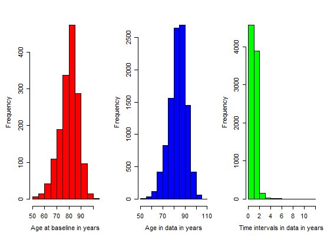
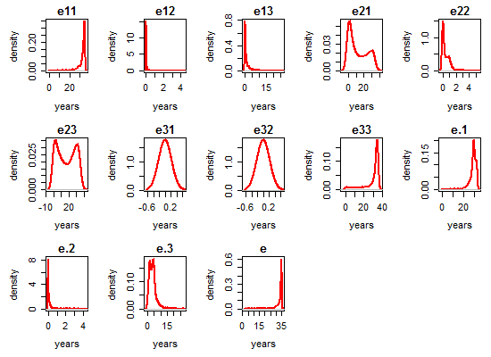

# Model B : Estimation Results

<!-- These two chunks should be added in the beginning of every .Rmd that you want to source an .R script -->
<!--  The 1st mandatory chunck  -->
<!--  Set the working directory to the repository's base directory -->


<!--  The 2nd mandatory chunck  -->
<!-- Set the report-wide options, and point to the external code file. -->


Estimation results of **Model B**, specified by the following input:

```r
q <- .01
# transition matrix
Q <- rbind( c(0, q, 0, q), 
            c(q, 0, q, q),
            c(0, 0, 0, q), 
            c(0, 0, 0, 0)) 
# misclassification matrix
E <- rbind( c( 0,  0,  0, 0),  
            c( 0,  0, .1, 0), 
            c( 0,  0,  0, 0),
            c( 0,  0,  0, 0) )
# transition names
qnames = c(
  "Healthy - Mild",   # q12
  # "Healthy - Severe", # q13
  "Healthy - Dead",  # q14
  "Mild - Healthy",  # q21  
  "Mild - Severe",   # q23
  "Mild - Dead",     # q24
  # "Severe - Healthy",# q31
  # "Severe - Mild",   # q32
  "Severe - Dead"    # q34
)
```


# Load environmet
<!-- Load 'sourced' R files.  Suppress the output when loading packages. --> 


<!-- Load the sources.  Suppress the output when loading sources. --> 


<!-- Load any Global functions and variables declared in the R file.  Suppress the output. --> 

```

 Save fitted models here : 
```

```
[1] "./data/shared/derived/models/model-b-mod-2/"
```

# Load data
<!-- Load the datasets.   -->


<!-- Inspect the datasets.   -->


```
Before ms encoding: 
           id fu_year died   age_bl  male edu age_death age_at_visit birth_year date_at_visit mmse dementia income_40
7755 62578487       0    0 97.51951 FALSE  16        NA     97.51951         NA          <NA>   17        1         9
7756 62578487       1    0 97.51951 FALSE  16        NA     98.33539         NA          <NA>   16       NA         9
     cogact_old socact_old soc_net social_isolation presumed_alive
7755   1.714286   2.833333       2              2.4           TRUE
7756   1.714286   2.500000      NA               NA           TRUE

After ms encoding 
           id fu_year died   age_bl  male edu      age birth_year date_at_visit state dementia income_40 cogact_old
7755 62578487       0    0 97.51951 FALSE  16 97.51951         NA          <NA>     3        1         9   1.714286
7756 62578487       1    0 97.51951 FALSE  16 98.33539         NA          <NA>     3       NA         9   1.714286
     socact_old soc_net social_isolation presumed_alive mmse firstobs
7755   2.833333       2              2.4           TRUE   17        1
7756   2.500000      NA               NA           TRUE   16        0
```

```
# A tibble: 1 × 2
  presumed_alive     n
           <lgl> <int>
1          FALSE  5166
```

```
# A tibble: 1 × 2
   died     n
  <dbl> <int>
1     1  5166
```

# Remove cases

```r
#### 1) Remove observations with missing age
# Initial number of observations with missing age : 
sum(is.na(ds_ms$age))
```

```
[1] 109
```

```r
ds_clean <- ds_ms %>% 
  dplyr::filter(!is.na(age))
# Resultant number of observations with missing age
sum(is.na(ds_clean$age))
```

```
[1] 0
```

```r
#### 3) Remove subjects with only ONE observed data point
# Initial number of subjects who have *n* observed data points
ds_clean %>% 
  dplyr::group_by(id) %>% 
  dplyr::summarize(n_data_points = n()) %>% 
  dplyr::group_by(n_data_points) %>% 
  dplyr::summarize(n_people=n()) %>% 
  print()
```

```
# A tibble: 19 × 2
   n_data_points n_people
           <int>    <int>
1              1      119
2              2      173
3              3      171
4              4      198
5              5      195
6              6      165
7              7      147
8              8      121
9              9       92
10            10       90
11            11       84
12            12      103
13            13       62
14            14       70
15            15       33
16            16        3
17            17       12
18            18        8
19            19        6
```

```r
# Determine which ids have only a single observation
remove_ids <- ds_clean %>% 
  dplyr::group_by(id) %>% 
  dplyr::summarize(n_data_points = n()) %>% 
  dplyr::arrange(n_data_points) %>% 
  dplyr::filter(n_data_points==1) %>% 
  dplyr::select(id)
remove_ids <- remove_ids$id
# How many subjects to be removed from the data set: 
length(remove_ids)
```

```
[1] 119
```

```r
ds_clean <- ds_clean %>% 
  dplyr::filter(!(id %in% remove_ids))
# Resultant number of subjects who have *n* observed data points
ds_clean %>% 
  dplyr::group_by(id) %>% 
  dplyr::summarize(n_data_points = n()) %>% 
  dplyr::group_by(n_data_points) %>% 
  dplyr::summarize(n_people=n()) %>% 
  print()
```

```
# A tibble: 18 × 2
   n_data_points n_people
           <int>    <int>
1              2      173
2              3      171
3              4      198
4              5      195
5              6      165
6              7      147
7              8      121
8              9       92
9             10       90
10            11       84
11            12      103
12            13       62
13            14       70
14            15       33
15            16        3
16            17       12
17            18        8
18            19        6
```

```r
#### 3) Remove subjects with IMS at the first observation
# Initial view of subjects with intermediate missing state at first observation:
ids_firstobs_ims <- ds_clean %>% 
  dplyr::filter(firstobs == TRUE & state == -1) %>% 
  dplyr::select(id) %>% print()
```

```
        id
1 33416479
2 80333458
3 90214403
4 90447310
5 91804757
```

```r
ids_firstobs_ims <- ids_firstobs_ims[,"id"]
ds_clean <- ds_clean %>% 
  dplyr::filter(!id %in% ids_firstobs_ims)
# Resultant view of subjects with intermediate missing state at first observation:
ds_clean %>% 
  dplyr::filter(firstobs == TRUE & state == -1) %>% 
  dplyr::select(id) %>% print()
```

```
[1] id
<0 rows> (or 0-length row.names)
```

# Categorize covariates

```
# A tibble: 26 × 2
     edu     n
   <dbl> <int>
1      0     4
2      2     7
3      3    11
4      4    26
5      5    25
6      6    58
7      7    31
8      8   202
9      9    88
10    10   199
11    11   246
12    12  2759
13    13  1021
14    14  1436
15    15   632
16    16  2601
17    17   583
18    18  1193
19    19   341
20    20   366
21    21   250
22    22    78
23    23    42
24    24    33
25    25    22
26    28    25
```

```

 How education was categorized: 
```

```
       educatF edu    n
1    0-9 years   0    4
2    0-9 years   2    7
3    0-9 years   3   11
4    0-9 years   4   26
5    0-9 years   5   25
6    0-9 years   6   58
7    0-9 years   7   31
8    0-9 years   8  202
9    0-9 years   9   88
10 10-11 years  10  199
11 10-11 years  11  246
12   >11 years  12 2759
13   >11 years  13 1021
14   >11 years  14 1436
15   >11 years  15  632
16   >11 years  16 2601
17   >11 years  17  583
18   >11 years  18 1193
19   >11 years  19  341
20   >11 years  20  366
21   >11 years  21  250
22   >11 years  22   78
23   >11 years  23   42
24   >11 years  24   33
25   >11 years  25   22
26   >11 years  28   25
```

```

 Frequencies of categorized education :
```

```
# A tibble: 3 × 2
      educatF     n
       <fctr> <int>
1   0-9 years   452
2 10-11 years   445
3   >11 years 11382
```

```

 Create dummy variables for testing effects of education: 
```

```

   -1     0     1  <NA> 
  452   445 11382     0 
```

```
    
         0     1
  -1   452     0
  0      0   445
  1  11382     0
```

```
    
         0     1
  -1   452     0
  0    445     0
  1      0 11382
```


```
# A tibble: 11 × 2
   income_40     n
       <dbl> <int>
1          1   483
2          2   786
3          3  1076
4          4  1048
5          5  1317
6          6  1160
7          7  1085
8          8  1480
9          9   909
10        10   408
11        NA  2527
```

```

 How income at age 40 was categorized: 
```

```
  sescatF sescat n_data_points
1     Low     -1          2345
2  Medium      0          4610
3    High      1          2797
4    <NA>     NA          2527
```

```

 Create dummy variables for testing effects of income: 
```

```
    
        0    1
  -1 2345    0
  0     0 4610
  1  2797    0
```

```
    
        0    1
  -1 2345    0
  0  4610    0
  1     0 2797
```


# Age diagnostic

```

 Minimum interval length :  0.00273785
```

```

 Maximum interval length :  11.86858
```

```

Time intervals between observations within individuals:
```

```
   0%   25%   50%   75%  100% 
 0.00  0.97  1.00  1.03 11.87 
```

```

 Graphs of age distribution :
```



# Estimation prep

```

 Number of subjects with intermediate missing state (-1) :  123
```

```

 Number of subjects with right censored state (-2) :  31
```

```

 Number of subjects with either IMS or RC state(s) :  151
```

```

 Number of subjects with both IMS and RC state(s) :  3
```

```

 Centering decisions :
```

```

 The variable `age` is centered at : 75
```

```

 The variable `age_bl` is centered at : 75
```

```


 The following dataset will be passed to msm call (view for one person): 
```

```
        id   age_bl male sescat edu educat   educatF edu_low_med edu_low_high firstobs fu_year       age state
1 90661046 7.401095    0     NA  16      1 >11 years           0            1        1       0  7.401095     2
2 90661046 7.401095    0     NA  16      1 >11 years           0            1        0       1  8.540041     2
3 90661046 7.401095    0     NA  16      1 >11 years           0            1        0       2  9.553046     3
4 90661046 7.401095    0     NA  16      1 >11 years           0            1        0       3 10.546886     3
5 90661046 7.401095    0     NA  16      1 >11 years           0            1        0       4 11.543463     3
6 90661046 7.401095    0     NA  16      1 >11 years           0            1        0       5 12.537303     3
7 90661046 7.401095    0     NA  16      1 >11 years           0            1        0      NA 12.876797     4
```

```

 Subject count :  1728 
```

```

 Frequency of states at baseline
```

```
# A tibble: 3 × 3
  state count   pct
  <dbl> <int> <dbl>
1     1  1321  0.76
2     2   299  0.17
3     3   108  0.06
```

```

 State table: 
```

```
    to
from   -2   -1    1    2    3    4
  -2   29    0    0    0    0    0
  -1    0   43   32   16   28   56
  1    23   70 5921  889  132  307
  2     4   25  636  564  317  178
  3     4   37   26  108  805  301
```

```

 The inital values for estimation :  0.76 0.17 0.06 0
```

# Specifications

## Fitting functions

```r
estimate_multistate <- function(
  model_name 
  ,ds                   # data object 
  ,Q                    # Q-matrix of transitions
  ,E                    # misspecification matrix
  ,qnames               # names of the rows in the Q matrix
  ,cf                   # string with covariate names for forward transitions
  ,cb                   # string with covariate names for backward transitions
  ,cd                   # string with covariate names for death transitions
){
  cov_forward  <- as.formula(paste0("~",cf))
  cov_backward <- as.formula(paste0("~",cb))
  cov_death    <- as.formula(paste0("~",cd))
  # covariates_ <- as.formula(paste0("~",cov_names))
  covariates_    = list(
    "1-2"       = cov_forward,
    "2-3"       = cov_forward,
    "2-1"       = cov_backward,
    "1-4"       = cov_death,
    "2-4"       = cov_death,
    "3-4"       = cov_death
  )  
  model <- msm(
    formula       = state ~ age,
    subject       = id,
    data          = ds,
    center        = FALSE,
    qmatrix       = Q,
    ematrix       = E,
    death         = TRUE,
    covariates    = covariates_,
    censor        = c(-1,-2),
    censor.states = list(c(1,2,3), c(1,2,3)),
    method        = method_,
    constraint    = constraint_,
    fixedpars     = fixedpars_,
    initprobs     = initprobs_,
    est.initprobs = TRUE,
    control       = list(trace=0,REPORT=1,maxit=1000,fnscale=10000)
  )
  # model <- paste0("test", covariates_)
  saveRDS(model, paste0(pathSaveFolder,model_name,".rds"))
  return(model)
} 
```

## Support functions

```r
get_crude_Q <- function(ds, Q, cov_names){
  formula_ <- as.formula(paste0("state ~ ",cov_names))
  Q_crude <- crudeinits.msm(
    formula = formula_, 
    subject = id, 
    qmatrix = Q, 
    data = ds,     
    censor        = c(-1,-2),
    censor.states = list(c(1,2,3), c(1,2,3)) 
  )
  return(Q_crude)
}

msm_summary <- function(model){
cat("\n-2loglik =", model$minus2loglik,"\n")
cat("Convergence code =", model$opt$convergence,"\n")
p    <- model$opt$par
p.se <- sqrt(diag(solve(1/2*model$opt$hessian)))
print(cbind(p=round(p,digits),
            se=round(p.se,digits),"Wald ChiSq"=round((p/p.se)^2,digits),
            "Pr>ChiSq"=round(1-pchisq((p/p.se)^2,df=1),digits)),
      quote=FALSE)
}

msm_details <- function(model){ 
  # intensity matrix
  cat("\n Intensity matrix : \n")
  print(qmatrix.msm(model)) 
  # qmatrix.msm(model, covariates = list(male = 0))
  # transition probability matrix
  t_ <- 2
  cat("\n Transition probability matrix for t = ", t_," : \n")
  print(pmatrix.msm(model, t = t_)) # t = time, in original metric
  # misclassification matrix
  cat("\n Misclassification matrix : \n")
  suppressWarnings(print(ematrix.msm(model), warnings=F))
  # hazard ratios
  cat("\n Hazard ratios : \n")
  print(hazard.msm(model))
  # mean sojourn times
  cat("\n Mean sojourn times : \n")
  print(sojourn.msm(model))
  # probability that each state is next
  cat("\n Probability that each state is next : \n")
  suppressWarnings(print(pnext.msm(model)))
  # total length of stay
  cat("\n  Total length of stay : \n")
  print(totlos.msm(model))
  # expected number of visits to the state
  cat("\n Expected number of visits to the state : \n")
  suppressWarnings(print(envisits.msm(model)))
  # ratio of transition intensities
  # qratio.msm(model,ind1 = c(2,1), ind2 = c(1,2))
}
```

## Model

```r
q <- .01
# transition matrix
Q <- rbind( c(0, q, 0, q), 
            c(q, 0, q, q),
            c(0, 0, 0, q), 
            c(0, 0, 0, 0)) 
# misclassification matrix
E <- rbind( c( 0,  0,  0, 0),  
            c( 0,  0, .1, 0), 
            c( 0,  0,  0, 0),
            c( 0,  0,  0, 0) )
# transition names
qnames = c(
  "Healthy - Mild",   # q12
  # "Healthy - Severe", # q13
  "Healthy - Dead",  # q14
  "Mild - Healthy",  # q21  
  "Mild - Severe",   # q23
  "Mild - Dead",     # q24
  # "Severe - Healthy",# q31
  # "Severe - Mild",   # q32
  "Severe - Dead"    # q34
)
```

## `msm` options

```r
digits = 2
method_  = "BFGS"     # alternatively, if does not converge "Nedler-Mead" 
constraint_ = NULL    # additional model constraints
fixedpars_ = NULL     # fixed parameters
initprobs_ = initial_probabilities 
```


```r
# turn this chunk OFF when printing the report
# compile model objects with msm() call
# each model will be saved in the specified folder, namely pathSaveFolder
(Q_crude <- get_crude_Q(ds, Q, "age"))
```

```
           [,1]       [,2]       [,3]       [,4]
[1,] -0.1571631  0.1147418  0.0000000 0.04242125
[2,]  0.3384696 -0.6087165  0.1702925 0.09995432
[3,]  0.0000000  0.0000000 -0.2491844 0.24918441
[4,]  0.0000000  0.0000000  0.0000000 0.00000000
```

```r
# estimate_multistate("mB_mod2_1", ds, Q_crude, E, qnames,
#                     cf = "age + male + edu_low_med + edu_low_high",
#                     cb = "age",
#                     cd = "age + male")
                     

# m2 <- estimate_multistate("mB_mod2_2", ds, Q_crude, E, qnames,
#                     cf = "age + male + edu_low_med + edu_low_high",
#                     cb = "age",
#                     cd = "age + male + edu_low_med + edu_low_high")
#   
# 
# m3 <- estimate_multistate("mB_mod2_3", ds, Q_crude, E, qnames,
#                     cf = "age + male  + edu_low_med + edu_low_high + sescat",
#                     cb = "age",
#                     cd = "age + male  + edu_low_med + edu_low_high + sescat")
# 
# 
# m4 <- estimate_multistate("mB_mod2_4", ds, Q_crude, E, qnames,
#                           cf = "age + male  + edu_low_med + edu_low_high + sescat",
#                           cb = "age",
#                           cd = "age + male  + edu_low_med + edu_low_high")
```


<!-- ## `elect` options -->


# Model results

The model was fitted using the following specification of covariates:
```
# Forward transitions:
  "1-2"       = "age + age_bl + male + edu_low_med + edu_low_high + sescat"
  "2-3"       = "age + age_bl + male + edu_low_med + edu_low_high + sescat"
# Backward transitions:
  "2-1"       = "age + age_bl"
# Death transitions: 
  "1-4"       = "age + age_bl + male + edu_low_med + edu_low_high + sescat"
  "2-4"       = "age + age_bl + male + edu_low_med + edu_low_high + sescat"
  "3-4"       = "age + age_bl + male + edu_low_med + edu_low_high + sescat"
```

## summary


## details

```

 Intensity matrix : 
        State 1                      State 2                      State 3                     
State 1 -0.24109 (-0.25944,-0.22405)  0.21354 ( 0.19673, 0.23179) 0                           
State 2  0.68134 ( 0.61735, 0.75196) -0.88906 (-0.96556,-0.81862)  0.16640 ( 0.13990, 0.19793)
State 3 0                            0                            -0.21963 (-0.27494,-0.17545)
State 4 0                            0                            0                           
        State 4                     
State 1  0.02755 ( 0.02231, 0.03403)
State 2  0.04132 ( 0.02125, 0.08033)
State 3  0.21963 ( 0.17545, 0.27494)
State 4 0                           

 Transition probability matrix for t =  2  : 
          State 1  State 2    State 3    State 4
State 1 0.7447567 0.162155 0.03158233 0.06150593
State 2 0.5173798 0.252719 0.12953383 0.10036740
State 3 0.0000000 0.000000 0.64450925 0.35549075
State 4 0.0000000 0.000000 0.00000000 1.00000000

 Misclassification matrix : 
        State 1 State 2 State 3                  State 4
State 1 1.00000 0       0                        0      
State 2 0       0       0.09422 (0.07987,0.1108) 0      
State 3 0       0       1.00000                  0      
State 4 0       0       0                        1.00000

 Hazard ratios : 
$age
                         HR         L         U
State 1 - State 2 1.0817688 1.0685209 1.0951810
State 1 - State 4 1.0932006 1.0616769 1.1256603
State 2 - State 1 0.9786018 0.9644179 0.9929942
State 2 - State 3 1.0475528 1.0235893 1.0720772
State 2 - State 4 1.1206108 1.0473361 1.1990120
State 3 - State 4 1.0609877 1.0343338 1.0883286

$male
                         HR         L        U
State 1 - State 2 1.3518759 1.1634508 1.570817
State 1 - State 4 1.5283380 1.0102761 2.312058
State 2 - State 1 1.0000000 1.0000000 1.000000
State 2 - State 3 0.8632398 0.6412034 1.162163
State 2 - State 4 1.6223599 0.8690614 3.028614
State 3 - State 4 1.2918229 0.9784201 1.705614

$edu_low_med
                         HR          L          U
State 1 - State 2 0.4962794 0.29963756  0.8219707
State 1 - State 4 1.3616011 0.28647368  6.4716509
State 2 - State 1 1.0000000 1.00000000  1.0000000
State 2 - State 3 2.4106920 0.99937698  5.8150586
State 2 - State 4 0.7969818 0.03850774 16.4948648
State 3 - State 4 1.2392559 0.55086223  2.7879116

$edu_low_high
                         HR         L        U
State 1 - State 2 0.3912102 0.2859022 0.535307
State 1 - State 4 0.9148032 0.2535784 3.300221
State 2 - State 1 1.0000000 1.0000000 1.000000
State 2 - State 3 1.3136454 0.6556073 2.632162
State 2 - State 4 1.0329985 0.2331025 4.577754
State 3 - State 4 0.7520626 0.4162742 1.358715

$sescat
                         HR         L        U
State 1 - State 2 0.9186049 0.8325058 1.013608
State 1 - State 4 0.7979964 0.6022813 1.057310
State 2 - State 1 1.0000000 1.0000000 1.000000
State 2 - State 3 0.9537569 0.7906058 1.150576
State 2 - State 4 1.2465251 0.7995677 1.943331
State 3 - State 4 1.0728188 0.8900392 1.293134


 Mean sojourn times : 
        estimates         SE        L        U
State 1  4.147748 0.15516698 3.854508 4.463296
State 2  1.124785 0.04736928 1.035671 1.221566
State 3  4.553049 0.52177586 3.637100 5.699665

 Probability that each state is next : 
        State 1                   State 2                   State 3                   State 4                  
State 1 0                         0.88572 (0.85944,0.90833) 0                         0.11428 (0.09167,0.14056)
State 2 0.76636 (0.72761,0.79495) 0                         0.18717 (0.15746,0.22173) 0.04647 (0.02272,0.08804)
State 3 0                         0                         0                         1.00000 (1.00000,1.00000)
State 4 0                         0                         0                         0                        

  Total length of stay : 
  State 1   State 2   State 3   State 4 
12.912350  3.101400  2.349748       Inf 

 Expected number of visits to the state : 
  State 1   State 2   State 3   State 4 
2.1130993 2.7573276 0.5160824 1.0000000 
```

## hazards

```
          transition    predictor             dense
1  State 1 - State 2          age 1.08 (1.07, 1.10)
2  State 1 - State 4          age 1.09 (1.06, 1.13)
3  State 2 - State 1          age 0.98 (0.96, 0.99)
4  State 2 - State 3          age 1.05 (1.02, 1.07)
5  State 2 - State 4          age 1.12 (1.05, 1.20)
6  State 3 - State 4          age 1.06 (1.03, 1.09)
7  State 1 - State 2         male 1.35 (1.16, 1.57)
8  State 1 - State 4         male 1.53 (1.01, 2.31)
9  State 2 - State 1         male 1.00 (1.00, 1.00)
10 State 2 - State 3         male 0.86 (0.64, 1.16)
11 State 2 - State 4         male 1.62 (0.87, 3.03)
12 State 3 - State 4         male 1.29 (0.98, 1.71)
13 State 1 - State 2  edu_low_med 0.50 (0.30, 0.82)
14 State 1 - State 4  edu_low_med 1.36 (0.29, 6.47)
15 State 2 - State 1  edu_low_med 1.00 (1.00, 1.00)
16 State 2 - State 3  edu_low_med 2.41 (1.00, 5.82)
17 State 2 - State 4  edu_low_med 0.80 (0.04,16.49)
18 State 3 - State 4  edu_low_med 1.24 (0.55, 2.79)
19 State 1 - State 2 edu_low_high 0.39 (0.29, 0.54)
20 State 1 - State 4 edu_low_high 0.91 (0.25, 3.30)
21 State 2 - State 1 edu_low_high 1.00 (1.00, 1.00)
22 State 2 - State 3 edu_low_high 1.31 (0.66, 2.63)
23 State 2 - State 4 edu_low_high 1.03 (0.23, 4.58)
24 State 3 - State 4 edu_low_high 0.75 (0.42, 1.36)
25 State 1 - State 2       sescat 0.92 (0.83, 1.01)
26 State 1 - State 4       sescat 0.80 (0.60, 1.06)
27 State 2 - State 1       sescat 1.00 (1.00, 1.00)
28 State 2 - State 3       sescat 0.95 (0.79, 1.15)
29 State 2 - State 4       sescat 1.25 (0.80, 1.94)
30 State 3 - State 4       sescat 1.07 (0.89, 1.29)
```

## elect summary

```

-----------------------------
ELECT summary
-----------------------------
Covariates values in the multi-state model:
   age age_bl   male educat sescat 
     0    -20      0      0      0 
Covariates in the state-distribution model:
   age 

Life expectancies:Using simulation with  1000 replications

Point estimates, and mean, SEs, and quantiles from simulation:
      pnt    mn    se 0.025q  0.5q 0.975q
e11 33.96 31.91  5.12  15.20 33.82  34.94
e12  0.02  0.13  0.38   0.00  0.01   1.03
e13  0.98  1.37  2.45   0.00  0.44   8.48
e21 10.60 12.56 11.59   0.02  8.77  33.14
e22  0.20  0.45  0.62   0.00  0.17   1.85
e23 23.26 16.80 11.85   0.09 16.51  34.51
e31  0.00  0.00  0.00   0.00  0.00   0.00
e32  0.00  0.00  0.00   0.00  0.00   0.00
e33 33.64 28.91  9.35   1.95 33.49  35.00
e.1 30.41 28.82  4.81  13.59 30.03  33.26
e.2  0.04  0.15  0.38   0.00  0.03   1.01
e.3  4.38  3.91  2.79   0.33  3.62  11.12
e   34.83 32.88  4.37  18.72 34.53  34.99
-----------------------------
```

## elect plots



# Session Info

```r
sessionInfo()
```

```
R version 3.3.1 (2016-06-21)
Platform: x86_64-w64-mingw32/x64 (64-bit)
Running under: Windows 10 x64 (build 14393)

locale:
[1] LC_COLLATE=English_United States.1252  LC_CTYPE=English_United States.1252    LC_MONETARY=English_United States.1252
[4] LC_NUMERIC=C                           LC_TIME=English_United States.1252    

attached base packages:
[1] stats     graphics  grDevices utils     datasets  methods   base     

other attached packages:
[1] nnet_7.3-12  msm_1.6.1    magrittr_1.5 knitr_1.14  

loaded via a namespace (and not attached):
 [1] Rcpp_0.12.7        formatR_1.4        nloptr_1.0.4       plyr_1.8.4         tools_3.3.1        digest_0.6.10     
 [7] lme4_1.1-12        evaluate_0.9       tibble_1.2         gtable_0.2.0       nlme_3.1-128       lattice_0.20-34   
[13] mgcv_1.8-15        Matrix_1.2-7.1     DBI_0.5-1          yaml_2.1.13        parallel_3.3.1     SparseM_1.72      
[19] mvtnorm_1.0-5      expm_0.999-0       dplyr_0.5.0        stringr_1.1.0      MatrixModels_0.4-1 grid_3.3.1        
[25] R6_2.1.3           survival_2.39-5    rmarkdown_1.0      minqa_1.2.4        ggplot2_2.1.0      car_2.1-3         
[31] scales_0.4.0       htmltools_0.3.5    splines_3.3.1      MASS_7.3-45        assertthat_0.1     pbkrtest_0.4-6    
[37] testit_0.5         colorspace_1.2-6   quantreg_5.29      stringi_1.1.1      lazyeval_0.2.0     munsell_0.4.3     
```


