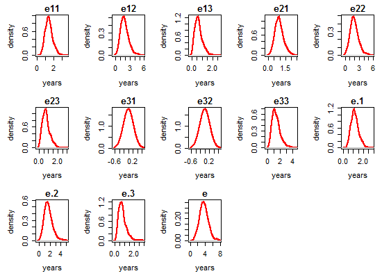

# Model Analysis

<!-- These two chunks should be added in the beginning of every .Rmd that you want to source an .R script -->
<!--  The 1st mandatory chunck  -->
<!--  Set the working directory to the repository's base directory -->


<!--  The 2nd mandatory chunck  -->
<!-- Set the report-wide options, and point to the external code file. -->

This report describes the 


Estimation results of **Model XXX**, specified by the following input:


# Load environmet
<!-- Load 'sourced' R files.  Suppress the output when loading packages. --> 


<!-- Load the sources.  Suppress the output when loading sources. --> 


<!-- Load any Global functions and variables declared in the R file.  Suppress the output. --> 

```

 Save fitted models here : 
```

```
[1] "./data/shared/derived/models/model-b-mod-2/"
```

# Load data
<!-- Load the datasets.   -->


# Functions used

```r
msm_summary <- function(model){
cat("\n-2loglik =", model$minus2loglik,"\n")
cat("Convergence code =", model$opt$convergence,"\n")
p    <- model$opt$par
p.se <- sqrt(diag(solve(1/2*model$opt$hessian)))
print(cbind(p=round(p,digits),
            se=round(p.se,digits),"Wald ChiSq"=round((p/p.se)^2,digits),
            "Pr>ChiSq"=round(1-pchisq((p/p.se)^2,df=1),digits)),
      quote=FALSE)
}

msm_details <- function(model){ 
  # intensity matrix
  cat("\n Intensity matrix : \n")
  print(qmatrix.msm(model)) 
  # qmatrix.msm(model, covariates = list(male = 0))
  # transition probability matrix
  t_ <- 2
  cat("\n Transition probability matrix for t = ", t_," : \n")
  print(pmatrix.msm(model, t = t_)) # t = time, in original metric
  # misclassification matrix
  cat("\n Misclassification matrix : \n")
  suppressWarnings(print(ematrix.msm(model), warnings=F))
  # mean sojourn times
  cat("\n Mean sojourn times : \n")
  print(sojourn.msm(model))
  # probability that each state is next
  cat("\n Probability that each state is next : \n")
  suppressWarnings(print(pnext.msm(model)))
  # total length of stay
  cat("\n  Total length of stay : \n")
  print(totlos.msm(model))
  # expected number of visits to the state
  cat("\n Expected number of visits to the state : \n")
  suppressWarnings(print(envisits.msm(model)))
  # ratio of transition intensities
  # qratio.msm(model,ind1 = c(2,1), ind2 = c(1,2))
}
```


```r
# wrapper function to compute a single conditional Life Expectancy
compute_one_condition <- function(
   msm_model
  ,age_min
  ,age_max
  # ,ds_alive
  ,ds_levels
  ,condition_n
){
  # assemble the levels of the covariates
  covar_list <- list(
    age    = age_min
    # ,age_bl = ds_levels[condition_n,"age_bl"] 
    ,male   = ds_levels[condition_n, "male"]
    ,educat = ds_levels[condition_n, "educat"]
    ,sescat = ds_levels[condition_n, "sescat"] 
  )
  # estimate Life Expectancies
  LE <- elect(
    model          = msm_model, # fitted msm model
    b.covariates   = covar_list, # list with specified covarites values
    statedistdata  = ds_alive, # data for distribution of living states
    time.scale.msm = time_scale, # time scale in multi-state model ("years", ...)
    h              = grid_par, # grid parameter for integration
    age.max        = age_max, # assumed maximum age in years
    S              = replication_n # number of simulation cycles
  )
  return(LE)
}

# wrapper function to compute ALL conditional LEs for a given set of covariate conditions
compute_conditional_les <- function(
  folder,
  model_name,
  age_min,
  age_max,
  ds_levels,
  condition_n = "all"
){
  model_path_in  <- paste0(folder,model_name,   '.rds') # msm object
  model_path_out <- paste0(folder,model_name,'_',age_min+75,'_',age_max+75,'.rds') # msm + elect objects
  model <- list() # initiate the list object
  model[["msm"]] <- readRDS(model_path_in) # import msm model object
  # store conditional levels of covariates for future reference
  model[["levels"]] <- ds_levels
  # loop through all conditional values of covariates
  if(condition_n == "all"){
    tested_conditions <- 1:nrow(ds_levels) 
  }else{
    tested_conditions <- condition_n
  }
  for(i in tested_conditions){  
    condition_number <- paste0(as.character(i))
    model[["le"]][[condition_number]] <- compute_one_condition(
      msm_model   = model[["msm"]], 
      age_min     = age_min, 
      age_max     = age_max,
      ds_levels   = ds_levels, 
      condition_n = i
    ) 
  }
  # return(model)
  saveRDS(model,model_path_out)
}

# simplified verision of summary.elect()
# this function only a temp hack before such functionality is added to summary.elect()
describe_reps<- function(
   LEs
  ,probs = c(.025,0.5,.975)
){
  (pnt <- LEs$pnt)
  (e_names <- attr(LEs$pnt, "names"))
  sim <- LEs$sim
  (mn <- apply(LEs$sim,2,mean))
  (se <- apply(LEs$sim,2,sd))
  (quants <- matrix(NA,ncol(LEs$sim),length(probs)))
  for(i in 1:ncol(LEs$sim)){
    for(j in 1:length(probs)){
      quants[i,j] <- quantile(LEs$sim[,i],probs=probs[j])
    }   
  }     
  out <- as.data.frame(cbind(pnt,mn,se,quantiles=quants))
  for(j in 4:(3+length(probs))){
    names(out)[j]<-paste(probs[j-3],"q",sep="")
  }
  return(out)
}
# describe_reps(model$le)

# organize the results of replication
organize_sim_results <- function(
  model_path
){
  model <- readRDS(model_path)
  lapply(model, names)
  for(i in seq_along(model$le)){
    
    (d0 <- model$levels[i,])
    (d1 <- describe_reps(model$le[[i]]))
    (d2 <- cbind(d1,d0))
    (d2$e_name <- attr(model$le[[i]]$pnt, "names") )
    (d2$condition_n <- i)
    model[["descriptives"]][[paste0(i)]] <- d2
  }
  lapply(model, names) 
  model$descriptives$`1`
  
  d <- do.call("rbind", model$descriptives)
  rownames(d) <- NULL
  d <- d %>% 
    dplyr::select(condition_n, e_name, male, educat, sescat, dplyr::everything()) %>% 
    dplyr::mutate(
      pnt      = sprintf("%0.2f", as.numeric(pnt)),
      mn       = sprintf("%0.2f", as.numeric(mn)),
      se       = sprintf("%0.2f", as.numeric(se)),
      `0.025q` = sprintf("%0.2f", as.numeric(`0.025q` )),
      `0.5q`   = sprintf("%0.2f", as.numeric(`0.5q` )),
      `0.975q` = sprintf("%0.2f", as.numeric(`0.975q` ))
      
    )
  model[["descriptives"]] <- d
  saveRDS(model, model_path)
  # return(model)
}
# organize_sim_results(
# model_path = "./data/shared/derived/models/model-b-mod-2/mB_mod2_3_80_110.rds"
# )
```


```r
# age_bl_possible <- seq(from=-10, to=10, by=10) 
male_possible <- c(0, 1)
educat_possible <- c(-1,0,1)
sescat_possible <- c(-1,0,1)

ds_levels <- tidyr::crossing(
  # age_bl = age_bl_possible 
  male   = male_possible   
  ,educat = educat_possible
  ,sescat = sescat_possible
) %>% as.data.frame() 

ds_levels %>% knitr::kable() %>% print()
```

```


 male   educat   sescat
-----  -------  -------
    0       -1       -1
    0       -1        0
    0       -1        1
    0        0       -1
    0        0        0
    0        0        1
    0        1       -1
    0        1        0
    0        1        1
    1       -1       -1
    1       -1        0
    1       -1        1
    1        0       -1
    1        0        0
    1        0        1
    1        1       -1
    1        1        0
    1        1        1
```


```r
alive_states <- c(1,2,3)
ds_alive <- ds[ds$state %in% alive_states,]

grid_par <- .5
time_scale <- "years"
replication_n <- 1000
```


```r
# compute_conditional_les(
#   folder =  "./data/shared/derived/models/model-b-mod-2/",
#   model_name = "mB_mod2_3",
#   age_min = 5, # centered at 75
#   age_max = 35,
#   ds_levels = ds_levels,
#   condition_n = "all"
# )
# 
# compute_conditional_les(
#   folder =  "./data/shared/derived/models/model-b-mod-2/",
#   model_name = "mB_mod2_3",
#   age_min = 10, # centered at 75
#   age_max = 35,
#   ds_levels = ds_levels,
#   condition_n = "all"
# )
```


```r
# compute_conditional_les(
#   folder =  "./data/shared/derived/models/model-b-mod-2/",
#   model_name = "mB_mod2_3",
#   age_min = 5, # centered at 75
#   age_max = 35,
#   ds_levels = ds_levels,
#   condition_n = "all"
# )
# 
# compute_conditional_les(
#   folder =  "./data/shared/derived/models/model-b-mod-2/",
#   model_name = "mB_mod2_3",
#   age_min = 10, # centered at 75
#   age_max = 35,
#   ds_levels = ds_levels,
#   condition_n = "all"
# )
```

# Results
## msm

```
          transition    predictor             dense
1  State 1 - State 2          age 1.08 (1.07, 1.09)
2  State 1 - State 4          age 1.10 (1.07, 1.13)
3  State 2 - State 1          age 0.98 (0.96, 0.99)
4  State 2 - State 3          age 1.05 (1.02, 1.07)
5  State 2 - State 4          age 1.11 (1.04, 1.18)
6  State 3 - State 4          age 1.06 (1.03, 1.09)
7  State 1 - State 2         male 1.36 (1.17, 1.58)
8  State 1 - State 4         male 1.44 (0.94, 2.20)
9  State 2 - State 1         male 1.00 (1.00, 1.00)
10 State 2 - State 3         male 0.87 (0.65, 1.17)
11 State 2 - State 4         male 1.74 (0.94, 3.25)
12 State 3 - State 4         male 1.30 (0.98, 1.72)
13 State 1 - State 2  edu_low_med 0.50 (0.30, 0.83)
14 State 1 - State 4  edu_low_med 1.31 (0.26, 6.66)
15 State 2 - State 1  edu_low_med 1.00 (1.00, 1.00)
16 State 2 - State 3  edu_low_med 2.39 (0.99, 5.80)
17 State 2 - State 4  edu_low_med 0.84 (0.04,15.75)
18 State 3 - State 4  edu_low_med 1.22 (0.54, 2.75)
19 State 1 - State 2 edu_low_high 0.40 (0.29, 0.54)
20 State 1 - State 4 edu_low_high 0.82 (0.21, 3.15)
21 State 2 - State 1 edu_low_high 1.00 (1.00, 1.00)
22 State 2 - State 3 edu_low_high 1.33 (0.66, 2.66)
23 State 2 - State 4 edu_low_high 1.13 (0.25, 4.97)
24 State 3 - State 4 edu_low_high 0.77 (0.43, 1.39)
25 State 1 - State 2       sescat 0.90 (0.82, 0.99)
26 State 1 - State 4       sescat 1.00 (1.00, 1.00)
27 State 2 - State 1       sescat 1.00 (1.00, 1.00)
28 State 2 - State 3       sescat 0.95 (0.79, 1.13)
29 State 2 - State 4       sescat 1.00 (1.00, 1.00)
30 State 3 - State 4       sescat 1.00 (1.00, 1.00)
```

```

-2loglik = 14515.36 
Convergence code = 0 
          p   se Wald ChiSq Pr>ChiSq
qbase -1.34 0.17      63.87     0.00
qbase -4.26 0.69      37.52     0.00
qbase -0.22 0.08       6.83     0.01
qbase -2.40 0.36      44.37     0.00
qbase -4.15 0.90      20.99     0.00
qbase -1.80 0.32      31.55     0.00
qcov   0.08 0.01     154.98     0.00
qcov   0.10 0.01      40.91     0.00
qcov  -0.02 0.01       8.12     0.00
qcov   0.05 0.01      14.97     0.00
qcov   0.10 0.03       8.91     0.00
qcov   0.06 0.01      20.99     0.00
qcov   0.31 0.08      16.07     0.00
qcov   0.36 0.22       2.80     0.09
qcov  -0.14 0.15       0.86     0.35
qcov   0.56 0.32       3.08     0.08
qcov   0.26 0.14       3.38     0.07
qcov  -0.68 0.26       7.11     0.01
qcov   0.27 0.83       0.10     0.75
qcov   0.87 0.45       3.74     0.05
qcov  -0.18 1.50       0.01     0.90
qcov   0.20 0.42       0.22     0.64
qcov  -0.93 0.16      33.52     0.00
qcov  -0.19 0.69       0.08     0.78
qcov   0.28 0.35       0.64     0.42
qcov   0.12 0.76       0.02     0.88
qcov  -0.26 0.30       0.75     0.39
qcov  -0.11 0.05       4.76     0.03
qcov  -0.05 0.09       0.33     0.57
p     -2.26 0.09     600.40     0.00
initp -1.50 0.07     463.71     0.00
initp -3.23 0.16     415.39     0.00
```

```

 Intensity matrix : 
        State 1                      State 2                      State 3                     
State 1 -0.24128 (-0.25962,-0.22423)  0.21381 ( 0.19698, 0.23208) 0                           
State 2  0.68009 ( 0.61614, 0.75068) -0.89125 (-0.96787,-0.82070)  0.16674 ( 0.14002, 0.19856)
State 3 0                            0                            -0.21877 (-0.27441,-0.17442)
State 4 0                            0                            0                           
        State 4                     
State 1  0.02746 ( 0.02218, 0.03401)
State 2  0.04442 ( 0.02330, 0.08465)
State 3  0.21877 ( 0.17442, 0.27441)
State 4 0                           

 Transition probability matrix for t =  2  : 
          State 1   State 2    State 3    State 4
State 1 0.7442737 0.1620344 0.03166394 0.06202797
State 2 0.5153958 0.2517030 0.12969384 0.10320734
State 3 0.0000000 0.0000000 0.64561881 0.35438119
State 4 0.0000000 0.0000000 0.00000000 1.00000000

 Misclassification matrix : 
        State 1 State 2 State 3                  State 4
State 1 1.00000 0       0                        0      
State 2 0       0       0.09421 (0.07986,0.1108) 0      
State 3 0       0       1.00000                  0      
State 4 0       0       0                        1.00000

 Mean sojourn times : 
        estimates         SE        L        U
State 1  4.144622 0.15495420 3.851778 4.459731
State 2  1.122017 0.04721055 1.033198 1.218470
State 3  4.570948 0.52840403 3.644239 5.733312

 Probability that each state is next : 
        State 1                   State 2                   State 3                   State 4                  
State 1 0                         0.88618 (0.85779,0.90840) 0                         0.11382 (0.09160,0.14221)
State 2 0.76308 (0.72461,0.79342) 0                         0.18709 (0.15804,0.22161) 0.04984 (0.02664,0.09113)
State 3 0                         0                         0                         1.00000 (1.00000,1.00000)
State 4 0                         0                         0                         0                        

  Total length of stay : 
  State 1   State 2   State 3   State 4 
12.800827  3.070953  2.340572       Inf 

 Expected number of visits to the state : 
  State 1   State 2   State 3   State 4 
2.0885392 2.7369938 0.5120539 1.0000000 
```

## Conditions

```
   male educat sescat
1     0     -1     -1
2     0     -1      0
3     0     -1      1
4     0      0     -1
5     0      0      0
6     0      0      1
7     0      1     -1
8     0      1      0
9     0      1      1
10    1     -1     -1
11    1     -1      0
12    1     -1      1
13    1      0     -1
14    1      0      0
15    1      0      1
16    1      1     -1
17    1      1      0
18    1      1      1
```

## elect

```r
for(i in 1:nrow(model$levels)){
# for(i in 1:3){
  cat("\n### ",i,"\n")
  ds <- model$descriptives
  ds %>% 
    dplyr::filter(condition_n == as.integer(i)) %>% 
    knitr::kable() %>% print() 
  cat("\n")
  plot.elect(model$le[[i]])
  cat("\n")
  
}
```


###  1 


 condition_n  e_name    male   educat   sescat  pnt    mn     se     0.025q   0.5q   0.975q 
------------  -------  -----  -------  -------  -----  -----  -----  -------  -----  -------
           1  e11          0       -1       -1  1.00   0.78   0.56   0.06     0.64   2.27   
           1  e12          0       -1       -1  6.19   4.14   3.33   0.09     3.40   11.90  
           1  e13          0       -1       -1  0.76   0.81   1.00   0.01     0.46   3.95   
           1  e21          0       -1       -1  0.89   0.65   0.50   0.02     0.55   1.96   
           1  e22          0       -1       -1  6.19   4.25   3.37   0.02     3.54   12.13  
           1  e23          0       -1       -1  0.78   0.87   1.05   0.01     0.50   4.11   
           1  e31          0       -1       -1  0.00   0.00   0.00   0.00     0.00   0.00   
           1  e32          0       -1       -1  0.00   0.00   0.00   0.00     0.00   0.00   
           1  e33          0       -1       -1  2.54   3.35   2.79   0.32     2.52   10.67  
           1  e.1          0       -1       -1  0.86   0.66   0.48   0.06     0.55   1.92   
           1  e.2          0       -1       -1  5.44   3.67   2.94   0.07     3.02   10.63  
           1  e.3          0       -1       -1  0.98   1.12   1.07   0.11     0.80   4.27   
           1  e            0       -1       -1  7.28   5.45   3.56   0.57     4.93   13.48  


###  2 


 condition_n  e_name    male   educat   sescat  pnt    mn     se     0.025q   0.5q   0.975q 
------------  -------  -----  -------  -------  -----  -----  -----  -------  -----  -------
           2  e11          0       -1        0  2.19   1.84   0.83   0.55     1.75   3.65   
           2  e12          0       -1        0  4.89   3.79   2.23   0.39     3.51   8.74   
           2  e13          0       -1        0  0.99   0.91   0.83   0.04     0.68   2.90   
           2  e21          0       -1        0  1.78   1.42   0.76   0.19     1.35   3.05   
           2  e22          0       -1        0  4.99   3.92   2.31   0.28     3.68   8.93   
           2  e23          0       -1        0  1.06   1.00   0.89   0.05     0.76   3.18   
           2  e31          0       -1        0  0.00   0.00   0.00   0.00     0.00   0.00   
           2  e32          0       -1        0  0.00   0.00   0.00   0.00     0.00   0.00   
           2  e33          0       -1        0  3.23   3.67   2.23   0.87     3.16   9.29   
           2  e.1          0       -1        0  1.85   1.53   0.71   0.41     1.46   3.10   
           2  e.2          0       -1        0  4.31   3.37   1.99   0.33     3.13   7.66   
           2  e.3          0       -1        0  1.28   1.26   0.89   0.28     1.03   3.37   
           2  e            0       -1        0  7.44   6.16   2.78   1.39     6.10   11.63  


###  3 


 condition_n  e_name    male   educat   sescat  pnt    mn     se     0.025q   0.5q   0.975q 
------------  -------  -----  -------  -------  -----  -----  -----  -------  -----  -------
           3  e11          0       -1        1  4.14   3.74   1.02   1.89     3.72   5.80   
           3  e12          0       -1        1  3.55   3.05   1.40   0.54     3.00   6.13   
           3  e13          0       -1        1  1.19   1.13   0.67   0.15     1.01   2.66   
           3  e21          0       -1        1  3.18   2.75   1.02   0.60     2.75   4.68   
           3  e22          0       -1        1  3.79   3.28   1.50   0.44     3.26   6.41   
           3  e23          0       -1        1  1.35   1.30   0.75   0.18     1.19   3.01   
           3  e31          0       -1        1  0.00   0.00   0.00   0.00     0.00   0.00   
           3  e32          0       -1        1  0.00   0.00   0.00   0.00     0.00   0.00   
           3  e33          0       -1        1  4.06   4.30   1.53   1.95     4.07   7.77   
           3  e.1          0       -1        1  3.46   3.09   0.89   1.42     3.08   4.85   
           3  e.2          0       -1        1  3.16   2.73   1.26   0.46     2.69   5.50   
           3  e.3          0       -1        1  1.57   1.54   0.69   0.54     1.40   3.17   
           3  e            0       -1        1  8.19   7.36   2.30   2.75     7.53   11.69  


###  4 


 condition_n  e_name    male   educat   sescat  pnt    mn     se     0.025q   0.5q   0.975q 
------------  -------  -----  -------  -------  -----  -----  -----  -------  -----  -------
           4  e11          0        0       -1  1.59   1.36   0.52   0.50     1.31   2.59   
           4  e12          0        0       -1  4.23   3.42   1.62   0.87     3.18   7.15   
           4  e13          0        0       -1  1.04   0.91   0.64   0.14     0.77   2.62   
           4  e21          0        0       -1  1.27   1.06   0.45   0.31     1.02   2.14   
           4  e22          0        0       -1  4.28   3.53   1.66   0.85     3.28   7.31   
           4  e23          0        0       -1  1.10   1.00   0.68   0.16     0.85   2.79   
           4  e31          0        0       -1  0.00   0.00   0.00   0.00     0.00   0.00   
           4  e32          0        0       -1  0.00   0.00   0.00   0.00     0.00   0.00   
           4  e33          0        0       -1  2.10   2.38   1.37   0.62     2.09   5.93   
           4  e.1          0        0       -1  1.34   1.14   0.44   0.41     1.10   2.13   
           4  e.2          0        0       -1  3.72   3.03   1.44   0.75     2.81   6.47   
           4  e.3          0        0       -1  1.18   1.11   0.67   0.28     0.95   2.85   
           4  e            0        0       -1  6.24   5.28   1.89   1.86     5.11   9.47   


###  5 


 condition_n  e_name    male   educat   sescat  pnt    mn     se     0.025q   0.5q   0.975q 
------------  -------  -----  -------  -------  -----  -----  -----  -------  -----  -------
           5  e11          0        0        0  3.09   2.97   0.46   2.15     2.95   3.94   
           5  e12          0        0        0  3.02   2.81   0.61   1.72     2.81   4.02   
           5  e13          0        0        0  1.24   1.17   0.38   0.55     1.12   2.06   
           5  e21          0        0        0  2.28   2.16   0.40   1.42     2.15   2.99   
           5  e22          0        0        0  3.18   2.99   0.64   1.92     2.97   4.28   
           5  e23          0        0        0  1.40   1.33   0.42   0.63     1.30   2.28   
           5  e31          0        0        0  0.00   0.00   0.00   0.00     0.00   0.00   
           5  e32          0        0        0  0.00   0.00   0.00   0.00     0.00   0.00   
           5  e33          0        0        0  2.69   2.74   0.75   1.54     2.66   4.34   
           5  e.1          0        0        0  2.57   2.45   0.39   1.73     2.43   3.27   
           5  e.2          0        0        0  2.68   2.51   0.55   1.58     2.49   3.61   
           5  e.3          0        0        0  1.44   1.39   0.41   0.72     1.35   2.32   
           5  e            0        0        0  6.70   6.35   0.90   4.59     6.34   8.15   


###  6 


 condition_n  e_name    male   educat   sescat  pnt    mn     se     0.025q   0.5q   0.975q 
------------  -------  -----  -------  -------  -----  -----  -----  -------  -----  -------
           6  e11          0        0        1  5.27   5.25   0.18   4.87     5.25   5.59   
           6  e12          0        0        1  1.97   1.95   0.12   1.73     1.95   2.20   
           6  e13          0        0        1  1.33   1.33   0.12   1.10     1.33   1.57   
           6  e21          0        0        1  3.62   3.60   0.18   3.25     3.60   3.95   
           6  e22          0        0        1  2.26   2.24   0.12   2.01     2.24   2.49   
           6  e23          0        0        1  1.69   1.69   0.14   1.42     1.69   1.94   
           6  e31          0        0        1  0.00   0.00   0.00   0.00     0.00   0.00   
           6  e32          0        0        1  0.00   0.00   0.00   0.00     0.00   0.00   
           6  e33          0        0        1  3.41   3.42   0.27   2.90     3.42   3.98   
           6  e.1          0        0        1  4.33   4.29   0.17   3.93     4.30   4.60   
           6  e.2          0        0        1  1.78   1.78   0.13   1.54     1.77   2.05   
           6  e.3          0        0        1  1.65   1.65   0.13   1.40     1.66   1.89   
           6  e            0        0        1  7.76   7.72   0.24   7.24     7.72   8.16   


###  7 


 condition_n  e_name    male   educat   sescat  pnt    mn     se     0.025q   0.5q   0.975q 
------------  -------  -----  -------  -------  -----  -----  -----  -------  -----  -------
           7  e11          0        1       -1  2.13   1.97   0.52   1.08     1.91   3.13   
           7  e12          0        1       -1  2.21   1.94   0.74   0.64     1.85   3.61   
           7  e13          0        1       -1  1.09   0.98   0.45   0.27     0.92   2.02   
           7  e21          0        1       -1  1.44   1.29   0.44   0.50     1.25   2.28   
           7  e22          0        1       -1  2.28   2.03   0.79   0.65     1.96   3.79   
           7  e23          0        1       -1  1.24   1.14   0.50   0.33     1.07   2.31   
           7  e31          0        1       -1  0.00   0.00   0.00   0.00     0.00   0.00   
           7  e32          0        1       -1  0.00   0.00   0.00   0.00     0.00   0.00   
           7  e33          0        1       -1  1.72   1.84   0.77   0.67     1.72   3.65   
           7  e.1          0        1       -1  1.74   1.60   0.44   0.85     1.55   2.56   
           7  e.2          0        1       -1  1.95   1.73   0.66   0.59     1.65   3.20   
           7  e.3          0        1       -1  1.20   1.12   0.46   0.40     1.04   2.17   
           7  e            0        1       -1  4.89   4.44   1.10   2.22     4.41   6.74   


###  8 


 condition_n  e_name    male   educat   sescat  pnt    mn     se     0.025q   0.5q   0.975q 
------------  -------  -----  -------  -------  -----  -----  -----  -------  -----  -------
           8  e11          0        1        0  3.79   3.63   0.59   2.61     3.59   4.85   
           8  e12          0        1        0  1.43   1.32   0.33   0.72     1.29   2.03   
           8  e13          0        1        0  1.17   1.10   0.35   0.46     1.07   1.89   
           8  e21          0        1        0  2.30   2.13   0.46   1.31     2.11   3.12   
           8  e22          0        1        0  1.59   1.47   0.36   0.81     1.46   2.25   
           8  e23          0        1        0  1.51   1.43   0.42   0.65     1.40   2.35   
           8  e31          0        1        0  0.00   0.00   0.00   0.00     0.00   0.00   
           8  e32          0        1        0  0.00   0.00   0.00   0.00     0.00   0.00   
           8  e33          0        1        0  2.23   2.27   0.66   1.15     2.20   3.71   
           8  e.1          0        1        0  3.06   2.90   0.49   2.04     2.86   3.93   
           8  e.2          0        1        0  1.28   1.19   0.30   0.66     1.16   1.82   
           8  e.3          0        1        0  1.36   1.31   0.37   0.67     1.26   2.15   
           8  e            0        1        0  5.70   5.39   0.78   3.85     5.39   6.88   


###  9 


 condition_n  e_name    male   educat   sescat  pnt    mn     se     0.025q   0.5q   0.975q 
------------  -------  -----  -------  -------  -----  -----  -----  -------  -----  -------
           9  e11          0        1        1  5.97   5.59   1.39   2.83     5.60   8.21   
           9  e12          0        1        1  0.83   0.73   0.31   0.25     0.69   1.45   
           9  e13          0        1        1  1.13   1.04   0.55   0.26     0.94   2.35   
           9  e21          0        1        1  3.24   2.83   0.93   1.24     2.77   4.89   
           9  e22          0        1        1  1.09   0.96   0.36   0.36     0.94   1.74   
           9  e23          0        1        1  1.81   1.71   0.74   0.57     1.61   3.49   
           9  e31          0        1        1  0.00   0.00   0.00   0.00     0.00   0.00   
           9  e32          0        1        1  0.00   0.00   0.00   0.00     0.00   0.00   
           9  e33          0        1        1  2.85   3.00   1.19   1.22     2.82   5.94   
           9  e.1          0        1        1  4.75   4.37   1.13   2.21     4.36   6.63   
           9  e.2          0        1        1  0.77   0.69   0.28   0.25     0.64   1.34   
           9  e.3          0        1        1  1.46   1.41   0.61   0.56     1.29   2.95   
           9  e            0        1        1  6.99   6.46   1.53   3.41     6.48   9.35   


###  10 


 condition_n  e_name    male   educat   sescat  pnt    mn     se     0.025q   0.5q   0.975q 
------------  -------  -----  -------  -------  -----  -----  -----  -------  -----  -------
          10  e11          1       -1       -1  0.64   0.53   0.42   0.03     0.43   1.61   
          10  e12          1       -1       -1  5.04   3.76   3.20   0.02     2.94   11.94  
          10  e13          1       -1       -1  0.43   0.50   0.71   0.00     0.24   2.53   
          10  e21          1       -1       -1  0.58   0.45   0.38   0.00     0.38   1.42   
          10  e22          1       -1       -1  5.01   3.86   3.26   0.00     3.03   12.04  
          10  e23          1       -1       -1  0.44   0.53   0.74   0.00     0.26   2.84   
          10  e31          1       -1       -1  0.00   0.00   0.00   0.00     0.00   0.00   
          10  e32          1       -1       -1  0.00   0.00   0.00   0.00     0.00   0.00   
          10  e33          1       -1       -1  1.97   2.70   2.35   0.21     1.98   8.91   
          10  e.1          1       -1       -1  0.55   0.45   0.36   0.02     0.37   1.36   
          10  e.2          1       -1       -1  4.42   3.33   2.83   0.01     2.59   10.47  
          10  e.3          1       -1       -1  0.62   0.77   0.78   0.08     0.53   3.03   
          10  e            1       -1       -1  5.59   4.55   3.30   0.41     3.91   12.30  


###  11 


 condition_n  e_name    male   educat   sescat  pnt    mn     se     0.025q   0.5q   0.975q 
------------  -------  -----  -------  -------  -----  -----  -----  -------  -----  -------
          11  e11          1       -1        0  1.48   1.28   0.63   0.32     1.21   2.66   
          11  e12          1       -1        0  4.10   3.44   2.20   0.20     3.12   8.18   
          11  e13          1       -1        0  0.58   0.64   0.65   0.02     0.46   2.51   
          11  e21          1       -1        0  1.19   1.00   0.57   0.08     0.95   2.24   
          11  e22          1       -1        0  4.14   3.57   2.29   0.09     3.30   8.68   
          11  e23          1       -1        0  0.61   0.70   0.70   0.02     0.52   2.62   
          11  e31          1       -1        0  0.00   0.00   0.00   0.00     0.00   0.00   
          11  e32          1       -1        0  0.00   0.00   0.00   0.00     0.00   0.00   
          11  e33          1       -1        0  2.53   3.01   1.90   0.69     2.55   8.17   
          11  e.1          1       -1        0  1.25   1.07   0.54   0.25     1.02   2.25   
          11  e.2          1       -1        0  3.60   3.06   1.96   0.16     2.80   7.37   
          11  e.3          1       -1        0  0.82   0.94   0.70   0.22     0.75   2.70   
          11  e            1       -1        0  5.68   5.07   2.57   0.91     4.92   10.30  


###  12 


 condition_n  e_name    male   educat   sescat  pnt    mn     se     0.025q   0.5q   0.975q 
------------  -------  -----  -------  -------  -----  -----  -----  -------  -----  -------
          12  e11          1       -1        1  2.99   2.80   0.82   1.33     2.75   4.45   
          12  e12          1       -1        1  3.07   2.81   1.39   0.42     2.74   5.65   
          12  e13          1       -1        1  0.72   0.72   0.50   0.07     0.62   1.97   
          12  e21          1       -1        1  2.23   2.02   0.83   0.42     2.01   3.57   
          12  e22          1       -1        1  3.25   3.00   1.50   0.31     3.01   5.90   
          12  e23          1       -1        1  0.81   0.83   0.55   0.08     0.73   2.20   
          12  e31          1       -1        1  0.00   0.00   0.00   0.00     0.00   0.00   
          12  e32          1       -1        1  0.00   0.00   0.00   0.00     0.00   0.00   
          12  e33          1       -1        1  3.22   3.41   1.26   1.50     3.20   6.36   
          12  e.1          1       -1        1  2.49   2.31   0.71   1.00     2.28   3.71   
          12  e.2          1       -1        1  2.73   2.51   1.25   0.34     2.47   5.07   
          12  e.3          1       -1        1  1.04   1.07   0.52   0.37     0.97   2.36   
          12  e            1       -1        1  6.26   5.89   2.08   2.07     5.94   9.80   


###  13 


 condition_n  e_name    male   educat   sescat  pnt    mn     se     0.025q   0.5q   0.975q 
------------  -------  -----  -------  -------  -----  -----  -----  -------  -----  -------
          13  e11          1        0       -1  1.11   0.93   0.41   0.27     0.88   1.88   
          13  e12          1        0       -1  3.88   3.02   1.53   0.65     2.86   6.46   
          13  e13          1        0       -1  0.66   0.59   0.47   0.07     0.47   1.79   
          13  e21          1        0       -1  0.90   0.73   0.35   0.19     0.68   1.56   
          13  e22          1        0       -1  3.91   3.13   1.57   0.57     2.94   6.60   
          13  e23          1        0       -1  0.70   0.65   0.50   0.07     0.52   1.91   
          13  e31          1        0       -1  0.00   0.00   0.00   0.00     0.00   0.00   
          13  e32          1        0       -1  0.00   0.00   0.00   0.00     0.00   0.00   
          13  e33          1        0       -1  1.61   1.82   1.08   0.42     1.60   4.65   
          13  e.1          1        0       -1  0.94   0.78   0.35   0.23     0.73   1.60   
          13  e.2          1        0       -1  3.41   2.69   1.35   0.60     2.51   5.65   
          13  e.3          1        0       -1  0.78   0.75   0.49   0.18     0.62   2.00   
          13  e            1        0       -1  5.13   4.21   1.74   1.28     4.03   7.92   


###  14 


 condition_n  e_name    male   educat   sescat  pnt    mn     se     0.025q   0.5q   0.975q 
------------  -------  -----  -------  -------  -----  -----  -----  -------  -----  -------
          14  e11          1        0        0  2.28   2.14   0.36   1.46     2.14   2.87   
          14  e12          1        0        0  2.86   2.61   0.61   1.48     2.57   3.84   
          14  e13          1        0        0  0.81   0.79   0.31   0.31     0.74   1.48   
          14  e21          1        0        0  1.68   1.55   0.32   0.94     1.55   2.21   
          14  e22          1        0        0  2.99   2.75   0.65   1.51     2.73   4.04   
          14  e23          1        0        0  0.91   0.90   0.34   0.35     0.84   1.69   
          14  e31          1        0        0  0.00   0.00   0.00   0.00     0.00   0.00   
          14  e32          1        0        0  0.00   0.00   0.00   0.00     0.00   0.00   
          14  e33          1        0        0  2.09   2.18   0.63   1.16     2.13   3.59   
          14  e.1          1        0        0  1.90   1.76   0.31   1.17     1.75   2.38   
          14  e.2          1        0        0  2.53   2.33   0.55   1.32     2.29   3.45   
          14  e.3          1        0        0  0.98   0.98   0.32   0.50     0.93   1.74   
          14  e            1        0        0  5.41   5.06   0.88   3.38     5.08   6.79   


###  15 


 condition_n  e_name    male   educat   sescat  pnt    mn     se     0.025q   0.5q   0.975q 
------------  -------  -----  -------  -------  -----  -----  -----  -------  -----  -------
          15  e11          1        0        1  4.07   4.05   0.20   3.70     4.04   4.44   
          15  e12          1        0        1  1.91   1.89   0.14   1.63     1.89   2.18   
          15  e13          1        0        1  0.90   0.89   0.12   0.68     0.88   1.13   
          15  e21          1        0        1  2.77   2.75   0.18   2.41     2.74   3.11   
          15  e22          1        0        1  2.17   2.15   0.15   1.87     2.15   2.46   
          15  e23          1        0        1  1.13   1.13   0.14   0.89     1.12   1.41   
          15  e31          1        0        1  0.00   0.00   0.00   0.00     0.00   0.00   
          15  e32          1        0        1  0.00   0.00   0.00   0.00     0.00   0.00   
          15  e33          1        0        1  2.68   2.69   0.30   2.15     2.66   3.31   
          15  e.1          1        0        1  3.34   3.30   0.18   2.98     3.30   3.65   
          15  e.2          1        0        1  1.72   1.72   0.15   1.46     1.71   2.02   
          15  e.3          1        0        1  1.16   1.15   0.13   0.92     1.15   1.42   
          15  e            1        0        1  6.22   6.17   0.26   5.67     6.16   6.66   


###  16 


 condition_n  e_name    male   educat   sescat  pnt    mn     se     0.025q   0.5q   0.975q 
------------  -------  -----  -------  -------  -----  -----  -----  -------  -----  -------
          16  e11          1        1       -1  1.59   1.43   0.44   0.71     1.40   2.38   
          16  e12          1        1       -1  2.26   1.90   0.82   0.55     1.81   3.78   
          16  e13          1        1       -1  0.77   0.67   0.36   0.14     0.62   1.50   
          16  e21          1        1       -1  1.11   0.96   0.37   0.31     0.93   1.77   
          16  e22          1        1       -1  2.33   1.99   0.87   0.45     1.90   3.89   
          16  e23          1        1       -1  0.86   0.77   0.40   0.17     0.72   1.73   
          16  e31          1        1       -1  0.00   0.00   0.00   0.00     0.00   0.00   
          16  e32          1        1       -1  0.00   0.00   0.00   0.00     0.00   0.00   
          16  e33          1        1       -1  1.31   1.43   0.65   0.48     1.33   2.94   
          16  e.1          1        1       -1  1.31   1.17   0.37   0.55     1.13   1.97   
          16  e.2          1        1       -1  2.00   1.69   0.73   0.47     1.61   3.38   
          16  e.3          1        1       -1  0.85   0.78   0.37   0.25     0.72   1.67   
          16  e            1        1       -1  4.16   3.64   1.12   1.52     3.58   5.98   



###  17 


 condition_n  e_name    male   educat   sescat  pnt    mn     se     0.025q   0.5q   0.975q 
------------  -------  -----  -------  -------  -----  -----  -----  -------  -----  -------
          17  e11          1        1        0  2.93   2.78   0.54   1.83     2.75   3.95   
          17  e12          1        1        0  1.48   1.31   0.38   0.63     1.29   2.15   
          17  e13          1        1        0  0.84   0.77   0.31   0.27     0.74   1.44   
          17  e21          1        1        0  1.83   1.66   0.43   0.82     1.66   2.51   
          17  e22          1        1        0  1.66   1.48   0.43   0.62     1.48   2.36   
          17  e23          1        1        0  1.07   1.00   0.37   0.37     0.97   1.81   
          17  e31          1        1        0  0.00   0.00   0.00   0.00     0.00   0.00   
          17  e32          1        1        0  0.00   0.00   0.00   0.00     0.00   0.00   
          17  e33          1        1        0  1.72   1.79   0.58   0.88     1.71   3.07   
          17  e.1          1        1        0  2.38   2.22   0.46   1.44     2.20   3.17   
          17  e.2          1        1        0  1.33   1.19   0.35   0.56     1.18   1.95   
          17  e.3          1        1        0  0.99   0.94   0.32   0.41     0.90   1.65   
          17  e            1        1        0  4.70   4.35   0.81   2.68     4.39   5.86   


###  18 


 condition_n  e_name    male   educat   sescat  pnt    mn     se     0.025q   0.5q   0.975q 
------------  -------  -----  -------  -------  -----  -----  -----  -------  -----  -------
          18  e11          1        1        1  4.74   4.39   1.21   1.96     4.41   6.74   
          18  e12          1        1        1  0.87   0.74   0.35   0.21     0.69   1.59   
          18  e13          1        1        1  0.83   0.75   0.44   0.18     0.66   1.95   
          18  e21          1        1        1  2.64   2.26   0.84   0.81     2.21   4.17   
          18  e22          1        1        1  1.15   0.99   0.41   0.25     0.96   1.90   
          18  e23          1        1        1  1.30   1.24   0.61   0.34     1.16   2.80   
          18  e31          1        1        1  0.00   0.00   0.00   0.00     0.00   0.00   
          18  e32          1        1        1  0.00   0.00   0.00   0.00     0.00   0.00   
          18  e33          1        1        1  2.22   2.46   1.09   0.88     2.25   4.96   
          18  e.1          1        1        1  3.78   3.44   0.99   1.59     3.41   5.51   
          18  e.2          1        1        1  0.82   0.70   0.32   0.22     0.66   1.50   
          18  e.3          1        1        1  1.08   1.06   0.50   0.38     0.96   2.42   
          18  e            1        1        1  5.68   5.20   1.36   2.56     5.15   8.04   


```r
############# code for testing and re-learning below ------------
```

# Session Info

```r
sessionInfo()
```

```
R version 3.3.1 (2016-06-21)
Platform: x86_64-w64-mingw32/x64 (64-bit)
Running under: Windows 10 x64 (build 14393)

locale:
[1] LC_COLLATE=English_United States.1252  LC_CTYPE=English_United States.1252    LC_MONETARY=English_United States.1252
[4] LC_NUMERIC=C                           LC_TIME=English_United States.1252    

attached base packages:
[1] stats     graphics  grDevices utils     datasets  methods   base     

other attached packages:
[1] nnet_7.3-12  msm_1.6.1    magrittr_1.5 knitr_1.14  

loaded via a namespace (and not attached):
 [1] Rcpp_0.12.7      splines_3.3.1    testit_0.5       munsell_0.4.3    colorspace_1.2-6 lattice_0.20-34 
 [7] R6_2.1.3         highr_0.6        stringr_1.1.0    plyr_1.8.4       dplyr_0.5.0      tools_3.3.1     
[13] grid_3.3.1       gtable_0.2.0     DBI_0.5-1        htmltools_0.3.5  lazyeval_0.2.0   survival_2.39-5 
[19] yaml_2.1.13      digest_0.6.10    assertthat_0.1   tibble_1.2       Matrix_1.2-7.1   tidyr_0.6.0     
[25] ggplot2_2.1.0    formatR_1.4      evaluate_0.9     rmarkdown_1.0    stringi_1.1.1    scales_0.4.0    
[31] expm_0.999-0     mvtnorm_1.0-5   
```


