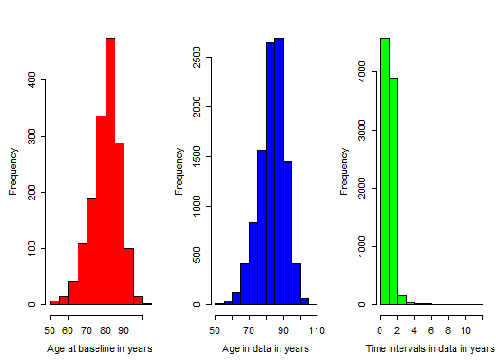
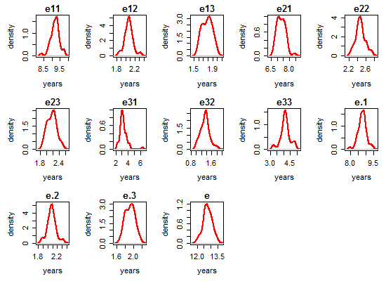
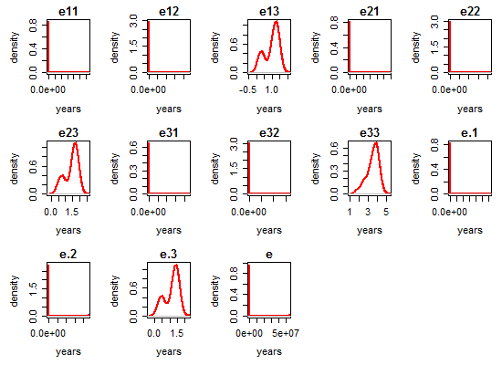
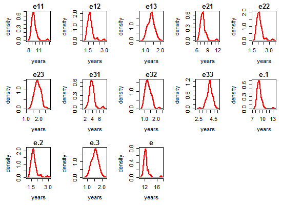
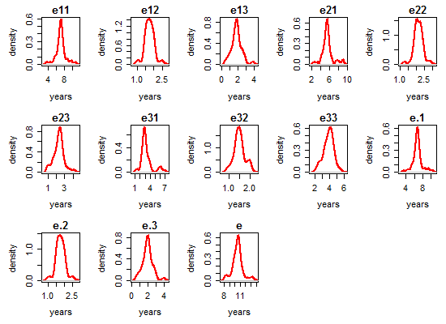

# Life Expectancies

<!-- These two chunks should be added in the beginning of every .Rmd that you want to source an .R script -->
<!--  The 1st mandatory chunck  -->
<!--  Set the working directory to the repository's base directory -->


<!--  The 2nd mandatory chunck  -->
<!-- Set the report-wide options, and point to the external code file. -->


# Load environmet
<!-- Load 'sourced' R files.  Suppress the output when loading packages. --> 

```r
# Attach these packages so their functions don't need to be qualified: http://r-pkgs.had.co.nz/namespace.html#search-path
library(magrittr) #Pipes
library(msm)
# Verify these packages are available on the machine, but their functions need to be qualified: http://r-pkgs.had.co.nz/namespace.html#search-path
requireNamespace("ggplot2", quietly=TRUE)
requireNamespace("dplyr", quietly=TRUE) #Avoid attaching dplyr, b/c its function names conflict with a lot of packages (esp base, stats, and plyr).
requireNamespace("testit", quietly=TRUE)
# requireNamespace("plyr", quietly=TRUE)
```


<!-- Load the sources.  Suppress the output when loading sources. --> 

```r
base::source("http://www.ucl.ac.uk/~ucakadl/ELECT/ELECT.r") # load  ELECT functions
base::source("./scripts/ELECT-utility-functions.R") # ELECT utility functions
```


<!-- Load any Global functions and variables declared in the R file.  Suppress the output. --> 

```r
path_input <- "./data/unshared/derived/dto.rds"
path_output <- "data/unshared/derived/dto.rds"

digits = 2
```

# Load data
<!-- Load the datasets.   -->

```r
# load the product of 0-ellis-island.R,  a list object 
# after it had been augmented by 1-encode-multistate.R script.
dto <- readRDS(path_input)
```

<!-- Inspect the datasets.   -->

```r
names(dto)
```

```
[1] "unitData" "metaData" "ms_mmse" 
```

```r
# 1st element - unit(person) level data
names(dto[["unitData"]])
```

```
  [1] "id"                    "study"                 "scaled_to.x"           "agreeableness"        
  [5] "conscientiousness"     "extraversion"          "neo_altruism"          "neo_conscientiousness"
  [9] "neo_trust"             "openness"              "anxiety_10items"       "neuroticism_12"       
 [13] "neuroticism_6"         "age_bl"                "age_death"             "died"                 
 [17] "educ"                  "msex"                  "race"                  "spanish"              
 [21] "apoe_genotype"         "alco_life"             "q3smo_bl"              "q4smo_bl"             
 [25] "smoke_bl"              "smoking"               "fu_year"               "scaled_to.y"          
 [29] "cesdsum"               "r_depres"              "intrusion"             "neglifeevents"        
 [33] "negsocexchange"        "nohelp"                "panas"                 "perceivedstress"      
 [37] "rejection"             "unsympathetic"         "dcfdx"                 "dementia"             
 [41] "r_stroke"              "cogn_ep"               "cogn_global"           "cogn_po"              
 [45] "cogn_ps"               "cogn_se"               "cogn_wo"               "cts_bname"            
 [49] "catfluency"            "cts_db"                "cts_delay"             "cts_df"               
 [53] "cts_doperf"            "cts_ebdr"              "cts_ebmt"              "cts_idea"             
 [57] "cts_lopair"            "mmse"                  "cts_nccrtd"            "cts_pmat"             
 [61] "cts_read_nart"         "cts_read_wrat"         "cts_sdmt"              "cts_story"            
 [65] "cts_wli"               "cts_wlii"              "cts_wliii"             "age_at_visit"         
 [69] "iadlsum"               "katzsum"               "rosbscl"               "rosbsum"              
 [73] "vision"                "visionlog"             "fev"                   "mep"                  
 [77] "mip"                   "pvc"                   "bun"                   "ca"                   
 [81] "chlstrl"               "cl"                    "co2"                   "crn"                  
 [85] "fasting"               "glucose"               "hba1c"                 "hdlchlstrl"           
 [89] "hdlratio"              "k"                     "ldlchlstrl"            "na"                   
 [93] "alcohol_g"             "bmi"                   "htm"                   "phys5itemsum"         
 [97] "wtkg"                  "bp11"                  "bp2"                   "bp3"                  
[101] "bp31"                  "hypertension_cum"      "dm_cum"                "thyroid_cum"          
[105] "chf_cum"               "claudication_cum"      "heart_cum"             "stroke_cum"           
[109] "vasc_3dis_sum"         "vasc_4dis_sum"         "vasc_risks_sum"        "gait_speed"           
[113] "gripavg"              
```

```r
# 2nd element - meta data, info about variables
names(dto[["metaData"]])
```

```
[1] "name"          "label"         "type"          "name_new"      "construct"     "self_reported" "longitudinal" 
[8] "unit"          "include"      
```

```r
# 3rd element - data for MMSE outcome
names(dto[["ms_mmse"]])
```

```
[1] "missing" "multi"  
```

```r
ds_miss <- dto$ms_mmse$missing # data after encoding missing states (-1, -2)
ds_ms <- dto$ms_mmse$multi # data after encoding multistates (1,2,3,4)
```

# Multistates

```r
# compare before and after ms encoding
view_id <- function(ds1,ds2,id){
  cat("Before ms encoding:","\n")
  print(ds1[ds1$id==id,])
  cat("\nAfter ms encoding","\n")
  print(ds2[ds2$id==id,])
}
# view a random person for sporadic inspections
ids <- sample(unique(ds_miss$id),1)
ids <- c(30597867) #, 50101073, 6804844, 83001827 , 56751351, 13485298, 56751351)
view_id(ds_miss, ds_ms, ids)
```

```
Before ms encoding: 
           id   age_bl  male edu age_at_visit mmse age_death presumed_alive
2110 30597867 75.91513 FALSE  11     75.91513   26  84.55852          FALSE
2111 30597867 75.91513 FALSE  11     76.91170   28  84.55852          FALSE
2112 30597867 75.91513 FALSE  11     77.91376   30  84.55852          FALSE

After ms encoding 
            id   age_bl  male edu      age state presumed_alive
2110  30597867 75.91513 FALSE  11 75.91513     2          FALSE
21111 30597867 75.91513 FALSE  11 76.91170     1          FALSE
2112  30597867 75.91513 FALSE  11 77.91376     1          FALSE
21101 30597867 75.91513 FALSE  11 84.55852     4          FALSE
```

<!-- Tweak the datasets.   -->

```r
# remove the observation with missing age
sum(is.na(ds_ms$age)) # count obs with missing age
```

```
[1] 1
```

```r
# ds_miss %>% 
ds_ms %>% 
  dplyr::group_by(id) %>% 
  dplyr::summarize(n_data_points = n()) %>% 
  dplyr::group_by(n_data_points) %>% 
  dplyr::summarize(n_people=n())
```

```
# A tibble: 17 x 2
   n_data_points n_people
           <int>    <int>
1              1      120
2              2      205
3              3      184
4              4      180
5              5      190
6              6      104
7              7      108
8              8      113
9              9      127
10            10      116
11            11      110
12            12       71
13            13       21
14            14       14
15            15       13
16            16       17
17            17        3
```

```r
remove_ids <- ds_ms %>% 
  dplyr::group_by(id) %>% 
  dplyr::summarize(n_data_points = n()) %>% 
  dplyr::arrange(n_data_points) %>% 
  dplyr::filter(n_data_points==1) %>% 
  dplyr::select(id)
remove_ids <- remove_ids$id
length(remove_ids) # number of ids to remove
```

```
[1] 120
```

```r
ds_clean <- ds_ms %>% 
  dplyr::filter(!(id %in% remove_ids))
```

# Analysis ready data

```r
ds <- ds_clean
ds %>% dplyr::summarise(unique_ids = n_distinct(id)) # subject count
```

```
  unique_ids
1       1576
```

```r
ds %>% dplyr::group_by(state) %>% dplyr::summarize(count = n()) # basic frequiencies
```

```
# A tibble: 6 x 2
  state count
  <dbl> <int>
1    -2    78
2    -1   142
3     1  6629
4     2  1584
5     3  1155
6     4   680
```

```r
cat("\nState table:"); print(msm::statetable.msm(state,id,data=ds)) # transition frequencies
```

```

State table:
```

```
    to
from   -2   -1    1    2    3    4
  -2   32    0    0    0    0    0
  -1    0   25   27   13   27   50
  1    32   59 4855  715  120  251
  2     8   20  534  478  257  146
  3     6   34   24   97  649  233
```

```r
# NOTE: -2 is a right censored value, indicating being alive but in an unknown living state.
```

# Age diagnostic

```r
head(ds)
```

```
     id   age_bl  male edu      age state presumed_alive
1  9121 79.96988 FALSE  12 79.96988     1           TRUE
2  9121 79.96988 FALSE  12 81.08145     1           TRUE
3  9121 79.96988 FALSE  12 81.61259     1           TRUE
4  9121 79.96988 FALSE  12 82.59548     1           TRUE
5  9121 79.96988 FALSE  12 83.62218     1           TRUE
6 33027 81.00753 FALSE  14 81.00753     1           TRUE
```

```r
length(unique(ds$id))
```

```
[1] 1576
```

```r
(N <- length(unique(ds$id)))
```

```
[1] 1576
```

```r
subjects <- as.numeric(unique(ds$id))
# Add first observation indicator
# this creates a new dummy variable "firstobs" with 1 for the first wave
cat("\nFirst observation indicator is added.\n")
```

```

First observation indicator is added.
```

```r
offset <- rep(NA,N)
for(i in 1:N){offset[i] <- min(which(ds$id==subjects[i]))}
firstobs <- rep(0,nrow(ds))
firstobs[offset] <- 1
ds <- cbind(ds,firstobs=firstobs)
head(ds)
```

```
     id   age_bl  male edu      age state presumed_alive firstobs
1  9121 79.96988 FALSE  12 79.96988     1           TRUE        1
2  9121 79.96988 FALSE  12 81.08145     1           TRUE        0
3  9121 79.96988 FALSE  12 81.61259     1           TRUE        0
4  9121 79.96988 FALSE  12 82.59548     1           TRUE        0
5  9121 79.96988 FALSE  12 83.62218     1           TRUE        0
6 33027 81.00753 FALSE  14 81.00753     1           TRUE        1
```

```r
# Time intervals in data:
# the age difference between timepoint for each individual
intervals <- matrix(NA,nrow(ds),2)
for(i in 2:nrow(ds)){
  if(ds$id[i]==ds$id[i-1]){
    intervals[i,1] <- ds$id[i]
    intervals[i,2] <- ds$age[i]-ds$age[i-1]
  }
  intervals <- as.data.frame(intervals)
  colnames(intervals) <- c("id", "interval")
}
head(intervals)
```

```
    id  interval
1   NA        NA
2 9121 1.1115674
3 9121 0.5311430
4 9121 0.9828884
5 9121 1.0266940
6   NA        NA
```

```r
# the age difference between timepoint for each individual
# Remove the N NAs:
intervals <- intervals[!is.na(intervals[,2]),]
cat("\nTime intervals between observations within individuals:\n")
```

```

Time intervals between observations within individuals:
```

```r
print(round(quantile(intervals[,2]),digits))
```

```
   0%   25%   50%   75%  100% 
 0.00  0.96  1.00  1.03 11.87 
```

```r
# Info on age and time between observations:
opar<-par(mfrow=c(1,3), mex=0.8,mar=c(5,5,3,1))
hist(ds$age[ds$firstobs==1],col="red",xlab="Age at baseline in years",main="")
hist(ds$age,col="blue",xlab="Age in data in years",main="")
hist(intervals[,2],col="green",xlab="Time intervals in data in years",main="")
```



```r
opar<-par(mfrow=c(1,1), mex=0.8,mar=c(5,5,2,1))
```

# Estimate multistate models

```r
# load utility functions
source("./scripts/ELECT-utility-functions.R")
# define function for getting a simple multistate output

ds <- ds_clean %>% 
  dplyr::mutate(
    male = as.numeric(male),
    age    = age - 75,
    age_bl = age_bl - 75
  )

q = .01
# qnames <- c("q12", "q13","q14","q21", "q23", "q24", "q31", "q32", "q34")
qnames = c(
  "Healthy - Mild",  # q12
  "Health - Severe", # q13
  "Healthy - Dead",  # q14
  "Mild - Healthy",  # q21  
  "Mild - Severe",   # q23
  "Mild - Dead",     # q24
  "Severe - Healthy",# q31
  "Severe - Mild",   # q32
  "Severe - Dead"    # q34
)
(Q <- rbind(c(0,q,q,q), c(q,0,q,q),c(q,q,0,q), c(0,0,0,0))) # verify structure
```

```
     [,1] [,2] [,3] [,4]
[1,] 0.00 0.01 0.01 0.01
[2,] 0.01 0.00 0.01 0.01
[3,] 0.01 0.01 0.00 0.01
[4,] 0.00 0.00 0.00 0.00
```

```r
# turn off estimation lines after the first run 

# models <- list()
# models[["age"]][["msm"]]    <- estimate_multistate(ds, Q, qnames,cov_names = "age")
# models[["age_bl"]][["msm"]] <- estimate_multistate(ds, Q, qnames,cov_names = "age + age_bl")
# models[["male"]][["msm"]]   <- estimate_multistate(ds, Q, qnames,cov_names = "age + age_bl + male")
# models[["edu"]][["msm"]]    <- estimate_multistate(ds, Q, qnames,cov_names = "age + age_bl + male + edu")
# 
# # save models estimated by msm() in a external object for faster access in the future
# 
# saveRDS(models, "./data/shared/derived/models-2.rds")
models <- readRDS("./data/shared/derived/models-2.rds")
lapply(models, names)
```

```
$age
[1] "msm"

$age_bl
[1] "msm"

$male
[1] "msm"

$edu
[1] "msm"
```

# Estimate Life Expectancies

```r
alive_states <- c(1,2,3)
ds_alive <- ds[ds$state %in% alive_states,]

age_min <- 0
age_max <- 50
age_bl <- 0
male <- 0
edu <- 9

replication_n <- 50
time_scale <- "years"
grid_par <- .5

# turn off estimation lines after the first run 

# for(model_ in names(models)){
#   # determine covariate list
#   if(model_=="age"){covar_list= list(age=age_min)}
#   if(model_=="age_bl"){covar_list = list(age=age_min, age_bl=age_bl)}
#   if(model_=="male"){covar_list = list(age=age_min, age_bl=age_bl, male=male)}
#   if(model_=="edu"){covar_list = list(age=age_min, age_bl=age_bl, male=male, edu=edu)}
#   # compute LE
#   models[[model_]][["LE"]] <- elect(
#     model=models[[model_]][["msm"]], # fitted msm model
#     b.covariates=covar_list, # list with specified covarites values
#     statedistdata=ds_alive, # data for distribution of living states
#     time.scale.msm=time_scale, # time scale in multi-state model ("years", ...)
#     h=grid_par, # grid parameter for integration
#     age.max=age_max, # assumed maximum age in years
#     S=replication_n # number of simulation cycles
#   )
# }
# 
# # save models estimated by elect() in a external object for faster access in the future 
# saveRDS(models, "./data/shared/derived/models_LE-2.rds")
models <- readRDS("./data/shared/derived/models_LE-2.rds")
lapply(models, names)
```

```
$age
[1] "msm" "LE" 

$age_bl
[1] "msm" "LE" 

$male
[1] "msm" "LE" 

$edu
[1] "msm" "LE" 
```

# Model results

## age
### msm summary

```r
model <- models[["age"]]
examine_multistate(model$msm)
```

```
---------------------------------------
Model ---  with covariates: ~age
and constraints:
NULL
and fixedpars:
named integer(0)
Convergence code = 0 

-2loglik = 12967.27 
AIC = 13003.27 

Parameter estimats and SEs:
---------------------------------------
```

```
                  q      p    se Wald.ChiSq Pr.ChiSq
1    Healthy - Mild -2.130 0.076    785.474    0.000
2   Health - Severe -6.340 0.924     47.080    0.000
3    Healthy - Dead -4.113 0.172    571.822    0.000
4    Mild - Healthy -0.178 0.086      4.284    0.038
5     Mild - Severe -1.525 0.133    131.473    0.000
6       Mild - Dead -3.219 0.418     59.305    0.000
7  Severe - Healthy -5.191 1.464     12.572    0.000
8     Severe - Mild -1.859 0.205     82.234    0.000
9     Severe - Dead -2.168 0.177    150.028    0.000
10   Healthy - Mild  0.081 0.006    182.250    0.000
11  Health - Severe -0.138 0.089      2.404    0.121
12   Healthy - Dead  0.081 0.015     29.160    0.000
13   Mild - Healthy -0.016 0.008      4.000    0.046
14    Mild - Severe  0.048 0.010     23.040    0.000
15      Mild - Dead  0.067 0.028      5.726    0.017
16 Severe - Healthy -0.326 0.124      6.912    0.009
17    Severe - Mild  0.001 0.015      0.004    0.947
18    Severe - Dead  0.065 0.011     34.917    0.000
```

### solution

```r
print(model$msm, showEnv= F)
```

```

Call:
msm(formula = state ~ age, subject = id, data = ds, qmatrix = Q,     covariates = covariates, constraint = constraint, death = TRUE,     censor = c(-1, -2), censor.states = list(c(1, 2, 3), c(1,         2, 3)), fixedpars = fixedpars, center = FALSE, method = method_,     control = list(trace = 0, REPORT = 1, maxit = 1000, fnscale = 10000))

Maximum likelihood estimates
Baselines are with covariates set to 0

Transition intensities with hazard ratios for each covariate
                  Baseline                        age                   
State 1 - State 1 -0.136971 (-0.1559880,-0.12027)                       
State 1 - State 2  0.118853 ( 0.1023513, 0.13802) 1.0845 (1.0708,1.0984)
State 1 - State 3  0.001765 ( 0.0002887, 0.01079) 0.8709 (0.7321,1.0359)
State 1 - State 4  0.016354 ( 0.0116653, 0.02293) 1.0846 (1.0537,1.1163)
State 2 - State 1  0.836885 ( 0.7075293, 0.98989) 0.9838 (0.9691,0.9987)
State 2 - State 2 -1.094503 (-1.2582573,-0.95206)                       
State 2 - State 3  0.217617 ( 0.1678023, 0.28222) 1.0488 (1.0288,1.0693)
State 2 - State 4  0.040002 ( 0.0176250, 0.09079) 1.0697 (1.0123,1.1303)
State 3 - State 1  0.005569 ( 0.0003160, 0.09814) 0.7220 (0.5660,0.9211)
State 3 - State 2  0.155802 ( 0.1043257, 0.23268) 1.0013 (0.9716,1.0319)
State 3 - State 3 -0.275735 (-0.3585946,-0.21202)                       
State 3 - State 4  0.114364 ( 0.0807908, 0.16189) 1.0667 (1.0438,1.0902)

-2 * log-likelihood:  12967.27 
[Note, to obtain old print format, use "printold.msm"]
```

### ELECT summary 

```r
summary.elect(
  model$LE, # life expectancy estimated by elect()
  probs = c(.025, .5, .975), # numeric vector of probabilities for quantiles
  digits=2, # number of decimals places in output
  print = TRUE # print toggle
)
```

```

-----------------------------
ELECT summary
-----------------------------
Covariates values in the multi-state model:
age 
  0 
Covariates in the state-distribution model:
   age 

Life expectancies:Using simulation with  50 replications

Point estimates, and mean, SEs, and quantiles from simulation:
      pnt    mn   se 0.025q  0.5q 0.975q
e11  9.29  9.20 0.26   8.74  9.21   9.73
e12  2.11  2.07 0.09   1.88  2.07   2.28
e13  1.80  1.78 0.11   1.62  1.79   1.97
e21  7.39  7.34 0.34   6.82  7.34   7.83
e22  2.52  2.47 0.11   2.27  2.46   2.71
e23  2.23  2.18 0.15   1.94  2.20   2.49
e31  3.15  3.26 0.63   2.31  3.17   4.28
e32  1.35  1.35 0.17   1.03  1.36   1.73
e33  4.23  4.13 0.36   3.27  4.13   4.85
e.1  8.84  8.76 0.27   8.28  8.76   9.29
e.2  2.12  2.08 0.09   1.89  2.08   2.29
e.3  1.95  1.92 0.11   1.72  1.93   2.14
e   12.90 12.77 0.33  12.15 12.76  13.39
-----------------------------
```

### plots

```r
plot.elect(
  model$LE, # life expectancy estimated by elect()
  kernel = "gaussian", #character string for smoothing kernal ("gaussian",...)
  col = "red", # color of the curve
  lwd = 2, # line width of the curve
  cex.lab = 1 # magnification to be used for axis-labels
)
```




## age_bl
### msm summary

```r
model <- models[["age_bl"]]
examine_multistate(model$msm)
```

```
---------------------------------------
Model ---  with covariates: ~age + age_bl
and constraints:
NULL
and fixedpars:
named integer(0)
Convergence code = 0 

-2loglik = 12903.95 
AIC = 12957.95 

Parameter estimats and SEs:
---------------------------------------
```

```
                  q      p    se Wald.ChiSq Pr.ChiSq
1    Healthy - Mild -2.034 0.082    615.282    0.000
2   Health - Severe -5.340 0.875     37.245    0.000
3    Healthy - Dead -4.261 0.202    444.959    0.000
4    Mild - Healthy -0.082 0.091      0.812    0.368
5     Mild - Severe -1.530 0.138    122.921    0.000
6       Mild - Dead -3.123 0.386     65.459    0.000
7  Severe - Healthy -5.523 2.416      5.226    0.022
8     Severe - Mild -1.511 0.226     44.700    0.000
9     Severe - Dead -2.297 0.184    155.843    0.000
10   Healthy - Mild  0.037 0.014      6.985    0.008
11  Health - Severe -0.689 0.471      2.140    0.144
12   Healthy - Dead  0.122 0.033     13.668    0.000
13   Mild - Healthy -0.073 0.018     16.448    0.000
14    Mild - Severe  0.036 0.019      3.590    0.058
15      Mild - Dead  0.102 0.052      3.848    0.050
16 Severe - Healthy -0.202 1.077      0.035    0.851
17    Severe - Mild -0.155 0.037     17.549    0.000
18    Severe - Dead  0.102 0.020     26.010    0.000
19   Healthy - Mild  0.052 0.014     13.796    0.000
20  Health - Severe  0.573 0.473      1.468    0.226
21   Healthy - Dead -0.045 0.034      1.752    0.186
22   Mild - Healthy  0.069 0.019     13.188    0.000
23    Mild - Severe  0.016 0.020      0.640    0.424
24      Mild - Dead -0.055 0.056      0.965    0.326
25 Severe - Healthy -0.157 1.152      0.019    0.892
26    Severe - Mild  0.185 0.040     21.391    0.000
27    Severe - Dead -0.045 0.021      4.592    0.032
```

### solution

```r
print(model$msm, showEnv= F)
```

```

Call:
msm(formula = state ~ age, subject = id, data = ds, qmatrix = Q,     covariates = covariates, constraint = constraint, death = TRUE,     censor = c(-1, -2), censor.states = list(c(1, 2, 3), c(1,         2, 3)), fixedpars = fixedpars, center = FALSE, method = method_,     control = list(trace = 0, REPORT = 1, maxit = 1000, fnscale = 10000))

Maximum likelihood estimates
Baselines are with covariates set to 0

Transition intensities with hazard ratios for each covariate
                  Baseline                        age                     age_bl                 
State 1 - State 1 -0.149701 (-1.724e-01,-0.12999)                                                
State 1 - State 2  0.130797 ( 1.114e-01, 0.15356) 1.0382 (1.01036,1.0667) 1.0538 (1.02461,1.0839)
State 1 - State 3  0.004797 ( 8.630e-04, 0.02667) 0.5020 (0.19947,1.2632) 1.7736 (0.70217,4.4799)
State 1 - State 4  0.014107 ( 9.495e-03, 0.02096) 1.1298 (1.05965,1.2046) 0.9564 (0.89456,1.0225)
State 2 - State 1  0.921581 ( 7.714e-01, 1.10093) 0.9299 (0.89835,0.9626) 1.0712 (1.03166,1.1123)
State 2 - State 2 -1.182117 (-1.372e+00,-1.01874)                                                
State 2 - State 3  0.216526 ( 1.651e-01, 0.28399) 1.0371 (0.99855,1.0772) 1.0165 (0.97745,1.0572)
State 2 - State 4  0.044010 ( 2.064e-02, 0.09382) 1.1072 (0.99962,1.2263) 0.9463 (0.84739,1.0567)
State 3 - State 1  0.003992 ( 3.502e-05, 0.45513) 0.8170 (0.09897,6.7447) 0.8545 (0.08927,8.1792)
State 3 - State 2  0.220588 ( 1.416e-01, 0.34374) 0.8566 (0.79604,0.9218) 1.2037 (1.11199,1.3030)
State 3 - State 3 -0.325175 (-4.504e-01,-0.23474)                                                
State 3 - State 4  0.100594 ( 7.016e-02, 0.14423) 1.1073 (1.06445,1.1519) 0.9562 (0.91740,0.9967)

-2 * log-likelihood:  12903.95 
[Note, to obtain old print format, use "printold.msm"]
```

### ELECT summary 

```r
summary.elect(
  model$LE, # life expectancy estimated by elect()
  probs = c(.025, .5, .975), # numeric vector of probabilities for quantiles
  digits=2, # number of decimals places in output
  print = TRUE # print toggle
)
```

```

-----------------------------
ELECT summary
-----------------------------
Covariates values in the multi-state model:
   age age_bl 
     0      0 
Covariates in the state-distribution model:
   age 

Life expectancies:Using simulation with  50 replications

Point estimates, and mean, SEs, and quantiles from simulation:
      pnt         mn         se 0.025q  0.5q     0.975q
e11  8.82  648563.95 4488507.35   8.23  9.12  521893.48
e12  1.68  480451.39 3283748.45   1.45  1.74  613498.33
e13  1.33       1.00       0.45   0.15  1.15       1.55
e21  7.01  594070.03 4110059.66   6.45  7.40  485142.01
e22  2.09  440166.20 3006900.08   1.85  2.16  570293.77
e23  1.78       1.43       0.46   0.52  1.59       1.98
e31  2.91  459337.34 3179032.39   2.40  3.53  368958.80
e32  1.11  340268.50 2325747.09   0.91  1.26  433717.03
e33  3.98       3.54       0.67   2.02  3.74       4.48
e.1  8.39  635425.71 4397532.36   7.85  8.70  511578.57
e.2  1.70  470721.94 3217192.73   1.46  1.76  601372.36
e.3  1.48       1.15       0.45   0.28  1.30       1.69
e   11.57 1106148.80 7614571.58  10.91 11.81 1112951.28
-----------------------------
```

### plots

```r
plot.elect(
  model$LE, # life expectancy estimated by elect()
  kernel = "gaussian", #character string for smoothing kernal ("gaussian",...)
  col = "red", # color of the curve
  lwd = 2, # line width of the curve
  cex.lab = 1 # magnification to be used for axis-labels
)
```




## male
### msm summary

```r
model <- models[["male"]]
examine_multistate(model$msm)
```

```
---------------------------------------
Model ---  with covariates: ~age + age_bl + male
and constraints:
NULL
and fixedpars:
named integer(0)
Convergence code = 0 

-2loglik = 12837.07 
AIC = 12909.07 

Parameter estimats and SEs:
---------------------------------------
```

```
                  q      p    se Wald.ChiSq Pr.ChiSq
1    Healthy - Mild -2.122 0.086    608.827    0.000
2   Health - Severe -5.429 0.920     34.823    0.000
3    Healthy - Dead -4.376 0.207    446.904    0.000
4    Mild - Healthy -0.103 0.097      1.128    0.288
5     Mild - Severe -1.406 0.143     96.672    0.000
6       Mild - Dead -3.471 0.479     52.510    0.000
7  Severe - Healthy -5.353 1.763      9.219    0.002
8     Severe - Mild -1.300 0.233     31.130    0.000
9     Severe - Dead -2.528 0.205    152.071    0.000
10   Healthy - Mild  0.037 0.014      6.985    0.008
11  Health - Severe -0.667 0.424      2.475    0.116
12   Healthy - Dead  0.129 0.032     16.251    0.000
13   Mild - Healthy -0.073 0.018     16.448    0.000
14    Mild - Severe  0.040 0.020      4.000    0.046
15      Mild - Dead  0.081 0.057      2.019    0.155
16 Severe - Healthy  0.109 0.275      0.157    0.692
17    Severe - Mild -0.189 0.043     19.319    0.000
18    Severe - Dead  0.121 0.020     36.602    0.000
19   Healthy - Mild  0.053 0.015     12.484    0.000
20  Health - Severe  0.556 0.430      1.672    0.196
21   Healthy - Dead -0.055 0.034      2.617    0.106
22   Mild - Healthy  0.068 0.019     12.809    0.000
23    Mild - Severe  0.011 0.020      0.302    0.582
24      Mild - Dead -0.016 0.062      0.067    0.796
25 Severe - Healthy -0.459 0.381      1.451    0.228
26    Severe - Mild  0.226 0.046     24.138    0.000
27    Severe - Dead -0.063 0.021      9.000    0.003
28   Healthy - Mild  0.331 0.094     12.399    0.000
29  Health - Severe  0.684 1.136      0.363    0.547
30   Healthy - Dead  0.455 0.228      3.982    0.046
31   Mild - Healthy  0.097 0.109      0.792    0.374
32    Mild - Severe -0.414 0.133      9.689    0.002
33      Mild - Dead  0.671 0.343      3.827    0.050
34 Severe - Healthy -1.218 1.465      0.691    0.406
35    Severe - Mild -0.627 0.234      7.180    0.007
36    Severe - Dead  0.455 0.138     10.871    0.001
```

### solution

```r
print(model$msm, showEnv= F)
```

```

Call:
msm(formula = state ~ age, subject = id, data = ds, qmatrix = Q,     covariates = covariates, constraint = constraint, death = TRUE,     censor = c(-1, -2), censor.states = list(c(1, 2, 3), c(1,         2, 3)), fixedpars = fixedpars, center = FALSE, method = method_,     control = list(trace = 0, REPORT = 1, maxit = 1000, fnscale = 10000))

Maximum likelihood estimates
Baselines are with covariates set to 0

Transition intensities with hazard ratios for each covariate
                  Baseline                        age                    age_bl                
State 1 - State 1 -0.136796 (-0.1588273,-0.11782)                                              
State 1 - State 2  0.119838 ( 0.1012970, 0.14177) 1.0377 (1.0097,1.0665) 1.0545 (1.0249,1.0850)
State 1 - State 3  0.004385 ( 0.0007226, 0.02661) 0.5133 (0.2235,1.1793) 1.7439 (0.7506,4.0517)
State 1 - State 4  0.012573 ( 0.0083813, 0.01886) 1.1372 (1.0686,1.2103) 0.9463 (0.8861,1.0107)
State 2 - State 1  0.901779 ( 0.7461917, 1.08981) 0.9299 (0.8980,0.9629) 1.0708 (1.0312,1.1118)
State 2 - State 2 -1.177972 (-1.3783031,-1.00676)                                              
State 2 - State 3  0.245105 ( 0.1851879, 0.32441) 1.0406 (1.0015,1.0812) 1.0114 (0.9719,1.0526)
State 2 - State 4  0.031088 ( 0.0121526, 0.07953) 1.0845 (0.9703,1.2122) 0.9837 (0.8706,1.1116)
State 3 - State 1  0.004735 ( 0.0001495, 0.14999) 1.1152 (0.6512,1.9100) 0.6319 (0.2996,1.3325)
State 3 - State 2  0.272616 ( 0.1728059, 0.43008) 0.8277 (0.7610,0.9004) 1.2531 (1.1447,1.3717)
State 3 - State 3 -0.357158 (-0.5091524,-0.25054)                                              
State 3 - State 4  0.079806 ( 0.0534018, 0.11927) 1.1282 (1.0839,1.1742) 0.9392 (0.9013,0.9786)
                  male                    
State 1 - State 1                         
State 1 - State 2 1.3919 (1.15748, 1.6739)
State 1 - State 3 1.9827 (0.21382,18.3851)
State 1 - State 4 1.5766 (1.00808, 2.4658)
State 2 - State 1 1.1018 (0.89056, 1.3631)
State 2 - State 2                         
State 2 - State 3 0.6608 (0.50932, 0.8574)
State 2 - State 4 1.9562 (0.99968, 3.8279)
State 3 - State 1 0.2958 (0.01676, 5.2200)
State 3 - State 2 0.5340 (0.33750, 0.8450)
State 3 - State 3                         
State 3 - State 4 1.5761 (1.20330, 2.0643)

-2 * log-likelihood:  12837.07 
[Note, to obtain old print format, use "printold.msm"]
```

### ELECT summary 

```r
summary.elect(
  model$LE, # life expectancy estimated by elect()
  probs = c(.025, .5, .975), # numeric vector of probabilities for quantiles
  digits=2, # number of decimals places in output
  print = TRUE # print toggle
)
```

```

-----------------------------
ELECT summary
-----------------------------
Covariates values in the multi-state model:
   age age_bl   male 
     0      0      0 
Covariates in the state-distribution model:
   age 

Life expectancies:Using simulation with  50 replications

Point estimates, and mean, SEs, and quantiles from simulation:
      pnt    mn   se 0.025q  0.5q 0.975q
e11  9.31  9.52 0.79   8.67  9.42  10.89
e12  1.68  1.69 0.27   1.39  1.65   2.32
e13  1.49  1.36 0.21   1.02  1.38   1.73
e21  7.43  7.66 0.81   6.61  7.61   9.00
e22  2.12  2.13 0.26   1.81  2.07   2.71
e23  2.04  1.90 0.24   1.48  1.88   2.25
e31  3.61  3.91 0.81   2.73  3.82   6.38
e32  1.28  1.31 0.25   0.95  1.26   1.71
e33  4.16  3.92 0.39   3.24  3.93   4.48
e.1  8.88  9.10 0.78   8.28  9.00  10.43
e.2  1.71  1.72 0.27   1.42  1.68   2.32
e.3  1.65  1.52 0.21   1.17  1.54   1.91
e   12.24 12.34 0.91  11.40 12.23  13.84
-----------------------------
```

### plots

```r
plot.elect(
  model$LE, # life expectancy estimated by elect()
  kernel = "gaussian", #character string for smoothing kernal ("gaussian",...)
  col = "red", # color of the curve
  lwd = 2, # line width of the curve
  cex.lab = 1 # magnification to be used for axis-labels
)
```



## edu
### msm summary

```r
model <- models[["edu"]]
examine_multistate(model$msm)
```

```
---------------------------------------
Model ---  with covariates: ~age + age_bl + male + edu
and constraints:
NULL
and fixedpars:
named integer(0)
Convergence code = 0 

-2loglik = 12771.81 
AIC = 12861.81 

Parameter estimats and SEs:
---------------------------------------
```

```
                  q      p    se Wald.ChiSq Pr.ChiSq
1    Healthy - Mild -1.219 0.217     31.556    0.000
2   Health - Severe -2.912 2.911      1.001    0.317
3    Healthy - Dead -3.418 0.519     43.372    0.000
4    Mild - Healthy -0.272 0.245      1.233    0.267
5     Mild - Severe -0.778 0.312      6.218    0.013
6       Mild - Dead -3.771 0.902     17.478    0.000
7  Severe - Healthy -8.933 4.744      3.546    0.060
8     Severe - Mild -0.485 0.412      1.386    0.239
9     Severe - Dead -2.473 0.337     53.850    0.000
10   Healthy - Mild  0.038 0.014      7.367    0.007
11  Health - Severe -0.812 0.513      2.505    0.113
12   Healthy - Dead  0.126 0.033     14.579    0.000
13   Mild - Healthy -0.076 0.018     17.827    0.000
14    Mild - Severe  0.044 0.020      4.840    0.028
15      Mild - Dead  0.090 0.057      2.493    0.114
16 Severe - Healthy  0.127 0.195      0.424    0.515
17    Severe - Mild -0.179 0.040     20.026    0.000
18    Severe - Dead  0.122 0.020     37.210    0.000
19   Healthy - Mild  0.050 0.015     11.111    0.001
20  Health - Severe  0.697 0.520      1.797    0.180
21   Healthy - Dead -0.053 0.034      2.430    0.119
22   Mild - Healthy  0.069 0.019     13.188    0.000
23    Mild - Severe  0.009 0.020      0.202    0.653
24      Mild - Dead -0.028 0.064      0.191    0.662
25 Severe - Healthy -0.687 0.308      4.975    0.026
26    Severe - Mild  0.222 0.042     27.939    0.000
27    Severe - Dead -0.063 0.021      9.000    0.003
28   Healthy - Mild  0.411 0.097     17.953    0.000
29  Health - Severe  0.468 1.209      0.150    0.699
30   Healthy - Dead  0.532 0.233      5.213    0.022
31   Mild - Healthy  0.069 0.113      0.373    0.541
32    Mild - Severe -0.344 0.135      6.493    0.011
33      Mild - Dead  0.659 0.365      3.260    0.071
34 Severe - Healthy -3.048 3.074      0.983    0.321
35    Severe - Mild -0.532 0.236      5.082    0.024
36    Severe - Dead  0.476 0.141     11.397    0.001
37   Healthy - Mild -0.062 0.014     19.612    0.000
38  Health - Severe -0.164 0.175      0.878    0.349
39   Healthy - Dead -0.065 0.033      3.880    0.049
40   Mild - Healthy  0.016 0.018      0.790    0.374
41    Mild - Severe -0.049 0.021      5.444    0.020
42      Mild - Dead  0.019 0.058      0.107    0.743
43 Severe - Healthy  0.174 0.256      0.462    0.497
44    Severe - Mild -0.068 0.030      5.138    0.023
45    Severe - Dead -0.005 0.021      0.057    0.812
```

### solution

```r
print(model$msm, showEnv= F)
```

```

Call:
msm(formula = state ~ age, subject = id, data = ds, qmatrix = Q,     covariates = covariates, constraint = constraint, death = TRUE,     censor = c(-1, -2), censor.states = list(c(1, 2, 3), c(1,         2, 3)), fixedpars = fixedpars, center = FALSE, method = method_,     control = list(trace = 0, REPORT = 1, maxit = 1000, fnscale = 10000))

Maximum likelihood estimates
Baselines are with covariates set to 0

Transition intensities with hazard ratios for each covariate
                  Baseline                        age                    age_bl                
State 1 - State 1 -0.382577 (-8.868e-01,-0.16505)                                              
State 1 - State 2  0.295428 ( 1.932e-01, 0.45177) 1.0390 (1.0105,1.0683) 1.0510 (1.0214,1.0816)
State 1 - State 3  0.054372 ( 1.811e-04,16.32502) 0.4442 (0.1624,1.2149) 2.0075 (0.7244,5.5627)
State 1 - State 4  0.032778 ( 1.185e-02, 0.09064) 1.1338 (1.0638,1.2085) 0.9488 (0.8870,1.0149)
State 2 - State 1  0.761965 ( 4.714e-01, 1.23153) 0.9268 (0.8943,0.9604) 1.0713 (1.0316,1.1126)
State 2 - State 2 -1.244432 (-1.799e+00,-0.86069)                                              
State 2 - State 3  0.459443 ( 2.492e-01, 0.84698) 1.0450 (1.0054,1.0861) 1.0095 (0.9698,1.0508)
State 2 - State 4  0.023023 ( 3.930e-03, 0.13488) 1.0939 (0.9776,1.2242) 0.9728 (0.8585,1.1024)
State 3 - State 1  0.000132 ( 1.210e-08, 1.44003) 1.1354 (0.7752,1.6629) 0.5030 (0.2751,0.9194)
State 3 - State 2  0.615525 ( 2.745e-01, 1.38016) 0.8359 (0.7728,0.9041) 1.2481 (1.1502,1.3543)
State 3 - State 3 -0.699955 (-1.430e+00,-0.34268)                                              
State 3 - State 4  0.084298 ( 4.355e-02, 0.16316) 1.1294 (1.0849,1.1757) 0.9388 (0.9008,0.9784)
                  male                        edu                   
State 1 - State 1                                                   
State 1 - State 2 1.50884 (1.2473880, 1.8251) 0.9402 (0.9142,0.9668)
State 1 - State 3 1.59640 (0.1494300,17.0547) 0.8489 (0.6025,1.1961)
State 1 - State 4 1.70281 (1.0794013, 2.6863) 0.9369 (0.8778,1.0000)
State 2 - State 1 1.07155 (0.8583061, 1.3378) 1.0158 (0.9798,1.0530)
State 2 - State 2                                                   
State 2 - State 3 0.70922 (0.5438052, 0.9249) 0.9526 (0.9143,0.9925)
State 2 - State 4 1.93344 (0.9450657, 3.9555) 1.0191 (0.9098,1.1417)
State 3 - State 1 0.04743 (0.0001147,19.6108) 1.1902 (0.7207,1.9656)
State 3 - State 2 0.58740 (0.3696601, 0.9334) 0.9343 (0.8816,0.9902)
State 3 - State 3                                                   
State 3 - State 4 1.60946 (1.2198229, 2.1236) 0.9945 (0.9541,1.0367)

-2 * log-likelihood:  12771.81 
[Note, to obtain old print format, use "printold.msm"]
```

### ELECT summary 

```r
summary.elect(
  model$LE, # life expectancy estimated by elect()
  probs = c(.025, .5, .975), # numeric vector of probabilities for quantiles
  digits=2, # number of decimals places in output
  print = TRUE # print toggle
)
```

```

-----------------------------
ELECT summary
-----------------------------
Covariates values in the multi-state model:
   age age_bl   male    edu 
     0      0      0      9 
Covariates in the state-distribution model:
   age 

Life expectancies:Using simulation with  50 replications

Point estimates, and mean, SEs, and quantiles from simulation:
      pnt    mn   se 0.025q  0.5q 0.975q
e11  7.14  7.09 1.20   4.46  7.13   9.67
e12  1.70  1.74 0.28   1.15  1.72   2.34
e13  1.92  1.88 0.61   0.73  1.88   2.92
e21  5.58  5.66 1.18   3.53  5.57   8.89
e22  2.12  2.16 0.27   1.68  2.16   2.69
e23  2.45  2.32 0.61   1.04  2.42   3.59
e31  2.91  3.29 1.13   1.70  2.99   6.22
e32  1.40  1.50 0.25   1.01  1.49   2.00
e33  4.16  3.89 0.68   2.60  3.98   5.07
e.1  6.81  6.79 1.18   4.35  6.78   9.45
e.2  1.73  1.77 0.27   1.20  1.75   2.36
e.3  2.07  2.01 0.60   0.82  2.04   3.00
e   10.61 10.57 0.95   8.49 10.63  12.91
-----------------------------
```

### plots

```r
plot.elect(
  model$LE, # life expectancy estimated by elect()
  kernel = "gaussian", #character string for smoothing kernal ("gaussian",...)
  col = "red", # color of the curve
  lwd = 2, # line width of the curve
  cex.lab = 1 # magnification to be used for axis-labels
)
```



# Session Info

```r
sessionInfo()
```

```
R version 3.3.1 (2016-06-21)
Platform: x86_64-w64-mingw32/x64 (64-bit)
Running under: Windows 10 x64 (build 10586)

locale:
[1] LC_COLLATE=English_United States.1252  LC_CTYPE=English_United States.1252    LC_MONETARY=English_United States.1252
[4] LC_NUMERIC=C                           LC_TIME=English_United States.1252    

attached base packages:
[1] stats     graphics  grDevices utils     datasets  methods   base     

other attached packages:
[1] nnet_7.3-12  msm_1.6.1    magrittr_1.5 knitr_1.13  

loaded via a namespace (and not attached):
 [1] Rcpp_0.12.6        splines_3.3.1      testit_0.5         munsell_0.4.3      colorspace_1.2-6   lattice_0.20-33   
 [7] R6_2.1.2           stringr_1.0.0      plyr_1.8.4         dplyr_0.5.0        tools_3.3.1        grid_3.3.1        
[13] gtable_0.2.0       DBI_0.4-1          htmltools_0.3.5    lazyeval_0.2.0     survival_2.39-4    yaml_2.1.13       
[19] digest_0.6.10      assertthat_0.1     tibble_1.1         Matrix_1.2-6       ggplot2_2.1.0      formatR_1.4       
[25] evaluate_0.9       rmarkdown_0.9.6.14 stringi_1.1.1      scales_0.4.0       expm_0.999-0       mvtnorm_1.0-5     
```


