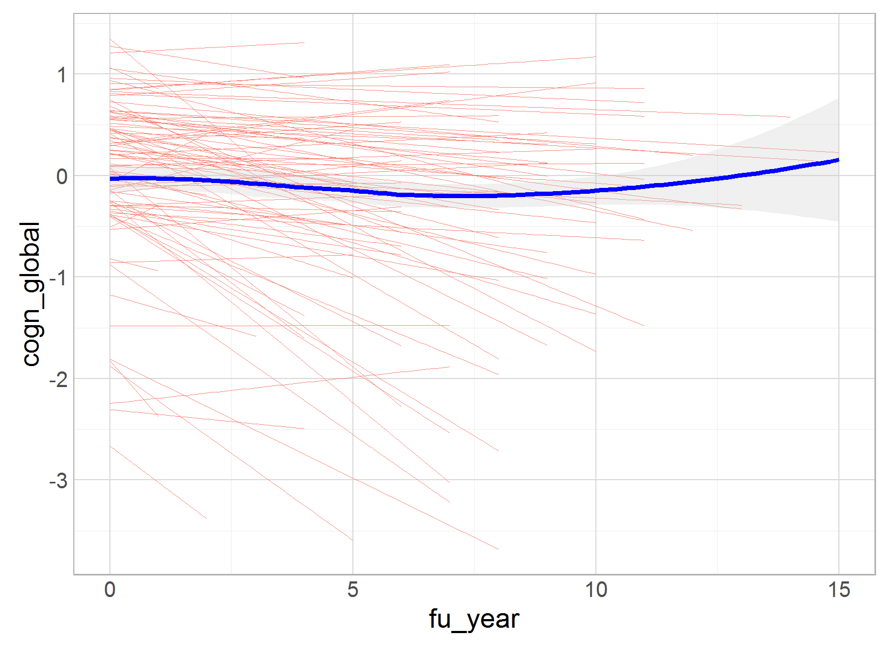
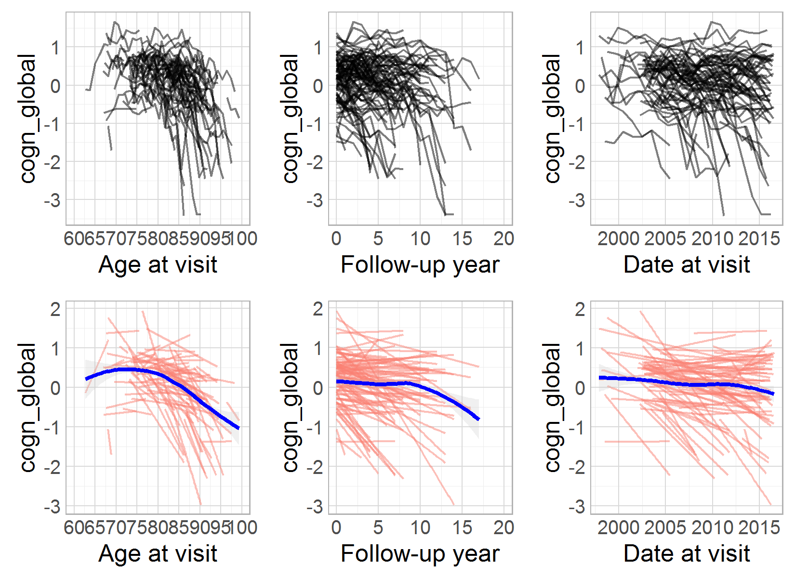
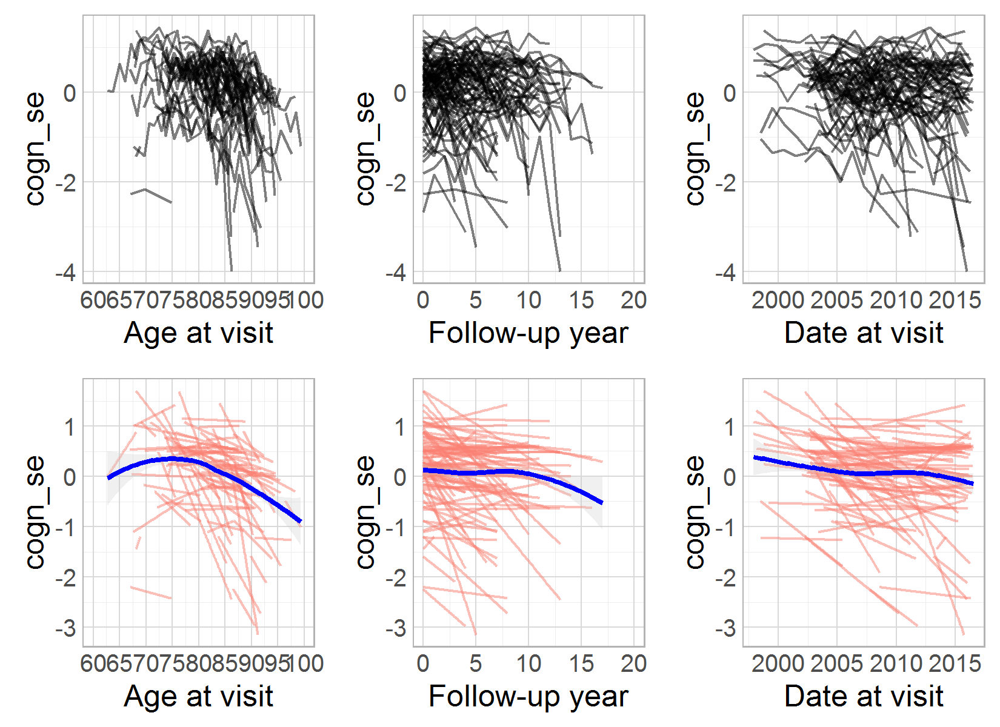
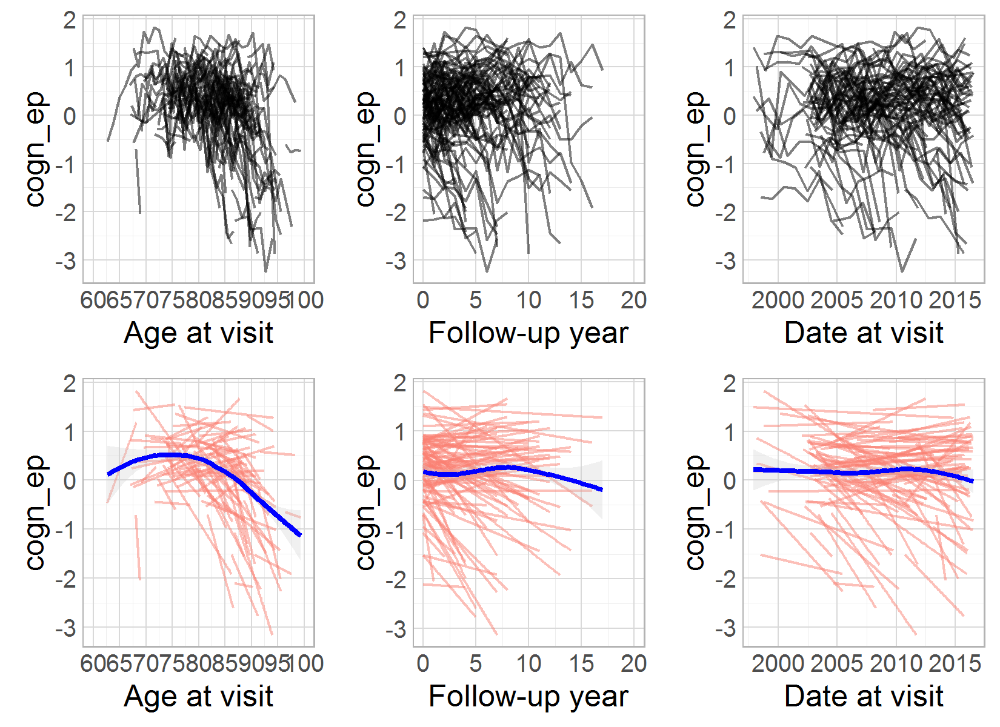
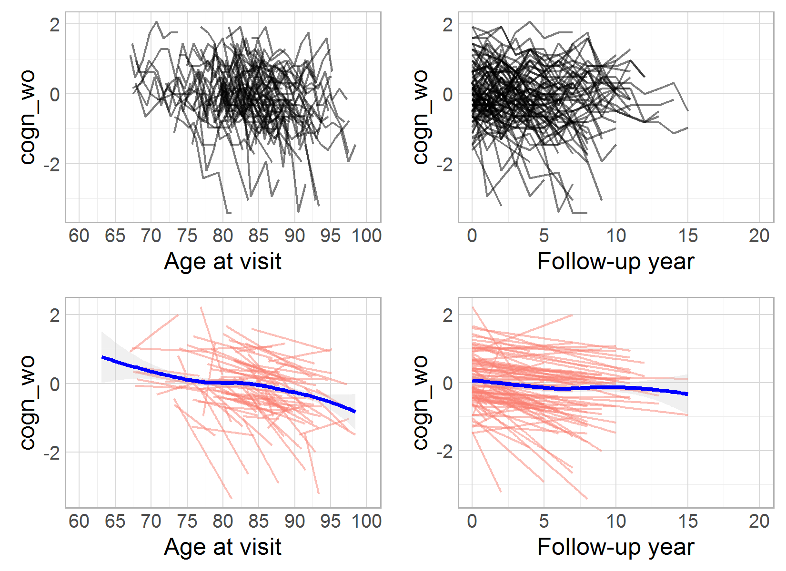
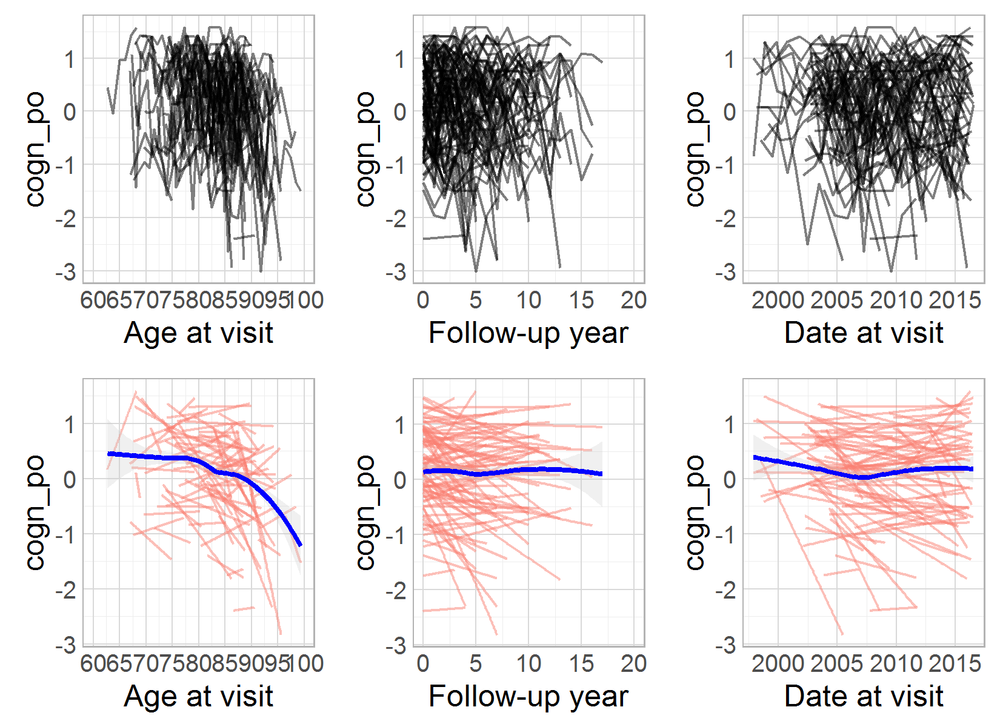
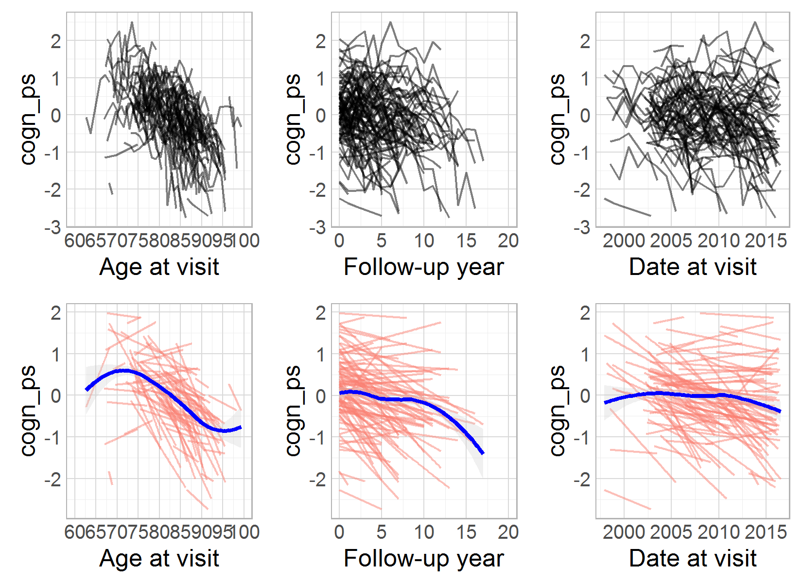
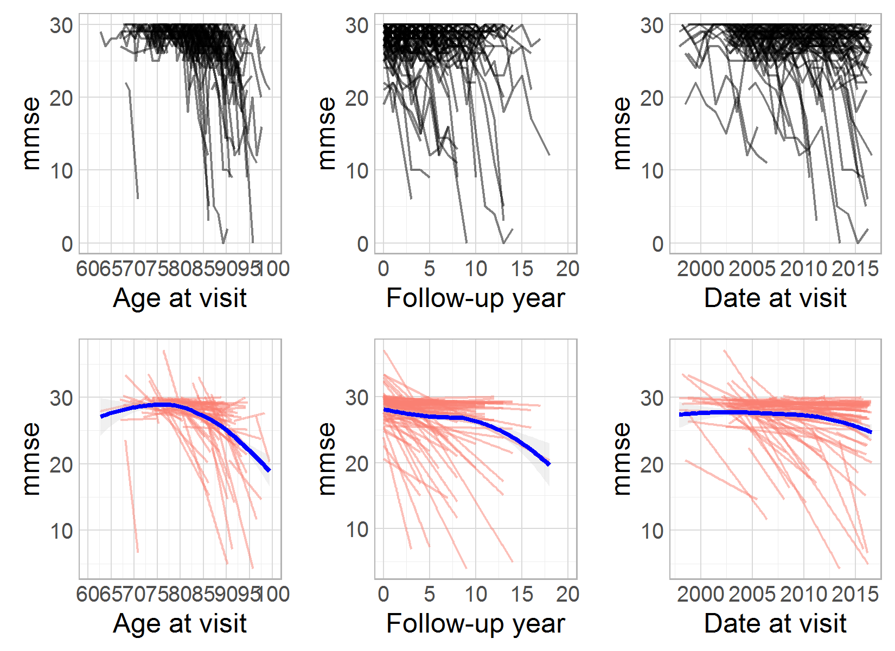
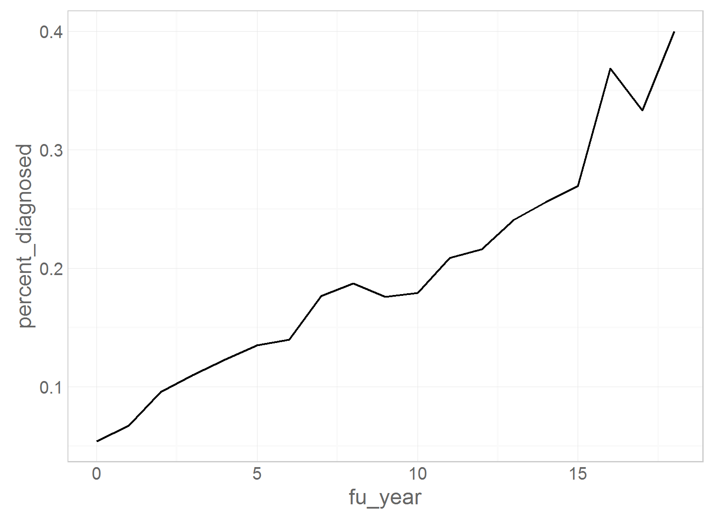
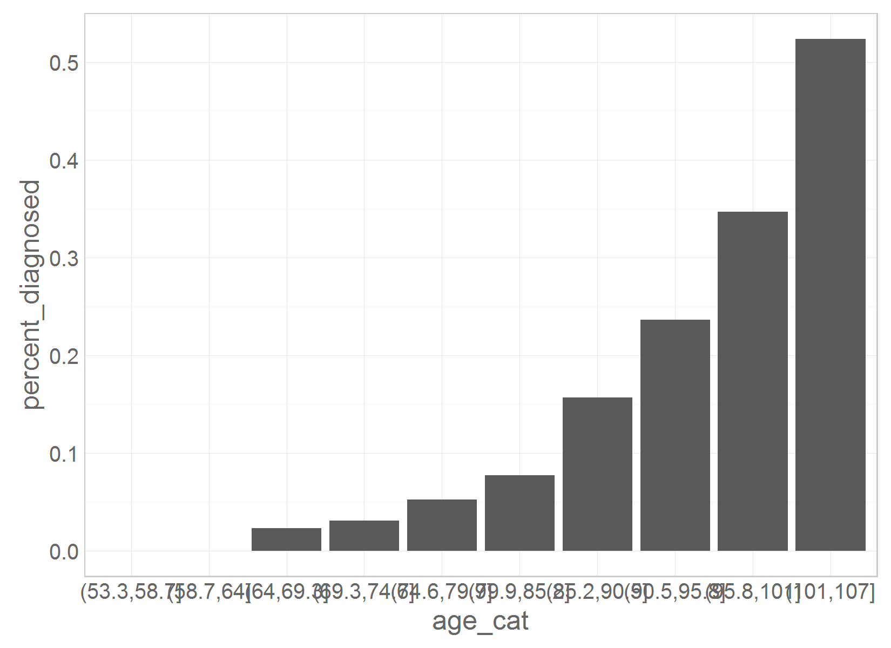

# MAP: initial variable review

<!-- These two chunks should be added in the beginning of every .Rmd that you want to source an .R script -->
<!--  The 1st mandatory chunck  -->
<!--  Set the working directory to the repository's base directory -->


<!--  The 2nd mandatory chunck  -->
<!-- Set the report-wide options, and point to the external code file. -->


<!-- Load 'sourced' R files.  Suppress the output when loading packages. --> 


<!-- Load the sources.  Suppress the output when loading sources. --> 


<!-- Load any Global functions and variables declared in the R file.  Suppress the output. --> 


<!-- Declare any global functions specific to a Rmd output.  Suppress the output. --> 


# (I) Exposition

> This report is a record of interaction with a data transfer object (dto) produced by `./manipulation/map/0-ellis-island.R`. 

The next section recaps this script, exposes the architecture of the DTO, and demonstrates the language of interacting with it.   

## (I.A) Ellis Island

> All data land on Ellis Island.

The script `0-ellis-island.R` is the first script in the analytic workflow. It accomplished the following: 

- (1) Reads in raw data file
- (2) Extract, combines, and exports metadata (specifically, variable names and labels, if provided) into `./data/meta/map/names-labels-live.csv`, which is updated every time Ellis Island script is executed.   
- (3) Augments raw metadata with instructions for renaming and classifying variables. The instructions are provided as manually entered values in `./data/meta/map/meta-data-map.csv`. They are used by automatic scripts in later manipulation and analysis.  
- (4) Combines unit and meta data into a single DTO to serve as a starting point to all subsequent analyses.   


<!-- Load the datasets.   -->

```
[1] "unitData" "metaData"
```

```
Source: local data frame [9,708 x 113]

       id study scaled_to.x agreeableness conscientiousness extraversion neo_altruism neo_conscientiousness neo_trust
    (int) (chr)       (chr)         (int)             (int)        (int)        (int)                 (int)     (int)
1    9121  MAP         MAP             NA                35           34           27                    35        25
2    9121  MAP         MAP             NA                35           34           27                    35        25
3    9121  MAP         MAP             NA                35           34           27                    35        25
4    9121  MAP         MAP             NA                35           34           27                    35        25
5    9121  MAP         MAP             NA                35           34           27                    35        25
6   33027  MAP         MAP             NA                NA           30           NA                    NA        NA
7   33027  MAP         MAP             NA                NA           30           NA                    NA        NA
8  204228  MAP         MAP             NA                NA           32           NA                    NA        NA
9  204228  MAP         MAP             NA                NA           32           NA                    NA        NA
10 204228  MAP         MAP             NA                NA           32           NA                    NA        NA
..    ...   ...         ...           ...               ...          ...          ...                   ...       ...
Variables not shown: openness (int), anxiety_10items (dbl), neuroticism_12 (int), neuroticism_6 (int), age_bl (dbl),
  age_death (dbl), died (int), educ (int), msex (int), race (int), spanish (int), apoe_genotype (int), alco_life (dbl),
  q3smo_bl (int), q4smo_bl (int), smoke_bl (int), smoking (int), fu_year (int), scaled_to.y (chr), cesdsum (int),
  r_depres (int), intrusion (dbl), neglifeevents (int), negsocexchange (dbl), nohelp (dbl), panas (dbl),
  perceivedstress (dbl), rejection (dbl), unsympathetic (dbl), dcfdx (int), dementia (int), r_stroke (int), cogn_ep
  (dbl), cogn_global (dbl), cogn_po (dbl), cogn_ps (dbl), cogn_se (dbl), cogn_wo (dbl), cts_bname (int), catfluency
  (int), cts_db (int), cts_delay (int), cts_df (int), cts_doperf (int), cts_ebdr (int), cts_ebmt (int), cts_idea (int),
  cts_lopair (int), mmse (dbl), cts_nccrtd (int), cts_pmat (int), cts_read_nart (int), cts_read_wrat (int), cts_sdmt
  (int), cts_story (int), cts_wli (int), cts_wlii (int), cts_wliii (int), age_at_visit (dbl), iadlsum (int), katzsum
  (int), rosbscl (int), rosbsum (int), vision (int), visionlog (dbl), fev (dbl), mep (dbl), mip (dbl), pvc (dbl), bun
  (int), ca (dbl), chlstrl (int), cl (int), co2 (int), crn (dbl), fasting (int), glucose (int), hba1c (dbl), hdlchlstrl
  (int), hdlratio (dbl), k (dbl), ldlchlstrl (int), na (int), alcohol_g (dbl), bmi (dbl), htm (dbl), phys5itemsum
  (dbl), wtkg (dbl), bp11 (chr), bp2 (chr), bp3 (int), bp31 (chr), hypertension_cum (int), dm_cum (int), thyroid_cum
  (int), chf_cum (int), claudication_cum (int), heart_cum (int), stroke_cum (int), vasc_3dis_sum (dbl), vasc_4dis_sum
  (dbl), vasc_risks_sum (dbl), gait_speed (dbl), gripavg (dbl)
```

```
Source: local data frame [113 x 9]

                    name                     label        type              name_new construct self_reported
                   (chr)                     (chr)       (chr)                 (chr)     (chr)         (lgl)
1                     id                        NA      design                    id        id         FALSE
2                  study                        NA      design                 study                      NA
3            scaled_to.x                        NA      design           scaled_to.x                      NA
4          agreeableness     NEO agreeableness-ROS personality         agreeableness                      NA
5      conscientiousness Conscientiousness-ROS/MAP personality     conscientiousness                      NA
6           extraversion  NEO extraversion-ROS/MAP personality          extraversion                      NA
7           neo_altruism    NEO altruism scale-MAP personality          neo_altruism                      NA
8  neo_conscientiousness NEO conscientiousness-MAP personality neo_conscientiousness                      NA
9              neo_trust             NEO trust-MAP personality             neo_trust                      NA
10              openness           NEO openess-ROS personality              openness                      NA
..                   ...                       ...         ...                   ...       ...           ...
Variables not shown: longitudinal (lgl), unit (chr), include (lgl)
```

### Meta

```r
dto[["metaData"]] %>%  
  DT::datatable(
    class   = 'cell-border stripe',
    caption = "This is a dynamic table of the metadata file. Edit at `./data/meta/map/meta-data-map.csv",
    filter  = "top",
    options = list(pageLength = 6, autoWidth = TRUE)
  )
```

<!--html_preserve--><div id="htmlwidget-6547" style="width:100%;height:auto;" class="datatables html-widget"></div>
<script type="application/json" data-for="htmlwidget-6547">{"x":{"data":[["1","2","3","4","5","6","7","8","9","10","11","12","13","14","15","16","17","18","19","20","21","22","23","24","25","26","27","28","29","30","31","32","33","34","35","36","37","38","39","40","41","42","43","44","45","46","47","48","49","50","51","52","53","54","55","56","57","58","59","60","61","62","63","64","65","66","67","68","69","70","71","72","73","74","75","76","77","78","79","80","81","82","83","84","85","86","87","88","89","90","91","92","93","94","95","96","97","98","99","100","101","102","103","104","105","106","107","108","109","110","111","112","113"],["id","study","scaled_to.x","agreeableness","conscientiousness","extraversion","neo_altruism","neo_conscientiousness","neo_trust","openness","anxiety_10items","neuroticism_12","neuroticism_6","age_bl","age_death","died","educ","msex","race","spanish","apoe_genotype","ldai_bl","q3smo_bl","q4smo_bl","smoke_bl","smoking","fu_year","scaled_to.y","cesdsum","r_depres","intrusion","neglifeevents","negsocexchange","nohelp","panas","perceivedstress","rejection","unsympathetic","dcfdx","dementia","r_stroke","cogn_ep","cogn_global","cogn_po","cogn_ps","cogn_se","cogn_wo","cts_bname","cts_catflu","cts_db","cts_delay","cts_df","cts_doperf","cts_ebdr","cts_ebmt","cts_idea","cts_lopair","cts_mmse30","cts_nccrtd","cts_pmat","cts_read_nart","cts_read_wrat","cts_sdmt","cts_story","cts_wli","cts_wlii","cts_wliii","age_at_visit","iadlsum","katzsum","rosbscl","rosbsum","vision","visionlog","fev","mep","mip","pvc","bun","ca","chlstrl","cl","co2","crn","fasting","glucose","hba1c","hdlchlstrl","hdlratio","k","ldlchlstrl","na","alcohol_g","bmi","htm","phys5itemsum","wtkg","bp11","bp2","bp3","bp31","hypertension_cum","dm_cum","thyroid_cum","chf_cum","claudication_cum","heart_cum","stroke_cum","vasc_3dis_sum","vasc_4dis_sum","vasc_risks_sum","gait_speed","gripavg"],[null,null,null,"NEO agreeableness-ROS","Conscientiousness-ROS/MAP","NEO extraversion-ROS/MAP","NEO altruism scale-MAP","NEO conscientiousness-MAP","NEO trust-MAP","NEO openess-ROS","Anxiety-10 item version - ROS and MAP","Neuroticism - 12 item version-RMM","Neuroticism - 6 item version - RMM","Age at baseline","Age at death","Indicator of death","Years of education","Gender","Participant's race","Spanish/Hispanic origin","ApoE genotype","Lifetime daily alcohol intake -baseline","Smoking quantity-baseline","Smoking duration-baseline","Smoking at baseline","Smoking","Follow-up year","No label found in codebook","CESD-Measure of depressive symptoms","Major depression dx-clinic rating","Negative social exchange-intrusion-MAP","Negative life events","Negative social exchange","Negative social exchange-help-MAP","Panas score","Perceived stress","Negative social exchange - rejection-MAP","Negative social exchange-unsymapathetic-MAP","Clinical dx summary","Dementia diagnosis","Clinical stroke dx","Calculated domain score-episodic memory","Global cognitive score","Calculated domain score - perceptual orientation","Calculated domain score - perceptual speed","Calculated domain score - semantic memory","Calculated domain score - working memory","Boston naming - 2014","Category fluency - 2014","Digits backwards - 2014","Logical memory IIa - 2014","Digits forwards - 2014","Digit ordering - 2014","East Boston story - delayed recall - 2014","East Boston story - immediate - 2014","Complex ideas - 2014","Line orientation - 2014","MMSE - 2014","Number comparison - 2014","Progressive Matrices - 2014","Reading test-NART-2014","Reading test - WRAT - 2014","Symbol digit modalitities - 2014","Logical memory Ia - immediate - 2014","Word list I- immediate- 2014","Word list II - delayed - 2014","Word list III - recognition - 2014","Age at cycle - fractional","Instrumental activities of daily liviing","Katz measure of disability","Rosow-Breslau scale","Rosow-Breslau scale","Vision acuity","Visual acuity","forced expiratory volume","maximal expiratory pressure","maximal inspiratory pressure","pulmonary vital capacity","Blood urea nitrogen","Calcium","Cholesterol","Chloride","Carbon Dioxide","Creatinine","Whether blood was collected on fasting participant","Glucose","Hemoglobin A1c","HDL cholesterol","HDL ratio","Potassium","LDL cholesterol","Sodium","Grams of alcohol per day","Body mass index","Height(meters)","Summary of self reported physical activity\nmeasure (in hours) ROS/MAP","Weight (kg)","Blood pressure measurement- sitting - trial 1","Blood pressure measurement- sitting - trial 2","Hx of Meds for HTN","Blood pressure measurement- standing","Medical conditions - hypertension - cumulative","Medical history - diabetes - cumulative","Medical Conditions - thyroid disease - cumulative","Medical Conditions - congestive heart failure -\ncumulative","Medical conditions - claudication -cumulative","Medical Conditions - heart - cumulative","Clinical Diagnoses - Stroke - cumulative","Vascular disease burden (3 items w/o chf)\nROS/MAP/MARS","Vascular disease burden (4 items) - MAP/MARS\nonly","Vascular disease risk factors","Gait Speed - MAP","Extremity strength"],["design","design","design","personality","personality","personality","personality","personality","personality","personality","personality","personality","personality","demographic","demographic","demographic","demographic","demographic","demographic","demographic","clinical","substance","substance","substance","substance","substance","design","design","psychological","psychological","psychological","psychological","psychological","psychological","psychological","psychological","psychological","psychological","clinical","cognitive","clinical","cognitive","cognitive","cognitive","cognitive","cognitive","cognitive","cognitive","cognitive","cognitive","cognitive","cognitive","cognitive","cognitive","cognitive","cognitive","cognitive","cognitive","cognitive","cognitive","cognitive","cognitive","cognitive","cognitive","cognitive","cognitive","cognitive","demographic","physical","physical","physical","physical","physical","physical","physical","physical","physical","physical","clinical","clinical","clinical","clinical","clinical","clinical","clinical","clinical","clinical","clinical","clinical","clinical","clinical","clinical","substance","physical","physical","physical","physical","clinical","clinical","clinical","clinical","clinical","clinical","clinical","clinical","clinical","clinical","clinical","clinical","clinical","clinical","physical","physical"],["id","study","scaled_to.x","agreeableness","conscientiousness","extraversion","neo_altruism","neo_conscientiousness","neo_trust","openness","anxiety_10items","neuroticism_12","neuroticism_6","age_bl","age_death","died","educ","msex","race","spanish","apoe_genotype","alco_life","q3smo_bl","q4smo_bl","smoke_bl","smoking","fu_year","scaled_to.y","cesdsum","r_depres","intrusion","neglifeevents","negsocexchange","nohelp","panas","perceivedstress","rejection","unsympathetic","dcfdx","dementia","r_stroke","cogn_ep","cogn_global","cogn_po","cogn_ps","cogn_se","cogn_wo","cts_bname","catfluency","cts_db","cts_delay","cts_df","cts_doperf","cts_ebdr","cts_ebmt","cts_idea","cts_lopair","mmse","cts_nccrtd","cts_pmat","cts_read_nart","cts_read_wrat","cts_sdmt","cts_story","cts_wli","cts_wlii","cts_wliii","age_at_visit","iadlsum","katzsum","rosbscl","rosbsum","vision","visionlog","fev","mep","mip","pvc","bun","ca","chlstrl","cl","co2","crn","fasting","glucose","hba1c","hdlchlstrl","hdlratio","k","ldlchlstrl","na","alcohol_g","bmi","htm","phys5itemsum","wtkg","bp11","bp2","bp3","bp31","hypertension_cum","dm_cum","thyroid_cum","chf_cum","claudication_cum","heart_cum","stroke_cum","vasc_3dis_sum","vasc_4dis_sum","vasc_risks_sum","gait_speed","gripavg"],["id","","","","","","","","","","","","","age","age","age","education","sex","race","race","apoe","alcohol","smoking","smoking","smoking","smoking","time","","","","","","","","","","","","cognition","dementia","stroke","episodic memory","global cognition","perceptual orientation","perceptual speed","semantic memory","working memory","semantic memory","semantic memory","working memory","episodic memory","working memory","working memory","episodic memory","episodic memory","verbal comprehension","perceptual orientation","dementia","perceptual speed","perceptual orientation","semantic memory","semantic memory","perceptual speed","episodic memory","episodic memory","episodic memory","episodic memory","","physact","physcap","physcap","physcap","physcap","physcap","physcap","physcap","physcap","physcap","","","","","","","","","","","","","","","alcohol","physique","physique","physact","physique","hypertension","hypertension","hypertension","hypertension","hypertension","diabetes","","cardio","","","stroke","","","","physcap","physcap"],[false,null,null,null,null,null,null,null,null,null,null,null,null,false,false,false,true,false,true,true,false,true,true,true,true,true,false,null,null,null,null,null,null,null,null,null,null,null,false,false,false,false,false,false,false,false,false,false,false,false,false,false,false,false,false,false,false,true,false,false,false,false,false,false,false,false,false,null,true,true,true,true,false,false,false,false,false,false,null,null,null,null,null,null,null,null,null,null,null,null,null,null,true,false,false,true,false,false,false,true,false,true,true,null,true,null,null,false,null,null,null,false,false],[false,null,null,null,null,null,null,null,null,null,null,null,null,false,false,false,false,false,false,false,false,false,false,false,false,false,true,null,null,null,null,null,null,null,null,null,null,null,true,true,true,true,true,true,true,true,true,true,true,true,true,true,true,true,true,true,true,true,true,true,true,true,true,true,true,true,true,null,true,true,true,true,true,true,true,true,true,true,null,null,null,null,null,null,null,null,null,null,null,null,null,null,false,true,true,null,true,true,true,true,true,true,true,null,true,null,null,true,null,null,null,true,true],["person","","","","","","","","","","","","","year","year","category","years","category","category","category","scale","drinks/day","cigarettes / day","years","category","category","time point","","","","","","","","","","","","category","0, 1","category","composite","composite","composite","composite","composite","composite","0 to 15","0 to 75","0 to 12","0 to 25","0 to 12","0 to 14","0 to 12","0 to 12","0 to 8","0 to 15","0 to 30","0 to 48","0 to 16","0 to 10","0 to 15","0 to 110","0 to 25","0 to 30","0 to 10","o to 10","","scale","scale","scale","scale","scale","scale","liters","cm H20","cm H20","liters","","","","","","","","","","","","","","","grams","kg/msq","meters","","kilos","","","","","","","","category","","","category","","","","min/sec","lbs"],[true,null,null,null,null,null,null,null,null,null,null,null,null,true,true,true,true,true,true,true,true,true,true,true,true,true,true,null,null,null,null,null,null,null,null,null,null,null,true,true,true,true,true,true,true,true,true,null,null,null,null,null,null,null,null,null,null,true,null,null,null,null,null,null,null,null,null,null,true,true,true,true,true,true,true,true,true,true,null,null,null,null,null,null,null,null,null,null,null,null,null,null,true,true,true,null,true,null,null,null,null,null,null,null,true,null,null,true,null,null,null,true,true]],"container":"<table class=\"cell-border stripe\">\n  <thead>\n    <tr>\n      <th> \u003c/th>\n      <th>name\u003c/th>\n      <th>label\u003c/th>\n      <th>type\u003c/th>\n      <th>name_new\u003c/th>\n      <th>construct\u003c/th>\n      <th>self_reported\u003c/th>\n      <th>longitudinal\u003c/th>\n      <th>unit\u003c/th>\n      <th>include\u003c/th>\n    \u003c/tr>\n  \u003c/thead>\n\u003c/table>","options":{"pageLength":6,"autoWidth":true,"order":[],"orderClasses":false,"columnDefs":[{"orderable":false,"targets":0}],"orderCellsTop":true,"lengthMenu":[6,10,25,50,100]},"callback":null,"caption":"<caption>This is a dynamic table of the metadata file. Edit at `./data/meta/map/meta-data-map.csv\u003c/caption>","filter":"top","filterHTML":"<tr>\n  <td>\u003c/td>\n  <td data-type=\"character\" style=\"vertical-align: top;\">\n    <div class=\"form-group has-feedback\" style=\"margin-bottom: auto;\">\n      <input type=\"search\" placeholder=\"All\" class=\"form-control\" style=\"width: 100%;\"/>\n      <span class=\"glyphicon glyphicon-remove-circle form-control-feedback\">\u003c/span>\n    \u003c/div>\n  \u003c/td>\n  <td data-type=\"character\" style=\"vertical-align: top;\">\n    <div class=\"form-group has-feedback\" style=\"margin-bottom: auto;\">\n      <input type=\"search\" placeholder=\"All\" class=\"form-control\" style=\"width: 100%;\"/>\n      <span class=\"glyphicon glyphicon-remove-circle form-control-feedback\">\u003c/span>\n    \u003c/div>\n  \u003c/td>\n  <td data-type=\"character\" style=\"vertical-align: top;\">\n    <div class=\"form-group has-feedback\" style=\"margin-bottom: auto;\">\n      <input type=\"search\" placeholder=\"All\" class=\"form-control\" style=\"width: 100%;\"/>\n      <span class=\"glyphicon glyphicon-remove-circle form-control-feedback\">\u003c/span>\n    \u003c/div>\n  \u003c/td>\n  <td data-type=\"character\" style=\"vertical-align: top;\">\n    <div class=\"form-group has-feedback\" style=\"margin-bottom: auto;\">\n      <input type=\"search\" placeholder=\"All\" class=\"form-control\" style=\"width: 100%;\"/>\n      <span class=\"glyphicon glyphicon-remove-circle form-control-feedback\">\u003c/span>\n    \u003c/div>\n  \u003c/td>\n  <td data-type=\"character\" style=\"vertical-align: top;\">\n    <div class=\"form-group has-feedback\" style=\"margin-bottom: auto;\">\n      <input type=\"search\" placeholder=\"All\" class=\"form-control\" style=\"width: 100%;\"/>\n      <span class=\"glyphicon glyphicon-remove-circle form-control-feedback\">\u003c/span>\n    \u003c/div>\n  \u003c/td>\n  <td data-type=\"logical\" style=\"vertical-align: top;\">\n    <div class=\"form-group has-feedback\" style=\"margin-bottom: auto;\">\n      <input type=\"search\" placeholder=\"All\" class=\"form-control\" style=\"width: 100%;\"/>\n      <span class=\"glyphicon glyphicon-remove-circle form-control-feedback\">\u003c/span>\n    \u003c/div>\n    <div style=\"width: 100%; display: none;\">\n      <select multiple=\"multiple\" style=\"width: 100%;\">\n        <option value=\"true\">true\u003c/option>\n        <option value=\"false\">false\u003c/option>\n        <option value=\"na\">na\u003c/option>\n      \u003c/select>\n    \u003c/div>\n  \u003c/td>\n  <td data-type=\"logical\" style=\"vertical-align: top;\">\n    <div class=\"form-group has-feedback\" style=\"margin-bottom: auto;\">\n      <input type=\"search\" placeholder=\"All\" class=\"form-control\" style=\"width: 100%;\"/>\n      <span class=\"glyphicon glyphicon-remove-circle form-control-feedback\">\u003c/span>\n    \u003c/div>\n    <div style=\"width: 100%; display: none;\">\n      <select multiple=\"multiple\" style=\"width: 100%;\">\n        <option value=\"true\">true\u003c/option>\n        <option value=\"false\">false\u003c/option>\n        <option value=\"na\">na\u003c/option>\n      \u003c/select>\n    \u003c/div>\n  \u003c/td>\n  <td data-type=\"character\" style=\"vertical-align: top;\">\n    <div class=\"form-group has-feedback\" style=\"margin-bottom: auto;\">\n      <input type=\"search\" placeholder=\"All\" class=\"form-control\" style=\"width: 100%;\"/>\n      <span class=\"glyphicon glyphicon-remove-circle form-control-feedback\">\u003c/span>\n    \u003c/div>\n  \u003c/td>\n  <td data-type=\"logical\" style=\"vertical-align: top;\">\n    <div class=\"form-group has-feedback\" style=\"margin-bottom: auto;\">\n      <input type=\"search\" placeholder=\"All\" class=\"form-control\" style=\"width: 100%;\"/>\n      <span class=\"glyphicon glyphicon-remove-circle form-control-feedback\">\u003c/span>\n    \u003c/div>\n    <div style=\"width: 100%; display: none;\">\n      <select multiple=\"multiple\" style=\"width: 100%;\">\n        <option value=\"true\">true\u003c/option>\n        <option value=\"false\">false\u003c/option>\n        <option value=\"na\">na\u003c/option>\n      \u003c/select>\n    \u003c/div>\n  \u003c/td>\n\u003c/tr>"},"evals":[],"jsHooks":[]}</script><!--/html_preserve-->


<!-- Inspect the datasets.   -->


<!-- Tweak the datasets.   -->


<!-- Basic table view.   -->


<!-- Basic graph view.   -->


# (II) Development

Details  were requested about the following items (including the availability of treatment for each) :

1. N at each wave
2. Cognitive capability measures
3. Dementia diagnosis
4. Education
5. Social class
6. Physique
7. Smoking  habits
8. Alcohol consumption
9. Social engagement
10. Physical activitiy
11. APOE status
12. Physical capability measures 
13. Cardiovascular disease
14. Hypertension
15. Stroke
16. Diabetes

### General comments

for **all variables** conditions, declare whether they are   
- self reported or diagnosed 
- time variant or invariant (study entry only) 
- treatment or management of the conditions is available
- provide levels and labels for items with categorical responses 
- specific description of measurement encoding 

## (1) N at each wave

The following pattern of attrition has been observed in the data

```r
dto[["metaData"]] %>% dplyr::filter(name=="fu_year")
```

```
     name          label   type name_new construct self_reported longitudinal       unit include
1 fu_year Follow-up year design  fu_year      time         FALSE         TRUE time point    TRUE
```

```r
ds %>% 
  dplyr::group_by_("fu_year") %>%
  dplyr::summarize(sample_size=n())
```

```
Source: local data frame [18 x 2]

   fu_year sample_size
     (int)       (int)
1        0        1695
2        1        1467
3        2        1266
4        3        1078
5        4         908
6        5         740
7        6         666
8        7         558
9        8         466
10       9         342
11      10         237
12      11         133
13      12          56
14      13          44
15      14          28
16      15          21
17      16           2
18      NA           1
```


## (2) Cognitive capability measures
The following measures of cognitive capability are available in the present instance of MAP data:


```r
dto[["metaData"]] %>% 
  dplyr::filter(type=="cognitive") %>% 
  dplyr::select(-name,-type,-name_new, -include) %>%
  dplyr::arrange(construct)
```

```
                                              label              construct self_reported longitudinal      unit
1                                Dementia diagnosis               dementia         FALSE         TRUE      0, 1
2                                       MMSE - 2014               dementia          TRUE         TRUE   0 to 30
3           Calculated domain score-episodic memory        episodic memory         FALSE         TRUE composite
4                         Logical memory IIa - 2014        episodic memory         FALSE         TRUE   0 to 25
5         East Boston story - delayed recall - 2014        episodic memory         FALSE         TRUE   0 to 12
6              East Boston story - immediate - 2014        episodic memory         FALSE         TRUE   0 to 12
7              Logical memory Ia - immediate - 2014        episodic memory         FALSE         TRUE   0 to 25
8                      Word list I- immediate- 2014        episodic memory         FALSE         TRUE   0 to 30
9                     Word list II - delayed - 2014        episodic memory         FALSE         TRUE   0 to 10
10               Word list III - recognition - 2014        episodic memory         FALSE         TRUE   o to 10
11                           Global cognitive score       global cognition         FALSE         TRUE composite
12 Calculated domain score - perceptual orientation perceptual orientation         FALSE         TRUE composite
13                          Line orientation - 2014 perceptual orientation         FALSE         TRUE   0 to 15
14                      Progressive Matrices - 2014 perceptual orientation         FALSE         TRUE   0 to 16
15       Calculated domain score - perceptual speed       perceptual speed         FALSE         TRUE composite
16                         Number comparison - 2014       perceptual speed         FALSE         TRUE   0 to 48
17                 Symbol digit modalitities - 2014       perceptual speed         FALSE         TRUE  0 to 110
18        Calculated domain score - semantic memory        semantic memory         FALSE         TRUE composite
19                             Boston naming - 2014        semantic memory         FALSE         TRUE   0 to 15
20                          Category fluency - 2014        semantic memory         FALSE         TRUE   0 to 75
21                           Reading test-NART-2014        semantic memory         FALSE         TRUE   0 to 10
22                       Reading test - WRAT - 2014        semantic memory         FALSE         TRUE   0 to 15
23                             Complex ideas - 2014   verbal comprehension         FALSE         TRUE    0 to 8
24         Calculated domain score - working memory         working memory         FALSE         TRUE composite
25                          Digits backwards - 2014         working memory         FALSE         TRUE   0 to 12
26                           Digits forwards - 2014         working memory         FALSE         TRUE   0 to 12
27                            Digit ordering - 2014         working memory         FALSE         TRUE   0 to 14
```
Keep for modelling only composite score of cognitive domains


```r
dto[["metaData"]] %>% 
  dplyr::filter(type=="cognitive", include==TRUE) %>% 
  dplyr::select(-type,-name_new, - include) %>%
  dplyr::arrange(construct)
```

```
         name                                            label              construct self_reported longitudinal
1    dementia                               Dementia diagnosis               dementia         FALSE         TRUE
2  cts_mmse30                                      MMSE - 2014               dementia          TRUE         TRUE
3     cogn_ep          Calculated domain score-episodic memory        episodic memory         FALSE         TRUE
4 cogn_global                           Global cognitive score       global cognition         FALSE         TRUE
5     cogn_po Calculated domain score - perceptual orientation perceptual orientation         FALSE         TRUE
6     cogn_ps       Calculated domain score - perceptual speed       perceptual speed         FALSE         TRUE
7     cogn_se        Calculated domain score - semantic memory        semantic memory         FALSE         TRUE
8     cogn_wo         Calculated domain score - working memory         working memory         FALSE         TRUE
       unit
1      0, 1
2   0 to 30
3 composite
4 composite
5 composite
6 composite
7 composite
8 composite
```

Now we observe how the crossectional distribution of age was changing across follow-up points

```r
dto[["unitData"]] %>% 
  dplyr::select(id,fu_year, cogn_global) %>% 
  dplyr::filter(!is.na(cogn_global)) %>%
  dplyr::group_by(fu_year) %>% 
  dplyr::summarize(average_global_cognition = round(mean(cogn_global),3),
                   sd = sprintf("%0.2f",sd(cogn_global)), 
                   observed =n()) 
```

```
Source: local data frame [17 x 4]

   fu_year average_global_cognition    sd observed
     (int)                    (dbl) (chr)    (int)
1        0                   -0.029  0.70     1686
2        1                    0.004  0.70     1444
3        2                   -0.010  0.75     1242
4        3                   -0.018  0.80     1050
5        4                   -0.053  0.84      881
6        5                   -0.077  0.90      716
7        6                   -0.120  0.93      636
8        7                   -0.134  0.92      533
9        8                   -0.150  0.92      440
10       9                   -0.139  0.88      320
11      10                   -0.121  0.93      222
12      11                   -0.260  1.08      123
13      12                   -0.193  1.12       53
14      13                   -0.332  1.30       41
15      14                   -0.174  1.14       26
16      15                   -0.246  1.25       20
17      16                    0.661  0.11        2
```

Individual graphs could be produced with the following script



### Global
Global cognitive score


### Semantic
 Calculated domain score - semantic memory



### Episodic 
 Calculated domain score-episodic memory


### Working 
 Calculated domain score - working memory



### Perceptual 
Calculated domain score - perceptual orientation


### Speed
 Calculated domain score - perceptual speed


### MMSE 
Mini mental state exam 



## (3) Dementia
 Dementia diagnosis

```
      name              label      type name_new construct self_reported longitudinal unit include
1 dementia Dementia diagnosis cognitive dementia  dementia         FALSE         TRUE 0, 1    TRUE
```

```
Source: local data frame [17 x 3]

   fu_year percent_diagnosed observed_n
     (int)             (dbl)      (int)
1        0        0.05726092       1694
2        1        0.06717452       1444
3        2        0.10008071       1239
4        3        0.11601151       1043
5        4        0.12013730        874
6        5        0.14344262        732
7        6        0.15160796        653
8        7        0.17765568        546
9        8        0.19376392        449
10       9        0.18327974        311
11      10        0.17452830        212
12      11        0.22018349        109
13      12        0.20000000         55
14      13        0.22727273         44
15      14        0.25925926         27
16      15        0.26315789         19
17      16        0.00000000          2
```



```
Source: local data frame [10 x 3]

       age_cat percent_diagnosed observed_n
        (fctr)             (dbl)      (int)
1  (53.3,58.7]        0.00000000         30
2    (58.7,64]        0.00000000         93
3    (64,69.3]        0.02331606        386
4  (69.3,74.6]        0.03109453        804
5  (74.6,79.9]        0.05242967       1564
6  (79.9,85.2]        0.07741692       2648
7  (85.2,90.5]        0.15722772       2525
8  (90.5,95.8]        0.23658751       1137
9   (95.8,101]        0.34693878        245
10   (101,107]        0.52380952         21
```




## (4) Education


```
  name              label        type name_new construct self_reported longitudinal  unit include
1 educ Years of education demographic     educ education          TRUE        FALSE years    TRUE
```

```
Source: local data frame [27 x 2]

    educ count
   (int) (int)
1      0     4
2      2     8
3      3     9
4      4    17
5      5    21
6      6    45
7      7    26
8      8   166
9      9    71
10    10   161
..   ...   ...
```

```
Source: local data frame [18 x 4]

   fu_year average_years_edu       SD observed_n
     (int)             (dbl)    (dbl)      (int)
1        0          14.48869 3.279858       1680
2        1          14.61486 3.196754       1467
3        2          14.59874 3.163047       1266
4        3          14.63729 3.143604       1078
5        4          14.65749 3.142426        908
6        5          14.62973 3.083973        740
7        6          14.52853 3.161792        666
8        7          14.73297 2.997070        558
9        8          14.81330 2.924409        466
10       9          14.69298 2.933657        342
11      10          14.86498 3.052978        237
12      11          14.94737 2.818542        133
13      12          15.03571 3.098177         56
14      13          15.43182 3.060610         44
15      14          15.60714 2.685203         28
16      15          15.52381 2.731649         21
17      16          15.00000 1.414214          2
18      NA          12.00000      NaN          1
```

## (5) Social class
No indicator of social class if found in our version of MAP data

## (6) BMI


```
  name           label     type name_new construct self_reported longitudinal   unit include
1  bmi Body mass index physical      bmi  physique         FALSE         TRUE kg/msq    TRUE
2  htm  Height(meters) physical      htm  physique         FALSE         TRUE meters    TRUE
3 wtkg     Weight (kg) physical     wtkg  physique         FALSE         TRUE  kilos    TRUE
```

```
Source: local data frame [17 x 4]

   fu_year average_bmi       SD observed_n
     (int)       (dbl)    (dbl)      (int)
1        0    27.16808 5.325645       1643
2        1    27.27554 5.261774       1395
3        2    27.17962 5.244885       1177
4        3    27.17739 5.357885        973
5        4    27.00213 5.062759        805
6        5    26.92788 5.391633        629
7        6    26.56684 5.183859        526
8        7    26.88239 5.294955        448
9        8    26.68655 5.340990        343
10       9    26.91890 5.848888        272
11      10    26.23854 4.726430        176
12      11    26.26217 4.993561        104
13      12    25.33696 4.337400         42
14      13    26.22375 4.210867         29
15      14    25.71626 4.309203         23
16      15    25.07465 4.102202         16
17      16    23.05176      NaN          1
```
