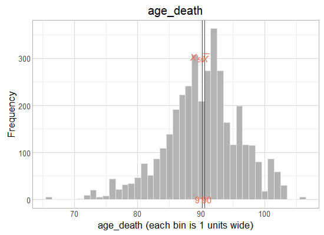

# MAP: initial variable review

<!-- These two chunks should be added in the beginning of every .Rmd that you want to source an .R script -->
<!--  The 1st mandatory chunck  -->
<!--  Set the working directory to the repository's base directory -->


<!--  The 2nd mandatory chunck  -->
<!-- Set the report-wide options, and point to the external code file. -->


<!-- Load 'sourced' R files.  Suppress the output when loading packages. --> 


<!-- Load the sources.  Suppress the output when loading sources. --> 


<!-- Load any Global functions and variables declared in the R file.  Suppress the output. --> 


<!-- Declare any global functions specific to a Rmd output.  Suppress the output. --> 


# (I) Exposition

> This report is a record of interaction with a data transfer object (dto) produced by `./manipulation/map/0-ellis-island.R`. 

The next section recaps this script, exposes the architecture of the DTO, and demonstrates the language of interacting with it.   

## (I.A) Ellis Island

> All data land on Ellis Island.

The script `0-ellis-island.R` is the first script in the analytic workflow. It accomplished the following: 

- (1) Reads in raw data file
- (2) Extract, combines, and exports metadata (specifically, variable names and labels, if provided) into `./data/meta/map/names-labels-live.csv`, which is updated every time Ellis Island script is executed.   
- (3) Augments raw metadata with instructions for renaming and classifying variables. The instructions are provided as manually entered values in `./data/meta/map/meta-data-map.csv`. They are used by automatic scripts in later manipulation and analysis.  
- (4) Combines unit and meta data into a single DTO to serve as a starting point to all subsequent analyses.   


<!-- Load the datasets.   -->

```
[1] "unitData" "metaData"
```

```
Source: local data frame [9,708 x 26]

       id   age_bl  msex  race  educ fu_year age_death  died age_at_visit iadlsum cts_mmse30 cts_catflu dementia
    (int)    (dbl) (int) (int) (int)   (int)     (dbl) (int)        (dbl)   (int)      (dbl)      (int)    (int)
1    9121 79.96988     0     1    12       0        NA     0     79.96988       0         29         40        0
2    9121 79.96988     0     1    12       1        NA     0     81.08145       0         29         43        0
3    9121 79.96988     0     1    12       2        NA     0     81.61259       0         30         48        0
4    9121 79.96988     0     1    12       3        NA     0     82.59548       0         30         49        0
5    9121 79.96988     0     1    12       4        NA     0     83.62218       0         29         45       NA
6   33027 81.00753     0     1    14       0        NA     0     81.00753       5         29         20        0
7   33027 81.00753     0     1    14       1        NA     0     82.13552       3         NA         NA       NA
8  204228 65.21561     1     1     8       0        NA     0     65.21561       0         27         31        0
9  204228 65.21561     1     1     8       2        NA     0     68.30116       0         25         27        0
10 204228 65.21561     1     1     8       3        NA     0     69.35524       0         28         26        0
..    ...      ...   ...   ...   ...     ...       ...   ...          ...     ...        ...        ...      ...
Variables not shown: bmi (dbl), phys5itemsum (dbl), q3smo_bl (int), q4smo_bl (int), smoke_bl (int), smoking (int),
  ldai_bl (dbl), dm_cum (int), hypertension_cum (int), stroke_cum (int), r_stroke (int), katzsum (int), rosbscl (int)
```

```
Source: local data frame [26 x 4]

           name                                    label     name_new       type
         (fctr)                                   (fctr)       (fctr)     (fctr)
1            id                                       NA           id     design
2        age_bl                          Age at baseline       age_bl       demo
3          msex                                   Gender         msex       demo
4          race                       Participant's race         race       demo
5          educ                       Years of education         educ       demo
6       fu_year                           Follow-up year      fu_year     design
7     age_death                             Age at death    age_death       demo
8          died                       Indicator of death         died       demo
9  age_at_visit                Age at cycle - fractional age_at_visit       demo
10      iadlsum Instrumental activities of daily liviing      iadlsum activities
..          ...                                      ...          ...        ...
```

### Meta

```r
dto[["metaData"]] %>%  
  DT::datatable(
    class   = 'cell-border stripe',
    caption = "This is a dynamic table of the metadata file. Edit at `./data/meta/map/meta-data-map.csv",
    filter  = "top",
    options = list(pageLength = 6, autoWidth = TRUE)
  )
```

<!--html_preserve--><div id="htmlwidget-1294" style="width:100%;height:auto;" class="datatables html-widget"></div>
<script type="application/json" data-for="htmlwidget-1294">{"x":{"filter":"top","filterHTML":"<tr>\n  <td>\u003c/td>\n  <td data-type=\"factor\" style=\"vertical-align: top;\">\n    <div class=\"form-group has-feedback\" style=\"margin-bottom: auto;\">\n      <input type=\"search\" placeholder=\"All\" class=\"form-control\" style=\"width: 100%;\"/>\n      <span class=\"glyphicon glyphicon-remove-circle form-control-feedback\">\u003c/span>\n    \u003c/div>\n    <div style=\"width: 100%; display: none;\">\n      <select multiple=\"multiple\" style=\"width: 100%;\">\n        <option value=\"age_at_visit\">age_at_visit\u003c/option>\n        <option value=\"age_bl\">age_bl\u003c/option>\n        <option value=\"age_death\">age_death\u003c/option>\n        <option value=\"bmi\">bmi\u003c/option>\n        <option value=\"cts_catflu\">cts_catflu\u003c/option>\n        <option value=\"cts_mmse30\">cts_mmse30\u003c/option>\n        <option value=\"dementia\">dementia\u003c/option>\n        <option value=\"died\">died\u003c/option>\n        <option value=\"dm_cum\">dm_cum\u003c/option>\n        <option value=\"educ\">educ\u003c/option>\n        <option value=\"fu_year\">fu_year\u003c/option>\n        <option value=\"hypertension_cum\">hypertension_cum\u003c/option>\n        <option value=\"iadlsum\">iadlsum\u003c/option>\n        <option value=\"id\">id\u003c/option>\n        <option value=\"katzsum\">katzsum\u003c/option>\n        <option value=\"ldai_bl\">ldai_bl\u003c/option>\n        <option value=\"msex\">msex\u003c/option>\n        <option value=\"phys5itemsum\">phys5itemsum\u003c/option>\n        <option value=\"q3smo_bl\">q3smo_bl\u003c/option>\n        <option value=\"q4smo_bl\">q4smo_bl\u003c/option>\n        <option value=\"r_stroke\">r_stroke\u003c/option>\n        <option value=\"race\">race\u003c/option>\n        <option value=\"rosbscl\">rosbscl\u003c/option>\n        <option value=\"smoke_bl\">smoke_bl\u003c/option>\n        <option value=\"smoking\">smoking\u003c/option>\n        <option value=\"stroke_cum\">stroke_cum\u003c/option>\n      \u003c/select>\n    \u003c/div>\n  \u003c/td>\n  <td data-type=\"factor\" style=\"vertical-align: top;\">\n    <div class=\"form-group has-feedback\" style=\"margin-bottom: auto;\">\n      <input type=\"search\" placeholder=\"All\" class=\"form-control\" style=\"width: 100%;\"/>\n      <span class=\"glyphicon glyphicon-remove-circle form-control-feedback\">\u003c/span>\n    \u003c/div>\n    <div style=\"width: 100%; display: none;\">\n      <select multiple=\"multiple\" style=\"width: 100%;\">\n        <option value=\"Age at baseline\">Age at baseline\u003c/option>\n        <option value=\"Age at cycle - fractional\">Age at cycle - fractional\u003c/option>\n        <option value=\"Age at death\">Age at death\u003c/option>\n        <option value=\"Body mass index\">Body mass index\u003c/option>\n        <option value=\"Category fluency - 2014\">Category fluency - 2014\u003c/option>\n        <option value=\"Clinical Diagnoses - Stroke - cumulative\">Clinical Diagnoses - Stroke - cumulative\u003c/option>\n        <option value=\"Clinical stroke dx\">Clinical stroke dx\u003c/option>\n        <option value=\"Dementia diagnosis\">Dementia diagnosis\u003c/option>\n        <option value=\"Follow-up year\">Follow-up year\u003c/option>\n        <option value=\"Gender\">Gender\u003c/option>\n        <option value=\"Indicator of death\">Indicator of death\u003c/option>\n        <option value=\"Instrumental activities of daily liviing\">Instrumental activities of daily liviing\u003c/option>\n        <option value=\"Katz measure of disability\">Katz measure of disability\u003c/option>\n        <option value=\"Lifetime daily alcohol intake -baseline\">Lifetime daily alcohol intake -baseline\u003c/option>\n        <option value=\"Medical conditions - hypertension - cumulative\">Medical conditions - hypertension - cumulative\u003c/option>\n        <option value=\"Medical history - diabetes - cumulative\">Medical history - diabetes - cumulative\u003c/option>\n        <option value=\"MMSE - 2014\">MMSE - 2014\u003c/option>\n        <option value=\"Participant&#39;s race\">Participant's race\u003c/option>\n        <option value=\"Rosow-Breslau scale\">Rosow-Breslau scale\u003c/option>\n        <option value=\"Smoking\">Smoking\u003c/option>\n        <option value=\"Smoking at baseline\">Smoking at baseline\u003c/option>\n        <option value=\"Smoking duration-baseline\">Smoking duration-baseline\u003c/option>\n        <option value=\"Smoking quantity-baseline\">Smoking quantity-baseline\u003c/option>\n        <option value=\"Summary of self reported physical activity&#10; measure (in hours) ROS/MAP\">Summary of self reported physical activity\n measure (in hours) ROS/MAP\u003c/option>\n        <option value=\"Years of education\">Years of education\u003c/option>\n      \u003c/select>\n    \u003c/div>\n  \u003c/td>\n  <td data-type=\"factor\" style=\"vertical-align: top;\">\n    <div class=\"form-group has-feedback\" style=\"margin-bottom: auto;\">\n      <input type=\"search\" placeholder=\"All\" class=\"form-control\" style=\"width: 100%;\"/>\n      <span class=\"glyphicon glyphicon-remove-circle form-control-feedback\">\u003c/span>\n    \u003c/div>\n    <div style=\"width: 100%; display: none;\">\n      <select multiple=\"multiple\" style=\"width: 100%;\">\n        <option value=\"age_at_visit\">age_at_visit\u003c/option>\n        <option value=\"age_bl\">age_bl\u003c/option>\n        <option value=\"age_death\">age_death\u003c/option>\n        <option value=\"alco_life\">alco_life\u003c/option>\n        <option value=\"bmi\">bmi\u003c/option>\n        <option value=\"catfluency\">catfluency\u003c/option>\n        <option value=\"dementia\">dementia\u003c/option>\n        <option value=\"died\">died\u003c/option>\n        <option value=\"dm_cum\">dm_cum\u003c/option>\n        <option value=\"educ\">educ\u003c/option>\n        <option value=\"fu_year\">fu_year\u003c/option>\n        <option value=\"hypertension_cum\">hypertension_cum\u003c/option>\n        <option value=\"iadlsum\">iadlsum\u003c/option>\n        <option value=\"id\">id\u003c/option>\n        <option value=\"katzsum\">katzsum\u003c/option>\n        <option value=\"mmse\">mmse\u003c/option>\n        <option value=\"msex\">msex\u003c/option>\n        <option value=\"phys5itemsum\">phys5itemsum\u003c/option>\n        <option value=\"q3smo_bl\">q3smo_bl\u003c/option>\n        <option value=\"q4smo_bl\">q4smo_bl\u003c/option>\n        <option value=\"r_stroke\">r_stroke\u003c/option>\n        <option value=\"race\">race\u003c/option>\n        <option value=\"rosbscl\">rosbscl\u003c/option>\n        <option value=\"smoke_bl\">smoke_bl\u003c/option>\n        <option value=\"smoking\">smoking\u003c/option>\n        <option value=\"stroke_cum\">stroke_cum\u003c/option>\n      \u003c/select>\n    \u003c/div>\n  \u003c/td>\n  <td data-type=\"factor\" style=\"vertical-align: top;\">\n    <div class=\"form-group has-feedback\" style=\"margin-bottom: auto;\">\n      <input type=\"search\" placeholder=\"All\" class=\"form-control\" style=\"width: 100%;\"/>\n      <span class=\"glyphicon glyphicon-remove-circle form-control-feedback\">\u003c/span>\n    \u003c/div>\n    <div style=\"width: 100%; display: none;\">\n      <select multiple=\"multiple\" style=\"width: 100%;\">\n        <option value=\"activities\">activities\u003c/option>\n        <option value=\"cognitive\">cognitive\u003c/option>\n        <option value=\"demo\">demo\u003c/option>\n        <option value=\"design\">design\u003c/option>\n        <option value=\"medical\">medical\u003c/option>\n        <option value=\"physical\">physical\u003c/option>\n        <option value=\"substance\">substance\u003c/option>\n      \u003c/select>\n    \u003c/div>\n  \u003c/td>\n\u003c/tr>","caption":"<caption>This is a dynamic table of the metadata file. Edit at `./data/meta/map/meta-data-map.csv\u003c/caption>","data":[["1","2","3","4","5","6","7","8","9","10","11","12","13","14","15","16","17","18","19","20","21","22","23","24","25","26"],["id","age_bl","msex","race","educ","fu_year","age_death","died","age_at_visit","iadlsum","cts_mmse30","cts_catflu","dementia","bmi","phys5itemsum","q3smo_bl","q4smo_bl","smoke_bl","smoking","ldai_bl","dm_cum","hypertension_cum","stroke_cum","r_stroke","katzsum","rosbscl"],[null,"Age at baseline","Gender","Participant's race","Years of education","Follow-up year","Age at death","Indicator of death","Age at cycle - fractional","Instrumental activities of daily liviing","MMSE - 2014","Category fluency - 2014","Dementia diagnosis","Body mass index","Summary of self reported physical activity\n measure (in hours) ROS/MAP","Smoking quantity-baseline","Smoking duration-baseline","Smoking at baseline","Smoking","Lifetime daily alcohol intake -baseline","Medical history - diabetes - cumulative","Medical conditions - hypertension - cumulative","Clinical Diagnoses - Stroke - cumulative","Clinical stroke dx","Katz measure of disability","Rosow-Breslau scale"],["id","age_bl","msex","race","educ","fu_year","age_death","died","age_at_visit","iadlsum","mmse","catfluency","dementia","bmi","phys5itemsum","q3smo_bl","q4smo_bl","smoke_bl","smoking","alco_life","dm_cum","hypertension_cum","stroke_cum","r_stroke","katzsum","rosbscl"],["design","demo","demo","demo","demo","design","demo","demo","demo","activities","cognitive","cognitive","cognitive","physical","physical","substance","substance","substance","substance","substance","medical","medical","medical","medical","physical","physical"]],"container":"<table class=\"cell-border stripe\">\n  <thead>\n    <tr>\n      <th> \u003c/th>\n      <th>name\u003c/th>\n      <th>label\u003c/th>\n      <th>name_new\u003c/th>\n      <th>type\u003c/th>\n    \u003c/tr>\n  \u003c/thead>\n\u003c/table>","options":{"pageLength":6,"autoWidth":true,"order":[],"orderClasses":false,"columnDefs":[{"orderable":false,"targets":0}],"orderCellsTop":true,"lengthMenu":[6,10,25,50,100]}},"evals":[],"jsHooks":[]}</script><!--/html_preserve-->


<!-- Inspect the datasets.   -->


<!-- Tweak the datasets.   -->


<!-- Basic table view.   -->


<!-- Basic graph view.   -->

```r
# this is how we can interact with the `dto` to call and graph data and metadata
dto[["metaData"]] %>% 
  dplyr::filter(type=="demo") %>% 
  dplyr::select(name,name_new,label)
```

```
          name     name_new                     label
1       age_bl       age_bl           Age at baseline
2         msex         msex                    Gender
3         race         race        Participant's race
4         educ         educ        Years of education
5    age_death    age_death              Age at death
6         died         died        Indicator of death
7 age_at_visit age_at_visit Age at cycle - fractional
```

```r
dto[["unitData"]]%>%
  histogram_continuous("age_death", bin_width=1)
```



# (II) Development

Details  were requested about the following items (including the availability of treatment for each) :

1. (N at baseline)
2. Number of waves
3. Cognitive outcomes
4. Dementia diagnosis
5. Education
6. Social class
7. BMI (self reported/ measured?)
8. Smoking  habits
9. Alcohol consumption
10. Social engagement
11. Physical activitiy
12. APOE status
13. Physical capability measures ( ex: grip strength)
14. Social engagement
15. Cardiovascular disease
16. Hypertension
17. Stroke
18. Diabetes

### General comments

- for **all variables** conditions, please state whether  they are 
  - self reported or diagnosed 
  - time variant or invariant (study entry only) 
  - treatment or management of the conditions is available
  - provide levels and labels for items with categorical responses 
  - specific description of measurement encoding 

### Specific comments

* education: years or degree? if years, please add mean and st.dev.  
* alcohol consumption: self reported? is it coded as units per week?  
* smoking: self reported ? how was it coded? cigarettes per week? or ever vs never? or current, never, ex-smoker?  
* social engagement: this is a tough cookie! some studies collect info about participation in clubs, visits from relatives, etc  
* dementia diagnosis: plase state how and who performed the diagnosis.  
