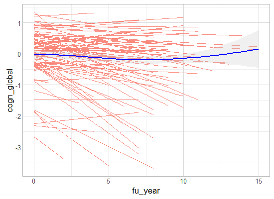

# MAP: initial variable review

<!-- These two chunks should be added in the beginning of every .Rmd that you want to source an .R script -->
<!--  The 1st mandatory chunck  -->
<!--  Set the working directory to the repository's base directory -->


<!--  The 2nd mandatory chunck  -->
<!-- Set the report-wide options, and point to the external code file. -->


<!-- Load 'sourced' R files.  Suppress the output when loading packages. --> 


<!-- Load the sources.  Suppress the output when loading sources. --> 


<!-- Load any Global functions and variables declared in the R file.  Suppress the output. --> 


<!-- Declare any global functions specific to a Rmd output.  Suppress the output. --> 


# (I) Exposition

> This report is a record of interaction with a data transfer object (dto) produced by `./manipulation/map/0-ellis-island.R`. 

The next section recaps this script, exposes the architecture of the DTO, and demonstrates the language of interacting with it.   

## (I.A) Ellis Island

> All data land on Ellis Island.

The script `0-ellis-island.R` is the first script in the analytic workflow. It accomplished the following: 

- (1) Reads in raw data file
- (2) Extract, combines, and exports metadata (specifically, variable names and labels, if provided) into `./data/meta/map/names-labels-live.csv`, which is updated every time Ellis Island script is executed.   
- (3) Augments raw metadata with instructions for renaming and classifying variables. The instructions are provided as manually entered values in `./data/meta/map/meta-data-map.csv`. They are used by automatic scripts in later manipulation and analysis.  
- (4) Combines unit and meta data into a single DTO to serve as a starting point to all subsequent analyses.   


<!-- Load the datasets.   -->

```
[1] "unitData" "metaData"
```

```
Source: local data frame [9,708 x 27]

       id   age_bl  msex  race  educ fu_year age_death  died age_at_visit cogn_global iadlsum cts_mmse30 cts_catflu
    (int)    (dbl) (int) (int) (int)   (int)     (dbl) (int)        (dbl)       (dbl)   (int)      (dbl)      (int)
1    9121 79.96988     0     1    12       0        NA     0     79.96988  0.25733204       0         29         40
2    9121 79.96988     0     1    12       1        NA     0     81.08145  0.33752780       0         29         43
3    9121 79.96988     0     1    12       2        NA     0     81.61259  0.06659408       0         30         48
4    9121 79.96988     0     1    12       3        NA     0     82.59548  0.40477229       0         30         49
5    9121 79.96988     0     1    12       4        NA     0     83.62218  0.36073919       0         29         45
6   33027 81.00753     0     1    14       0        NA     0     81.00753 -0.24058161       5         29         20
7   33027 81.00753     0     1    14       1        NA     0     82.13552          NA       3         NA         NA
8  204228 65.21561     1     1     8       0        NA     0     65.21561 -0.20382164       0         27         31
9  204228 65.21561     1     1     8       2        NA     0     68.30116 -0.44946465       0         25         27
10 204228 65.21561     1     1     8       3        NA     0     69.35524 -0.41319096       0         28         26
..    ...      ...   ...   ...   ...     ...       ...   ...          ...         ...     ...        ...        ...
Variables not shown: dementia (int), bmi (dbl), phys5itemsum (dbl), q3smo_bl (int), q4smo_bl (int), smoke_bl (int),
  smoking (int), ldai_bl (dbl), dm_cum (int), hypertension_cum (int), stroke_cum (int), r_stroke (int), katzsum (int),
  rosbscl (int)
```

```
Source: local data frame [113 x 9]

                    name                     label        type              name_new construct self_reported
                  (fctr)                    (fctr)      (fctr)                (fctr)    (fctr)         (lgl)
1                     id                        NA      design                    id        id         FALSE
2                  study                        NA      design                 study                      NA
3            scaled_to.x                        NA      design           scaled_to.x                      NA
4          agreeableness     NEO agreeableness-ROS personality         agreeableness                      NA
5      conscientiousness Conscientiousness-ROS/MAP personality     conscientiousness                      NA
6           extraversion  NEO extraversion-ROS/MAP personality          extraversion                      NA
7           neo_altruism    NEO altruism scale-MAP personality          neo_altruism                      NA
8  neo_conscientiousness NEO conscientiousness-MAP personality neo_conscientiousness                      NA
9              neo_trust             NEO trust-MAP personality             neo_trust                      NA
10              openness           NEO openess-ROS personality              openness                      NA
..                   ...                       ...         ...                   ...       ...           ...
Variables not shown: longitudinal (lgl), unit (fctr), include (lgl)
```

### Meta

```r
dto[["metaData"]] %>%  
  DT::datatable(
    class   = 'cell-border stripe',
    caption = "This is a dynamic table of the metadata file. Edit at `./data/meta/map/meta-data-map.csv",
    filter  = "top",
    options = list(pageLength = 6, autoWidth = TRUE)
  )
```

<!--html_preserve--><div id="htmlwidget-6547" style="width:100%;height:auto;" class="datatables html-widget"></div>
<script type="application/json" data-for="htmlwidget-6547">{"x":{"filter":"top","filterHTML":"<tr>\n  <td>\u003c/td>\n  <td data-type=\"factor\" style=\"vertical-align: top;\">\n    <div class=\"form-group has-feedback\" style=\"margin-bottom: auto;\">\n      <input type=\"search\" placeholder=\"All\" class=\"form-control\" style=\"width: 100%;\"/>\n      <span class=\"glyphicon glyphicon-remove-circle form-control-feedback\">\u003c/span>\n    \u003c/div>\n    <div style=\"width: 100%; display: none;\">\n      <select multiple=\"multiple\" style=\"width: 100%;\">\n        <option value=\"age_at_visit\">age_at_visit\u003c/option>\n        <option value=\"age_bl\">age_bl\u003c/option>\n        <option value=\"age_death\">age_death\u003c/option>\n        <option value=\"agreeableness\">agreeableness\u003c/option>\n        <option value=\"alcohol_g\">alcohol_g\u003c/option>\n        <option value=\"anxiety_10items\">anxiety_10items\u003c/option>\n        <option value=\"apoe_genotype\">apoe_genotype\u003c/option>\n        <option value=\"bmi\">bmi\u003c/option>\n        <option value=\"bp11\">bp11\u003c/option>\n        <option value=\"bp2\">bp2\u003c/option>\n        <option value=\"bp3\">bp3\u003c/option>\n        <option value=\"bp31\">bp31\u003c/option>\n        <option value=\"bun\">bun\u003c/option>\n        <option value=\"ca\">ca\u003c/option>\n        <option value=\"cesdsum\">cesdsum\u003c/option>\n        <option value=\"chf_cum\">chf_cum\u003c/option>\n        <option value=\"chlstrl\">chlstrl\u003c/option>\n        <option value=\"cl\">cl\u003c/option>\n        <option value=\"claudication_cum\">claudication_cum\u003c/option>\n        <option value=\"co2\">co2\u003c/option>\n        <option value=\"cogn_ep\">cogn_ep\u003c/option>\n        <option value=\"cogn_global\">cogn_global\u003c/option>\n        <option value=\"cogn_po\">cogn_po\u003c/option>\n        <option value=\"cogn_ps\">cogn_ps\u003c/option>\n        <option value=\"cogn_se\">cogn_se\u003c/option>\n        <option value=\"cogn_wo\">cogn_wo\u003c/option>\n        <option value=\"conscientiousness\">conscientiousness\u003c/option>\n        <option value=\"crn\">crn\u003c/option>\n        <option value=\"cts_bname\">cts_bname\u003c/option>\n        <option value=\"cts_catflu\">cts_catflu\u003c/option>\n        <option value=\"cts_db\">cts_db\u003c/option>\n        <option value=\"cts_delay\">cts_delay\u003c/option>\n        <option value=\"cts_df\">cts_df\u003c/option>\n        <option value=\"cts_doperf\">cts_doperf\u003c/option>\n        <option value=\"cts_ebdr\">cts_ebdr\u003c/option>\n        <option value=\"cts_ebmt\">cts_ebmt\u003c/option>\n        <option value=\"cts_idea\">cts_idea\u003c/option>\n        <option value=\"cts_lopair\">cts_lopair\u003c/option>\n        <option value=\"cts_mmse30\">cts_mmse30\u003c/option>\n        <option value=\"cts_nccrtd\">cts_nccrtd\u003c/option>\n        <option value=\"cts_pmat\">cts_pmat\u003c/option>\n        <option value=\"cts_read_nart\">cts_read_nart\u003c/option>\n        <option value=\"cts_read_wrat\">cts_read_wrat\u003c/option>\n        <option value=\"cts_sdmt\">cts_sdmt\u003c/option>\n        <option value=\"cts_story\">cts_story\u003c/option>\n        <option value=\"cts_wli\">cts_wli\u003c/option>\n        <option value=\"cts_wlii\">cts_wlii\u003c/option>\n        <option value=\"cts_wliii\">cts_wliii\u003c/option>\n        <option value=\"dcfdx\">dcfdx\u003c/option>\n        <option value=\"dementia\">dementia\u003c/option>\n        <option value=\"died\">died\u003c/option>\n        <option value=\"dm_cum\">dm_cum\u003c/option>\n        <option value=\"educ\">educ\u003c/option>\n        <option value=\"extraversion\">extraversion\u003c/option>\n        <option value=\"fasting\">fasting\u003c/option>\n        <option value=\"fev\">fev\u003c/option>\n        <option value=\"fu_year\">fu_year\u003c/option>\n        <option value=\"gait_speed\">gait_speed\u003c/option>\n        <option value=\"glucose\">glucose\u003c/option>\n        <option value=\"gripavg\">gripavg\u003c/option>\n        <option value=\"hba1c\">hba1c\u003c/option>\n        <option value=\"hdlchlstrl\">hdlchlstrl\u003c/option>\n        <option value=\"hdlratio\">hdlratio\u003c/option>\n        <option value=\"heart_cum\">heart_cum\u003c/option>\n        <option value=\"htm\">htm\u003c/option>\n        <option value=\"hypertension_cum\">hypertension_cum\u003c/option>\n        <option value=\"iadlsum\">iadlsum\u003c/option>\n        <option value=\"id\">id\u003c/option>\n        <option value=\"intrusion\">intrusion\u003c/option>\n        <option value=\"k\">k\u003c/option>\n        <option value=\"katzsum\">katzsum\u003c/option>\n        <option value=\"ldai_bl\">ldai_bl\u003c/option>\n        <option value=\"ldlchlstrl\">ldlchlstrl\u003c/option>\n        <option value=\"mep\">mep\u003c/option>\n        <option value=\"mip\">mip\u003c/option>\n        <option value=\"msex\">msex\u003c/option>\n        <option value=\"na\">na\u003c/option>\n        <option value=\"neglifeevents\">neglifeevents\u003c/option>\n        <option value=\"negsocexchange\">negsocexchange\u003c/option>\n        <option value=\"neo_altruism\">neo_altruism\u003c/option>\n        <option value=\"neo_conscientiousness\">neo_conscientiousness\u003c/option>\n        <option value=\"neo_trust\">neo_trust\u003c/option>\n        <option value=\"neuroticism_12\">neuroticism_12\u003c/option>\n        <option value=\"neuroticism_6\">neuroticism_6\u003c/option>\n        <option value=\"nohelp\">nohelp\u003c/option>\n        <option value=\"openness\">openness\u003c/option>\n        <option value=\"panas\">panas\u003c/option>\n        <option value=\"perceivedstress\">perceivedstress\u003c/option>\n        <option value=\"phys5itemsum\">phys5itemsum\u003c/option>\n        <option value=\"pvc\">pvc\u003c/option>\n        <option value=\"q3smo_bl\">q3smo_bl\u003c/option>\n        <option value=\"q4smo_bl\">q4smo_bl\u003c/option>\n        <option value=\"r_depres\">r_depres\u003c/option>\n        <option value=\"r_stroke\">r_stroke\u003c/option>\n        <option value=\"race\">race\u003c/option>\n        <option value=\"rejection\">rejection\u003c/option>\n        <option value=\"rosbscl\">rosbscl\u003c/option>\n        <option value=\"rosbsum\">rosbsum\u003c/option>\n        <option value=\"scaled_to.x\">scaled_to.x\u003c/option>\n        <option value=\"scaled_to.y\">scaled_to.y\u003c/option>\n        <option value=\"smoke_bl\">smoke_bl\u003c/option>\n        <option value=\"smoking\">smoking\u003c/option>\n        <option value=\"spanish\">spanish\u003c/option>\n        <option value=\"stroke_cum\">stroke_cum\u003c/option>\n        <option value=\"study\">study\u003c/option>\n        <option value=\"thyroid_cum\">thyroid_cum\u003c/option>\n        <option value=\"unsympathetic\">unsympathetic\u003c/option>\n        <option value=\"vasc_3dis_sum\">vasc_3dis_sum\u003c/option>\n        <option value=\"vasc_4dis_sum\">vasc_4dis_sum\u003c/option>\n        <option value=\"vasc_risks_sum\">vasc_risks_sum\u003c/option>\n        <option value=\"vision\">vision\u003c/option>\n        <option value=\"visionlog\">visionlog\u003c/option>\n        <option value=\"wtkg\">wtkg\u003c/option>\n      \u003c/select>\n    \u003c/div>\n  \u003c/td>\n  <td data-type=\"factor\" style=\"vertical-align: top;\">\n    <div class=\"form-group has-feedback\" style=\"margin-bottom: auto;\">\n      <input type=\"search\" placeholder=\"All\" class=\"form-control\" style=\"width: 100%;\"/>\n      <span class=\"glyphicon glyphicon-remove-circle form-control-feedback\">\u003c/span>\n    \u003c/div>\n    <div style=\"width: 100%; display: none;\">\n      <select multiple=\"multiple\" style=\"width: 100%;\">\n        <option value=\"Age at baseline\">Age at baseline\u003c/option>\n        <option value=\"Age at cycle - fractional\">Age at cycle - fractional\u003c/option>\n        <option value=\"Age at death\">Age at death\u003c/option>\n        <option value=\"Anxiety-10 item version - ROS and MAP\">Anxiety-10 item version - ROS and MAP\u003c/option>\n        <option value=\"ApoE genotype\">ApoE genotype\u003c/option>\n        <option value=\"Blood pressure measurement- sitting - trial 1\">Blood pressure measurement- sitting - trial 1\u003c/option>\n        <option value=\"Blood pressure measurement- sitting - trial 2\">Blood pressure measurement- sitting - trial 2\u003c/option>\n        <option value=\"Blood pressure measurement- standing\">Blood pressure measurement- standing\u003c/option>\n        <option value=\"Blood urea nitrogen\">Blood urea nitrogen\u003c/option>\n        <option value=\"Body mass index\">Body mass index\u003c/option>\n        <option value=\"Boston naming - 2014\">Boston naming - 2014\u003c/option>\n        <option value=\"Calcium\">Calcium\u003c/option>\n        <option value=\"Calculated domain score-episodic memory\">Calculated domain score-episodic memory\u003c/option>\n        <option value=\"Calculated domain score - perceptual orientation\">Calculated domain score - perceptual orientation\u003c/option>\n        <option value=\"Calculated domain score - perceptual speed\">Calculated domain score - perceptual speed\u003c/option>\n        <option value=\"Calculated domain score - semantic memory\">Calculated domain score - semantic memory\u003c/option>\n        <option value=\"Calculated domain score - working memory\">Calculated domain score - working memory\u003c/option>\n        <option value=\"Carbon Dioxide\">Carbon Dioxide\u003c/option>\n        <option value=\"Category fluency - 2014\">Category fluency - 2014\u003c/option>\n        <option value=\"CESD-Measure of depressive symptoms\">CESD-Measure of depressive symptoms\u003c/option>\n        <option value=\"Chloride\">Chloride\u003c/option>\n        <option value=\"Cholesterol\">Cholesterol\u003c/option>\n        <option value=\"Clinical Diagnoses - Stroke - cumulative\">Clinical Diagnoses - Stroke - cumulative\u003c/option>\n        <option value=\"Clinical dx summary\">Clinical dx summary\u003c/option>\n        <option value=\"Clinical stroke dx\">Clinical stroke dx\u003c/option>\n        <option value=\"Complex ideas - 2014\">Complex ideas - 2014\u003c/option>\n        <option value=\"Conscientiousness-ROS/MAP\">Conscientiousness-ROS/MAP\u003c/option>\n        <option value=\"Creatinine\">Creatinine\u003c/option>\n        <option value=\"Dementia diagnosis\">Dementia diagnosis\u003c/option>\n        <option value=\"Digit ordering - 2014\">Digit ordering - 2014\u003c/option>\n        <option value=\"Digits backwards - 2014\">Digits backwards - 2014\u003c/option>\n        <option value=\"Digits forwards - 2014\">Digits forwards - 2014\u003c/option>\n        <option value=\"East Boston story - delayed recall - 2014\">East Boston story - delayed recall - 2014\u003c/option>\n        <option value=\"East Boston story - immediate - 2014\">East Boston story - immediate - 2014\u003c/option>\n        <option value=\"Extremity strength\">Extremity strength\u003c/option>\n        <option value=\"Follow-up year\">Follow-up year\u003c/option>\n        <option value=\"forced expiratory volume\">forced expiratory volume\u003c/option>\n        <option value=\"Gait Speed - MAP\">Gait Speed - MAP\u003c/option>\n        <option value=\"Gender\">Gender\u003c/option>\n        <option value=\"Global cognitive score\">Global cognitive score\u003c/option>\n        <option value=\"Glucose\">Glucose\u003c/option>\n        <option value=\"Grams of alcohol per day\">Grams of alcohol per day\u003c/option>\n        <option value=\"HDL cholesterol\">HDL cholesterol\u003c/option>\n        <option value=\"HDL ratio\">HDL ratio\u003c/option>\n        <option value=\"Height(meters)\">Height(meters)\u003c/option>\n        <option value=\"Hemoglobin A1c\">Hemoglobin A1c\u003c/option>\n        <option value=\"Hx of Meds for HTN\">Hx of Meds for HTN\u003c/option>\n        <option value=\"Indicator of death\">Indicator of death\u003c/option>\n        <option value=\"Instrumental activities of daily liviing\">Instrumental activities of daily liviing\u003c/option>\n        <option value=\"Katz measure of disability\">Katz measure of disability\u003c/option>\n        <option value=\"LDL cholesterol\">LDL cholesterol\u003c/option>\n        <option value=\"Lifetime daily alcohol intake -baseline\">Lifetime daily alcohol intake -baseline\u003c/option>\n        <option value=\"Line orientation - 2014\">Line orientation - 2014\u003c/option>\n        <option value=\"Logical memory Ia - immediate - 2014\">Logical memory Ia - immediate - 2014\u003c/option>\n        <option value=\"Logical memory IIa - 2014\">Logical memory IIa - 2014\u003c/option>\n        <option value=\"Major depression dx-clinic rating\">Major depression dx-clinic rating\u003c/option>\n        <option value=\"maximal expiratory pressure\">maximal expiratory pressure\u003c/option>\n        <option value=\"maximal inspiratory pressure\">maximal inspiratory pressure\u003c/option>\n        <option value=\"Medical conditions - claudication -cumulative\">Medical conditions - claudication -cumulative\u003c/option>\n        <option value=\"Medical Conditions - congestive heart failure -&#10;cumulative\">Medical Conditions - congestive heart failure -\ncumulative\u003c/option>\n        <option value=\"Medical Conditions - heart - cumulative\">Medical Conditions - heart - cumulative\u003c/option>\n        <option value=\"Medical conditions - hypertension - cumulative\">Medical conditions - hypertension - cumulative\u003c/option>\n        <option value=\"Medical Conditions - thyroid disease - cumulative\">Medical Conditions - thyroid disease - cumulative\u003c/option>\n        <option value=\"Medical history - diabetes - cumulative\">Medical history - diabetes - cumulative\u003c/option>\n        <option value=\"MMSE - 2014\">MMSE - 2014\u003c/option>\n        <option value=\"Negative life events\">Negative life events\u003c/option>\n        <option value=\"Negative social exchange\">Negative social exchange\u003c/option>\n        <option value=\"Negative social exchange-help-MAP\">Negative social exchange-help-MAP\u003c/option>\n        <option value=\"Negative social exchange-intrusion-MAP\">Negative social exchange-intrusion-MAP\u003c/option>\n        <option value=\"Negative social exchange-unsymapathetic-MAP\">Negative social exchange-unsymapathetic-MAP\u003c/option>\n        <option value=\"Negative social exchange - rejection-MAP\">Negative social exchange - rejection-MAP\u003c/option>\n        <option value=\"NEO agreeableness-ROS\">NEO agreeableness-ROS\u003c/option>\n        <option value=\"NEO altruism scale-MAP\">NEO altruism scale-MAP\u003c/option>\n        <option value=\"NEO conscientiousness-MAP\">NEO conscientiousness-MAP\u003c/option>\n        <option value=\"NEO extraversion-ROS/MAP\">NEO extraversion-ROS/MAP\u003c/option>\n        <option value=\"NEO openess-ROS\">NEO openess-ROS\u003c/option>\n        <option value=\"NEO trust-MAP\">NEO trust-MAP\u003c/option>\n        <option value=\"Neuroticism - 12 item version-RMM\">Neuroticism - 12 item version-RMM\u003c/option>\n        <option value=\"Neuroticism - 6 item version - RMM\">Neuroticism - 6 item version - RMM\u003c/option>\n        <option value=\"No label found in codebook\">No label found in codebook\u003c/option>\n        <option value=\"Number comparison - 2014\">Number comparison - 2014\u003c/option>\n        <option value=\"Panas score\">Panas score\u003c/option>\n        <option value=\"Participant&#39;s race\">Participant's race\u003c/option>\n        <option value=\"Perceived stress\">Perceived stress\u003c/option>\n        <option value=\"Potassium\">Potassium\u003c/option>\n        <option value=\"Progressive Matrices - 2014\">Progressive Matrices - 2014\u003c/option>\n        <option value=\"pulmonary vital capacity\">pulmonary vital capacity\u003c/option>\n        <option value=\"Reading test-NART-2014\">Reading test-NART-2014\u003c/option>\n        <option value=\"Reading test - WRAT - 2014\">Reading test - WRAT - 2014\u003c/option>\n        <option value=\"Rosow-Breslau scale\">Rosow-Breslau scale\u003c/option>\n        <option value=\"Smoking\">Smoking\u003c/option>\n        <option value=\"Smoking at baseline\">Smoking at baseline\u003c/option>\n        <option value=\"Smoking duration-baseline\">Smoking duration-baseline\u003c/option>\n        <option value=\"Smoking quantity-baseline\">Smoking quantity-baseline\u003c/option>\n        <option value=\"Sodium\">Sodium\u003c/option>\n        <option value=\"Spanish/Hispanic origin\">Spanish/Hispanic origin\u003c/option>\n        <option value=\"Summary of self reported physical activity&#10;measure (in hours) ROS/MAP\">Summary of self reported physical activity\nmeasure (in hours) ROS/MAP\u003c/option>\n        <option value=\"Symbol digit modalitities - 2014\">Symbol digit modalitities - 2014\u003c/option>\n        <option value=\"Vascular disease burden (3 items w/o chf)&#10;ROS/MAP/MARS\">Vascular disease burden (3 items w/o chf)\nROS/MAP/MARS\u003c/option>\n        <option value=\"Vascular disease burden (4 items) - MAP/MARS&#10;only\">Vascular disease burden (4 items) - MAP/MARS\nonly\u003c/option>\n        <option value=\"Vascular disease risk factors\">Vascular disease risk factors\u003c/option>\n        <option value=\"Vision acuity\">Vision acuity\u003c/option>\n        <option value=\"Visual acuity\">Visual acuity\u003c/option>\n        <option value=\"Weight (kg)\">Weight (kg)\u003c/option>\n        <option value=\"Whether blood was collected on fasting participant\">Whether blood was collected on fasting participant\u003c/option>\n        <option value=\"Word list I- immediate- 2014\">Word list I- immediate- 2014\u003c/option>\n        <option value=\"Word list II - delayed - 2014\">Word list II - delayed - 2014\u003c/option>\n        <option value=\"Word list III - recognition - 2014\">Word list III - recognition - 2014\u003c/option>\n        <option value=\"Years of education\">Years of education\u003c/option>\n      \u003c/select>\n    \u003c/div>\n  \u003c/td>\n  <td data-type=\"factor\" style=\"vertical-align: top;\">\n    <div class=\"form-group has-feedback\" style=\"margin-bottom: auto;\">\n      <input type=\"search\" placeholder=\"All\" class=\"form-control\" style=\"width: 100%;\"/>\n      <span class=\"glyphicon glyphicon-remove-circle form-control-feedback\">\u003c/span>\n    \u003c/div>\n    <div style=\"width: 100%; display: none;\">\n      <select multiple=\"multiple\" style=\"width: 100%;\">\n        <option value=\"clinical\">clinical\u003c/option>\n        <option value=\"cognitive\">cognitive\u003c/option>\n        <option value=\"demographic\">demographic\u003c/option>\n        <option value=\"design\">design\u003c/option>\n        <option value=\"personality\">personality\u003c/option>\n        <option value=\"physical\">physical\u003c/option>\n        <option value=\"psychological\">psychological\u003c/option>\n        <option value=\"substance\">substance\u003c/option>\n      \u003c/select>\n    \u003c/div>\n  \u003c/td>\n  <td data-type=\"factor\" style=\"vertical-align: top;\">\n    <div class=\"form-group has-feedback\" style=\"margin-bottom: auto;\">\n      <input type=\"search\" placeholder=\"All\" class=\"form-control\" style=\"width: 100%;\"/>\n      <span class=\"glyphicon glyphicon-remove-circle form-control-feedback\">\u003c/span>\n    \u003c/div>\n    <div style=\"width: 100%; display: none;\">\n      <select multiple=\"multiple\" style=\"width: 100%;\">\n        <option value=\"age_at_visit\">age_at_visit\u003c/option>\n        <option value=\"age_bl\">age_bl\u003c/option>\n        <option value=\"age_death\">age_death\u003c/option>\n        <option value=\"agreeableness\">agreeableness\u003c/option>\n        <option value=\"alco_life\">alco_life\u003c/option>\n        <option value=\"alcohol_g\">alcohol_g\u003c/option>\n        <option value=\"anxiety_10items\">anxiety_10items\u003c/option>\n        <option value=\"apoe_genotype\">apoe_genotype\u003c/option>\n        <option value=\"bmi\">bmi\u003c/option>\n        <option value=\"bp11\">bp11\u003c/option>\n        <option value=\"bp2\">bp2\u003c/option>\n        <option value=\"bp3\">bp3\u003c/option>\n        <option value=\"bp31\">bp31\u003c/option>\n        <option value=\"bun\">bun\u003c/option>\n        <option value=\"ca\">ca\u003c/option>\n        <option value=\"catfluency\">catfluency\u003c/option>\n        <option value=\"cesdsum\">cesdsum\u003c/option>\n        <option value=\"chf_cum\">chf_cum\u003c/option>\n        <option value=\"chlstrl\">chlstrl\u003c/option>\n        <option value=\"cl\">cl\u003c/option>\n        <option value=\"claudication_cum\">claudication_cum\u003c/option>\n        <option value=\"co2\">co2\u003c/option>\n        <option value=\"cogn_ep\">cogn_ep\u003c/option>\n        <option value=\"cogn_global\">cogn_global\u003c/option>\n        <option value=\"cogn_po\">cogn_po\u003c/option>\n        <option value=\"cogn_ps\">cogn_ps\u003c/option>\n        <option value=\"cogn_se\">cogn_se\u003c/option>\n        <option value=\"cogn_wo\">cogn_wo\u003c/option>\n        <option value=\"conscientiousness\">conscientiousness\u003c/option>\n        <option value=\"crn\">crn\u003c/option>\n        <option value=\"cts_bname\">cts_bname\u003c/option>\n        <option value=\"cts_db\">cts_db\u003c/option>\n        <option value=\"cts_delay\">cts_delay\u003c/option>\n        <option value=\"cts_df\">cts_df\u003c/option>\n        <option value=\"cts_doperf\">cts_doperf\u003c/option>\n        <option value=\"cts_ebdr\">cts_ebdr\u003c/option>\n        <option value=\"cts_ebmt\">cts_ebmt\u003c/option>\n        <option value=\"cts_idea\">cts_idea\u003c/option>\n        <option value=\"cts_lopair\">cts_lopair\u003c/option>\n        <option value=\"cts_nccrtd\">cts_nccrtd\u003c/option>\n        <option value=\"cts_pmat\">cts_pmat\u003c/option>\n        <option value=\"cts_read_nart\">cts_read_nart\u003c/option>\n        <option value=\"cts_read_wrat\">cts_read_wrat\u003c/option>\n        <option value=\"cts_sdmt\">cts_sdmt\u003c/option>\n        <option value=\"cts_story\">cts_story\u003c/option>\n        <option value=\"cts_wli\">cts_wli\u003c/option>\n        <option value=\"cts_wlii\">cts_wlii\u003c/option>\n        <option value=\"cts_wliii\">cts_wliii\u003c/option>\n        <option value=\"dcfdx\">dcfdx\u003c/option>\n        <option value=\"dementia\">dementia\u003c/option>\n        <option value=\"died\">died\u003c/option>\n        <option value=\"dm_cum\">dm_cum\u003c/option>\n        <option value=\"educ\">educ\u003c/option>\n        <option value=\"extraversion\">extraversion\u003c/option>\n        <option value=\"fasting\">fasting\u003c/option>\n        <option value=\"fev\">fev\u003c/option>\n        <option value=\"fu_year\">fu_year\u003c/option>\n        <option value=\"gait_speed\">gait_speed\u003c/option>\n        <option value=\"glucose\">glucose\u003c/option>\n        <option value=\"gripavg\">gripavg\u003c/option>\n        <option value=\"hba1c\">hba1c\u003c/option>\n        <option value=\"hdlchlstrl\">hdlchlstrl\u003c/option>\n        <option value=\"hdlratio\">hdlratio\u003c/option>\n        <option value=\"heart_cum\">heart_cum\u003c/option>\n        <option value=\"htm\">htm\u003c/option>\n        <option value=\"hypertension_cum\">hypertension_cum\u003c/option>\n        <option value=\"iadlsum\">iadlsum\u003c/option>\n        <option value=\"id\">id\u003c/option>\n        <option value=\"intrusion\">intrusion\u003c/option>\n        <option value=\"k\">k\u003c/option>\n        <option value=\"katzsum\">katzsum\u003c/option>\n        <option value=\"ldlchlstrl\">ldlchlstrl\u003c/option>\n        <option value=\"mep\">mep\u003c/option>\n        <option value=\"mip\">mip\u003c/option>\n        <option value=\"mmse\">mmse\u003c/option>\n        <option value=\"msex\">msex\u003c/option>\n        <option value=\"na\">na\u003c/option>\n        <option value=\"neglifeevents\">neglifeevents\u003c/option>\n        <option value=\"negsocexchange\">negsocexchange\u003c/option>\n        <option value=\"neo_altruism\">neo_altruism\u003c/option>\n        <option value=\"neo_conscientiousness\">neo_conscientiousness\u003c/option>\n        <option value=\"neo_trust\">neo_trust\u003c/option>\n        <option value=\"neuroticism_12\">neuroticism_12\u003c/option>\n        <option value=\"neuroticism_6\">neuroticism_6\u003c/option>\n        <option value=\"nohelp\">nohelp\u003c/option>\n        <option value=\"openness\">openness\u003c/option>\n        <option value=\"panas\">panas\u003c/option>\n        <option value=\"perceivedstress\">perceivedstress\u003c/option>\n        <option value=\"phys5itemsum\">phys5itemsum\u003c/option>\n        <option value=\"pvc\">pvc\u003c/option>\n        <option value=\"q3smo_bl\">q3smo_bl\u003c/option>\n        <option value=\"q4smo_bl\">q4smo_bl\u003c/option>\n        <option value=\"r_depres\">r_depres\u003c/option>\n        <option value=\"r_stroke\">r_stroke\u003c/option>\n        <option value=\"race\">race\u003c/option>\n        <option value=\"rejection\">rejection\u003c/option>\n        <option value=\"rosbscl\">rosbscl\u003c/option>\n        <option value=\"rosbsum\">rosbsum\u003c/option>\n        <option value=\"scaled_to.x\">scaled_to.x\u003c/option>\n        <option value=\"scaled_to.y\">scaled_to.y\u003c/option>\n        <option value=\"smoke_bl\">smoke_bl\u003c/option>\n        <option value=\"smoking\">smoking\u003c/option>\n        <option value=\"spanish\">spanish\u003c/option>\n        <option value=\"stroke_cum\">stroke_cum\u003c/option>\n        <option value=\"study\">study\u003c/option>\n        <option value=\"thyroid_cum\">thyroid_cum\u003c/option>\n        <option value=\"unsympathetic\">unsympathetic\u003c/option>\n        <option value=\"vasc_3dis_sum\">vasc_3dis_sum\u003c/option>\n        <option value=\"vasc_4dis_sum\">vasc_4dis_sum\u003c/option>\n        <option value=\"vasc_risks_sum\">vasc_risks_sum\u003c/option>\n        <option value=\"vision\">vision\u003c/option>\n        <option value=\"visionlog\">visionlog\u003c/option>\n        <option value=\"wtkg\">wtkg\u003c/option>\n      \u003c/select>\n    \u003c/div>\n  \u003c/td>\n  <td data-type=\"factor\" style=\"vertical-align: top;\">\n    <div class=\"form-group has-feedback\" style=\"margin-bottom: auto;\">\n      <input type=\"search\" placeholder=\"All\" class=\"form-control\" style=\"width: 100%;\"/>\n      <span class=\"glyphicon glyphicon-remove-circle form-control-feedback\">\u003c/span>\n    \u003c/div>\n    <div style=\"width: 100%; display: none;\">\n      <select multiple=\"multiple\" style=\"width: 100%;\">\n        <option value=\"\">\u003c/option>\n        <option value=\"age\">age\u003c/option>\n        <option value=\"alcohol\">alcohol\u003c/option>\n        <option value=\"apoe\">apoe\u003c/option>\n        <option value=\"cardio\">cardio\u003c/option>\n        <option value=\"cognition\">cognition\u003c/option>\n        <option value=\"dementia\">dementia\u003c/option>\n        <option value=\"diabetes\">diabetes\u003c/option>\n        <option value=\"education\">education\u003c/option>\n        <option value=\"episodic memory\">episodic memory\u003c/option>\n        <option value=\"global\">global\u003c/option>\n        <option value=\"hypertension\">hypertension\u003c/option>\n        <option value=\"id\">id\u003c/option>\n        <option value=\"perceptual orientation\">perceptual orientation\u003c/option>\n        <option value=\"perceptual speed\">perceptual speed\u003c/option>\n        <option value=\"physact\">physact\u003c/option>\n        <option value=\"physcap\">physcap\u003c/option>\n        <option value=\"physique\">physique\u003c/option>\n        <option value=\"race\">race\u003c/option>\n        <option value=\"semantic memory\">semantic memory\u003c/option>\n        <option value=\"sex\">sex\u003c/option>\n        <option value=\"smoking\">smoking\u003c/option>\n        <option value=\"stroke\">stroke\u003c/option>\n        <option value=\"time\">time\u003c/option>\n        <option value=\"verbal comprehension\">verbal comprehension\u003c/option>\n        <option value=\"working memory\">working memory\u003c/option>\n      \u003c/select>\n    \u003c/div>\n  \u003c/td>\n  <td data-type=\"logical\" style=\"vertical-align: top;\">\n    <div class=\"form-group has-feedback\" style=\"margin-bottom: auto;\">\n      <input type=\"search\" placeholder=\"All\" class=\"form-control\" style=\"width: 100%;\"/>\n      <span class=\"glyphicon glyphicon-remove-circle form-control-feedback\">\u003c/span>\n    \u003c/div>\n    <div style=\"width: 100%; display: none;\">\n      <select multiple=\"multiple\" style=\"width: 100%;\">\n        <option value=\"true\">true\u003c/option>\n        <option value=\"false\">false\u003c/option>\n        <option value=\"na\">na\u003c/option>\n      \u003c/select>\n    \u003c/div>\n  \u003c/td>\n  <td data-type=\"logical\" style=\"vertical-align: top;\">\n    <div class=\"form-group has-feedback\" style=\"margin-bottom: auto;\">\n      <input type=\"search\" placeholder=\"All\" class=\"form-control\" style=\"width: 100%;\"/>\n      <span class=\"glyphicon glyphicon-remove-circle form-control-feedback\">\u003c/span>\n    \u003c/div>\n    <div style=\"width: 100%; display: none;\">\n      <select multiple=\"multiple\" style=\"width: 100%;\">\n        <option value=\"true\">true\u003c/option>\n        <option value=\"false\">false\u003c/option>\n        <option value=\"na\">na\u003c/option>\n      \u003c/select>\n    \u003c/div>\n  \u003c/td>\n  <td data-type=\"factor\" style=\"vertical-align: top;\">\n    <div class=\"form-group has-feedback\" style=\"margin-bottom: auto;\">\n      <input type=\"search\" placeholder=\"All\" class=\"form-control\" style=\"width: 100%;\"/>\n      <span class=\"glyphicon glyphicon-remove-circle form-control-feedback\">\u003c/span>\n    \u003c/div>\n    <div style=\"width: 100%; display: none;\">\n      <select multiple=\"multiple\" style=\"width: 100%;\">\n        <option value=\"\">\u003c/option>\n        <option value=\"0 to 10\">0 to 10\u003c/option>\n        <option value=\"0 to 110\">0 to 110\u003c/option>\n        <option value=\"0 to 12\">0 to 12\u003c/option>\n        <option value=\"0 to 14\">0 to 14\u003c/option>\n        <option value=\"0 to 15\">0 to 15\u003c/option>\n        <option value=\"0 to 16\">0 to 16\u003c/option>\n        <option value=\"0 to 25\">0 to 25\u003c/option>\n        <option value=\"0 to 30\">0 to 30\u003c/option>\n        <option value=\"0 to 48\">0 to 48\u003c/option>\n        <option value=\"0 to 75\">0 to 75\u003c/option>\n        <option value=\"0 to 8\">0 to 8\u003c/option>\n        <option value=\"0, 1\">0, 1\u003c/option>\n        <option value=\"category\">category\u003c/option>\n        <option value=\"cigarettes / day\">cigarettes / day\u003c/option>\n        <option value=\"cm H20\">cm H20\u003c/option>\n        <option value=\"composite\">composite\u003c/option>\n        <option value=\"drinks / day\">drinks / day\u003c/option>\n        <option value=\"grams\">grams\u003c/option>\n        <option value=\"kg/msq\">kg/msq\u003c/option>\n        <option value=\"kilos\">kilos\u003c/option>\n        <option value=\"lbs\">lbs\u003c/option>\n        <option value=\"liters\">liters\u003c/option>\n        <option value=\"meters\">meters\u003c/option>\n        <option value=\"min/sec\">min/sec\u003c/option>\n        <option value=\"o to 10\">o to 10\u003c/option>\n        <option value=\"person\">person\u003c/option>\n        <option value=\"scale\">scale\u003c/option>\n        <option value=\"time point\">time point\u003c/option>\n        <option value=\"year\">year\u003c/option>\n        <option value=\"years\">years\u003c/option>\n      \u003c/select>\n    \u003c/div>\n  \u003c/td>\n  <td data-type=\"logical\" style=\"vertical-align: top;\">\n    <div class=\"form-group has-feedback\" style=\"margin-bottom: auto;\">\n      <input type=\"search\" placeholder=\"All\" class=\"form-control\" style=\"width: 100%;\"/>\n      <span class=\"glyphicon glyphicon-remove-circle form-control-feedback\">\u003c/span>\n    \u003c/div>\n    <div style=\"width: 100%; display: none;\">\n      <select multiple=\"multiple\" style=\"width: 100%;\">\n        <option value=\"true\">true\u003c/option>\n        <option value=\"false\">false\u003c/option>\n        <option value=\"na\">na\u003c/option>\n      \u003c/select>\n    \u003c/div>\n  \u003c/td>\n\u003c/tr>","caption":"<caption>This is a dynamic table of the metadata file. Edit at `./data/meta/map/meta-data-map.csv\u003c/caption>","data":[["1","2","3","4","5","6","7","8","9","10","11","12","13","14","15","16","17","18","19","20","21","22","23","24","25","26","27","28","29","30","31","32","33","34","35","36","37","38","39","40","41","42","43","44","45","46","47","48","49","50","51","52","53","54","55","56","57","58","59","60","61","62","63","64","65","66","67","68","69","70","71","72","73","74","75","76","77","78","79","80","81","82","83","84","85","86","87","88","89","90","91","92","93","94","95","96","97","98","99","100","101","102","103","104","105","106","107","108","109","110","111","112","113"],["id","study","scaled_to.x","agreeableness","conscientiousness","extraversion","neo_altruism","neo_conscientiousness","neo_trust","openness","anxiety_10items","neuroticism_12","neuroticism_6","age_bl","age_death","died","educ","msex","race","spanish","apoe_genotype","ldai_bl","q3smo_bl","q4smo_bl","smoke_bl","smoking","fu_year","scaled_to.y","cesdsum","r_depres","intrusion","neglifeevents","negsocexchange","nohelp","panas","perceivedstress","rejection","unsympathetic","dcfdx","dementia","r_stroke","cogn_ep","cogn_global","cogn_po","cogn_ps","cogn_se","cogn_wo","cts_bname","cts_catflu","cts_db","cts_delay","cts_df","cts_doperf","cts_ebdr","cts_ebmt","cts_idea","cts_lopair","cts_mmse30","cts_nccrtd","cts_pmat","cts_read_nart","cts_read_wrat","cts_sdmt","cts_story","cts_wli","cts_wlii","cts_wliii","age_at_visit","iadlsum","katzsum","rosbscl","rosbsum","vision","visionlog","fev","mep","mip","pvc","bun","ca","chlstrl","cl","co2","crn","fasting","glucose","hba1c","hdlchlstrl","hdlratio","k","ldlchlstrl","na","alcohol_g","bmi","htm","phys5itemsum","wtkg","bp11","bp2","bp3","bp31","hypertension_cum","dm_cum","thyroid_cum","chf_cum","claudication_cum","heart_cum","stroke_cum","vasc_3dis_sum","vasc_4dis_sum","vasc_risks_sum","gait_speed","gripavg"],[null,null,null,"NEO agreeableness-ROS","Conscientiousness-ROS/MAP","NEO extraversion-ROS/MAP","NEO altruism scale-MAP","NEO conscientiousness-MAP","NEO trust-MAP","NEO openess-ROS","Anxiety-10 item version - ROS and MAP","Neuroticism - 12 item version-RMM","Neuroticism - 6 item version - RMM","Age at baseline","Age at death","Indicator of death","Years of education","Gender","Participant's race","Spanish/Hispanic origin","ApoE genotype","Lifetime daily alcohol intake -baseline","Smoking quantity-baseline","Smoking duration-baseline","Smoking at baseline","Smoking","Follow-up year","No label found in codebook","CESD-Measure of depressive symptoms","Major depression dx-clinic rating","Negative social exchange-intrusion-MAP","Negative life events","Negative social exchange","Negative social exchange-help-MAP","Panas score","Perceived stress","Negative social exchange - rejection-MAP","Negative social exchange-unsymapathetic-MAP","Clinical dx summary","Dementia diagnosis","Clinical stroke dx","Calculated domain score-episodic memory","Global cognitive score","Calculated domain score - perceptual orientation","Calculated domain score - perceptual speed","Calculated domain score - semantic memory","Calculated domain score - working memory","Boston naming - 2014","Category fluency - 2014","Digits backwards - 2014","Logical memory IIa - 2014","Digits forwards - 2014","Digit ordering - 2014","East Boston story - delayed recall - 2014","East Boston story - immediate - 2014","Complex ideas - 2014","Line orientation - 2014","MMSE - 2014","Number comparison - 2014","Progressive Matrices - 2014","Reading test-NART-2014","Reading test - WRAT - 2014","Symbol digit modalitities - 2014","Logical memory Ia - immediate - 2014","Word list I- immediate- 2014","Word list II - delayed - 2014","Word list III - recognition - 2014","Age at cycle - fractional","Instrumental activities of daily liviing","Katz measure of disability","Rosow-Breslau scale","Rosow-Breslau scale","Vision acuity","Visual acuity","forced expiratory volume","maximal expiratory pressure","maximal inspiratory pressure","pulmonary vital capacity","Blood urea nitrogen","Calcium","Cholesterol","Chloride","Carbon Dioxide","Creatinine","Whether blood was collected on fasting participant","Glucose","Hemoglobin A1c","HDL cholesterol","HDL ratio","Potassium","LDL cholesterol","Sodium","Grams of alcohol per day","Body mass index","Height(meters)","Summary of self reported physical activity\nmeasure (in hours) ROS/MAP","Weight (kg)","Blood pressure measurement- sitting - trial 1","Blood pressure measurement- sitting - trial 2","Hx of Meds for HTN","Blood pressure measurement- standing","Medical conditions - hypertension - cumulative","Medical history - diabetes - cumulative","Medical Conditions - thyroid disease - cumulative","Medical Conditions - congestive heart failure -\ncumulative","Medical conditions - claudication -cumulative","Medical Conditions - heart - cumulative","Clinical Diagnoses - Stroke - cumulative","Vascular disease burden (3 items w/o chf)\nROS/MAP/MARS","Vascular disease burden (4 items) - MAP/MARS\nonly","Vascular disease risk factors","Gait Speed - MAP","Extremity strength"],["design","design","design","personality","personality","personality","personality","personality","personality","personality","personality","personality","personality","demographic","demographic","demographic","demographic","demographic","demographic","demographic","clinical","substance","substance","substance","substance","substance","design","design","psychological","psychological","psychological","psychological","psychological","psychological","psychological","psychological","psychological","psychological","clinical","cognitive","clinical","cognitive","cognitive","cognitive","cognitive","cognitive","cognitive","cognitive","cognitive","cognitive","cognitive","cognitive","cognitive","cognitive","cognitive","cognitive","cognitive","cognitive","cognitive","cognitive","cognitive","cognitive","cognitive","cognitive","cognitive","cognitive","cognitive","demographic","physical","physical","physical","physical","physical","physical","physical","physical","physical","physical","clinical","clinical","clinical","clinical","clinical","clinical","clinical","clinical","clinical","clinical","clinical","clinical","clinical","clinical","substance","physical","physical","physical","physical","clinical","clinical","clinical","clinical","clinical","clinical","clinical","clinical","clinical","clinical","clinical","clinical","clinical","clinical","physical","physical"],["id","study","scaled_to.x","agreeableness","conscientiousness","extraversion","neo_altruism","neo_conscientiousness","neo_trust","openness","anxiety_10items","neuroticism_12","neuroticism_6","age_bl","age_death","died","educ","msex","race","spanish","apoe_genotype","alco_life","q3smo_bl","q4smo_bl","smoke_bl","smoking","fu_year","scaled_to.y","cesdsum","r_depres","intrusion","neglifeevents","negsocexchange","nohelp","panas","perceivedstress","rejection","unsympathetic","dcfdx","dementia","r_stroke","cogn_ep","cogn_global","cogn_po","cogn_ps","cogn_se","cogn_wo","cts_bname","catfluency","cts_db","cts_delay","cts_df","cts_doperf","cts_ebdr","cts_ebmt","cts_idea","cts_lopair","mmse","cts_nccrtd","cts_pmat","cts_read_nart","cts_read_wrat","cts_sdmt","cts_story","cts_wli","cts_wlii","cts_wliii","age_at_visit","iadlsum","katzsum","rosbscl","rosbsum","vision","visionlog","fev","mep","mip","pvc","bun","ca","chlstrl","cl","co2","crn","fasting","glucose","hba1c","hdlchlstrl","hdlratio","k","ldlchlstrl","na","alcohol_g","bmi","htm","phys5itemsum","wtkg","bp11","bp2","bp3","bp31","hypertension_cum","dm_cum","thyroid_cum","chf_cum","claudication_cum","heart_cum","stroke_cum","vasc_3dis_sum","vasc_4dis_sum","vasc_risks_sum","gait_speed","gripavg"],["id","","","","","","","","","","","","","age","age","age","education","sex","race","race","apoe","alcohol","smoking","smoking","smoking","smoking","time","","","","","","","","","","","","cognition","dementia","stroke","episodic memory","global","perceptual orientation","perceptual speed","semantic memory","working memory","semantic memory","semantic memory","working memory","episodic memory","working memory","working memory","episodic memory","episodic memory","verbal comprehension","perceptual orientation","dementia","perceptual speed","perceptual orientation","semantic memory","semantic memory","perceptual speed","episodic memory","episodic memory","episodic memory","episodic memory","","physact","physcap","physcap","physcap","physcap","physcap","physcap","physcap","physcap","physcap","","","","","","","","","","","","","","","alcohol","physique","physique","physact","physique","hypertension","hypertension","hypertension","hypertension","hypertension","diabetes","","cardio","","","stroke","","","","physcap","physcap"],[false,null,null,null,null,null,null,null,null,null,null,null,null,false,false,false,true,false,true,true,false,true,true,true,true,true,false,null,null,null,null,null,null,null,null,null,null,null,false,false,false,false,false,false,false,false,false,false,false,false,false,false,false,false,false,false,false,true,false,false,false,false,false,false,false,false,false,null,true,true,true,true,false,false,false,false,false,false,null,null,null,null,null,null,null,null,null,null,null,null,null,null,true,false,false,true,false,false,false,true,false,true,true,null,true,null,null,false,null,null,null,false,false],[false,null,null,null,null,null,null,null,null,null,null,null,null,false,false,false,false,false,false,false,false,false,false,false,false,false,true,null,null,null,null,null,null,null,null,null,null,null,true,true,true,true,true,true,true,true,true,true,true,true,true,true,true,true,true,true,true,true,true,true,true,true,true,true,true,true,true,null,true,true,true,true,true,true,true,true,true,true,null,null,null,null,null,null,null,null,null,null,null,null,null,null,false,true,true,null,true,true,true,true,true,true,true,null,true,null,null,true,null,null,null,true,true],["person","","","","","","","","","","","","","year","year","category","years","category","category","category","scale","drinks / day","cigarettes / day","years","category","category","time point","","","","","","","","","","","","category","0, 1","category","composite","composite","composite","composite","composite","composite","0 to 15","0 to 75","0 to 12","0 to 25","0 to 12","0 to 14","0 to 12","0 to 12","0 to 8","0 to 15","0 to 30","0 to 48","0 to 16","0 to 10","0 to 15","0 to 110","0 to 25","0 to 30","0 to 10","o to 10","","scale","scale","scale","scale","scale","scale","liters","cm H20","cm H20","liters","","","","","","","","","","","","","","","grams","kg/msq","meters","","kilos","","","","","","","","category","","","category","","","","min/sec","lbs"],[true,null,null,null,null,null,null,null,null,null,null,null,null,true,true,true,true,true,true,true,true,true,true,true,true,true,true,null,null,null,null,null,null,null,null,null,null,null,true,true,true,true,true,true,true,true,true,null,null,null,null,null,null,null,null,null,null,true,null,null,null,null,null,null,null,null,null,null,true,true,true,true,true,true,true,true,true,true,null,null,null,null,null,null,null,null,null,null,null,null,null,null,true,true,true,null,true,null,null,null,null,null,null,null,true,null,null,true,null,null,null,true,true]],"container":"<table class=\"cell-border stripe\">\n  <thead>\n    <tr>\n      <th> \u003c/th>\n      <th>name\u003c/th>\n      <th>label\u003c/th>\n      <th>type\u003c/th>\n      <th>name_new\u003c/th>\n      <th>construct\u003c/th>\n      <th>self_reported\u003c/th>\n      <th>longitudinal\u003c/th>\n      <th>unit\u003c/th>\n      <th>include\u003c/th>\n    \u003c/tr>\n  \u003c/thead>\n\u003c/table>","options":{"pageLength":6,"autoWidth":true,"order":[],"orderClasses":false,"columnDefs":[{"orderable":false,"targets":0}],"orderCellsTop":true,"lengthMenu":[6,10,25,50,100]}},"evals":[],"jsHooks":[]}</script><!--/html_preserve-->


<!-- Inspect the datasets.   -->


<!-- Tweak the datasets.   -->


<!-- Basic table view.   -->


<!-- Basic graph view.   -->

```r
# this is how we can interact with the `dto` to call and graph data and metadata
dto[["metaData"]] %>% 
  dplyr::filter(type=="demographic") %>% 
  dplyr::select(name,name_new,label)
```

```
          name     name_new                     label
1       age_bl       age_bl           Age at baseline
2    age_death    age_death              Age at death
3         died         died        Indicator of death
4         educ         educ        Years of education
5         msex         msex                    Gender
6         race         race        Participant's race
7      spanish      spanish   Spanish/Hispanic origin
8 age_at_visit age_at_visit Age at cycle - fractional
```

```r
dto[["unitData"]]%>%
  histogram_continuous("age_death", bin_width=1)
```


```r
names(ds)
```

```
 [1] "id"               "age_bl"           "msex"             "race"             "educ"             "fu_year"         
 [7] "age_death"        "died"             "age_at_visit"     "cogn_global"      "iadlsum"          "cts_mmse30"      
[13] "cts_catflu"       "dementia"         "bmi"              "phys5itemsum"     "q3smo_bl"         "q4smo_bl"        
[19] "smoke_bl"         "smoking"          "ldai_bl"          "dm_cum"           "hypertension_cum" "stroke_cum"      
[25] "r_stroke"         "katzsum"          "rosbscl"         
```

```r
set.seed(1)
(ids <- sample(ds$id,100))
```

```
  [1] 35913453 46909396 50410319 89811231 28314511 88488240 93014211 60747316 56670427  8536593 28875005 25423683
 [13] 64358179 48013463 73549281 50302004 67725478 98430933 47520485 74635126 91949579 29629849 59150662 17712202
 [25] 36010337 48192539  2136155 47652086 85328131 42988567 50300246 52940446 50301251 26516467 80487613 61389630
 [37] 76867532 16068769 68481703 50101811 79692387 58203880 75175129 50406345 50402431 75862131  3430444 50112436
 [49] 69331934 64831489 50112436 84483565 50105699 33400773  9896826 14726154 40071481 50400961 60278494 50101073
 [61] 89645797 37914710 50108048 41725500 58458351 34781079 50112436 72717425 13360984 85527016 42543978 81526371
 [73] 44041093 41828674 50111971 87179008 84642424 48451825 73943687 94144536 50104972 66787314 50100068 40880222
 [85] 71648351 28314511 66406040 17345449 33400773 20046260 33006377  8109170 57833358 85508351 73957787 76733461
 [97] 50107295 50101361 77970662 52957571
```

```r
d <- dto[["unitData"]] %>% dplyr::filter(id %in% ids)
g <- basic_line(d, "cogn_global", "fu_year", "salmon", .9, .1, T)
g
```



```r
raw_smooth_lines(d, "cogn_global")
```


# (II) Development

Details  were requested about the following items (including the availability of treatment for each) :

1. N at each wave
2. Cognitive capability measures
3. Dementia diagnosis
4. Education
5. Social class
6. Physique
7. Smoking  habits
8. Alcohol consumption
9. Social engagement
10. Physical activitiy
11. APOE status
12. Physical capability measures 
13. Cardiovascular disease
14. Hypertension
15. Stroke
16. Diabetes

### General comments

for **all variables** conditions, declare whether they are 
  - self reported or diagnosed 
  - time variant or invariant (study entry only) 
  - treatment or management of the conditions is available
  - provide levels and labels for items with categorical responses 
  - specific description of measurement encoding 

## (1) N at each wave

The following pattern of attrition has been observed in the data

```r
dto[["metaData"]] %>% dplyr::filter(name=="fu_year")
```

```
     name          label   type name_new construct self_reported longitudinal       unit include
1 fu_year Follow-up year design  fu_year      time         FALSE         TRUE time point    TRUE
```

```r
ds %>% 
  dplyr::group_by_("fu_year") %>%
  dplyr::summarize(sample_size=n())
```

```
Source: local data frame [18 x 2]

   fu_year sample_size
     (int)       (int)
1        0        1695
2        1        1467
3        2        1266
4        3        1078
5        4         908
6        5         740
7        6         666
8        7         558
9        8         466
10       9         342
11      10         237
12      11         133
13      12          56
14      13          44
15      14          28
16      15          21
17      16           2
18      NA           1
```


## (2) Cognitive capability measures
The following measures of cognitive capability are available in the present instance of MAP data:


```r
dto[["metaData"]] %>% 
  dplyr::filter(type=="cognitive") %>% 
  dplyr::select(-name,-type,-name_new) %>%
  dplyr::arrange(construct, include)
```

```
                                              label              construct self_reported longitudinal      unit include
1                                Dementia diagnosis               dementia         FALSE         TRUE      0, 1    TRUE
2                                       MMSE - 2014               dementia          TRUE         TRUE   0 to 30    TRUE
3           Calculated domain score-episodic memory        episodic memory         FALSE         TRUE composite    TRUE
4                         Logical memory IIa - 2014        episodic memory         FALSE         TRUE   0 to 25      NA
5         East Boston story - delayed recall - 2014        episodic memory         FALSE         TRUE   0 to 12      NA
6              East Boston story - immediate - 2014        episodic memory         FALSE         TRUE   0 to 12      NA
7              Logical memory Ia - immediate - 2014        episodic memory         FALSE         TRUE   0 to 25      NA
8                      Word list I- immediate- 2014        episodic memory         FALSE         TRUE   0 to 30      NA
9                     Word list II - delayed - 2014        episodic memory         FALSE         TRUE   0 to 10      NA
10               Word list III - recognition - 2014        episodic memory         FALSE         TRUE   o to 10      NA
11                           Global cognitive score                 global         FALSE         TRUE composite    TRUE
12 Calculated domain score - perceptual orientation perceptual orientation         FALSE         TRUE composite    TRUE
13                          Line orientation - 2014 perceptual orientation         FALSE         TRUE   0 to 15      NA
14                      Progressive Matrices - 2014 perceptual orientation         FALSE         TRUE   0 to 16      NA
15       Calculated domain score - perceptual speed       perceptual speed         FALSE         TRUE composite    TRUE
16                         Number comparison - 2014       perceptual speed         FALSE         TRUE   0 to 48      NA
17                 Symbol digit modalitities - 2014       perceptual speed         FALSE         TRUE  0 to 110      NA
18        Calculated domain score - semantic memory        semantic memory         FALSE         TRUE composite    TRUE
19                             Boston naming - 2014        semantic memory         FALSE         TRUE   0 to 15      NA
20                          Category fluency - 2014        semantic memory         FALSE         TRUE   0 to 75      NA
21                           Reading test-NART-2014        semantic memory         FALSE         TRUE   0 to 10      NA
22                       Reading test - WRAT - 2014        semantic memory         FALSE         TRUE   0 to 15      NA
23                             Complex ideas - 2014   verbal comprehension         FALSE         TRUE    0 to 8      NA
24         Calculated domain score - working memory         working memory         FALSE         TRUE composite    TRUE
25                          Digits backwards - 2014         working memory         FALSE         TRUE   0 to 12      NA
26                           Digits forwards - 2014         working memory         FALSE         TRUE   0 to 12      NA
27                            Digit ordering - 2014         working memory         FALSE         TRUE   0 to 14      NA
```
Keep for modelling only composite score of cognitive domains


```r
dto[["metaData"]] %>% 
  dplyr::filter(type=="cognitive", include==TRUE) %>% 
  dplyr::select(-type,-name_new) %>%
  dplyr::arrange(construct, include)
```

```
         name                                            label              construct self_reported longitudinal
1    dementia                               Dementia diagnosis               dementia         FALSE         TRUE
2  cts_mmse30                                      MMSE - 2014               dementia          TRUE         TRUE
3     cogn_ep          Calculated domain score-episodic memory        episodic memory         FALSE         TRUE
4 cogn_global                           Global cognitive score                 global         FALSE         TRUE
5     cogn_po Calculated domain score - perceptual orientation perceptual orientation         FALSE         TRUE
6     cogn_ps       Calculated domain score - perceptual speed       perceptual speed         FALSE         TRUE
7     cogn_se        Calculated domain score - semantic memory        semantic memory         FALSE         TRUE
8     cogn_wo         Calculated domain score - working memory         working memory         FALSE         TRUE
       unit include
1      0, 1    TRUE
2   0 to 30    TRUE
3 composite    TRUE
4 composite    TRUE
5 composite    TRUE
6 composite    TRUE
7 composite    TRUE
8 composite    TRUE
```


```r
dto[["unitData"]] %>% 
  dplyr::select(id,fu_year, cogn_global) %>% 
  dplyr::filter(!is.na(cogn_global)) %>%
  dplyr::group_by(fu_year) %>% 
  dplyr::summarize(ave_cog = round(mean(cogn_global),3),
                   sd = sprintf("%0.2f",sd(cogn_global)), 
                   observed =n()) 
```

```
Source: local data frame [17 x 4]

   fu_year ave_cog    sd observed
     (int)   (dbl) (chr)    (int)
1        0  -0.029  0.70     1686
2        1   0.004  0.70     1444
3        2  -0.010  0.75     1242
4        3  -0.018  0.80     1050
5        4  -0.053  0.84      881
6        5  -0.077  0.90      716
7        6  -0.120  0.93      636
8        7  -0.134  0.92      533
9        8  -0.150  0.92      440
10       9  -0.139  0.88      320
11      10  -0.121  0.93      222
12      11  -0.260  1.08      123
13      12  -0.193  1.12       53
14      13  -0.332  1.30       41
15      14  -0.174  1.14       26
16      15  -0.246  1.25       20
17      16   0.661  0.11        2
```


```
 [1] "id"               "age_bl"           "msex"             "race"             "educ"             "fu_year"         
 [7] "age_death"        "died"             "age_at_visit"     "cogn_global"      "iadlsum"          "cts_mmse30"      
[13] "cts_catflu"       "dementia"         "bmi"              "phys5itemsum"     "q3smo_bl"         "q4smo_bl"        
[19] "smoke_bl"         "smoking"          "ldai_bl"          "dm_cum"           "hypertension_cum" "stroke_cum"      
[25] "r_stroke"         "katzsum"          "rosbscl"         
```

```
  [1] 35913453 46909396 50410319 89811231 28314511 88488240 93014211 60747316 56670427  8536593 28875005 25423683
 [13] 64358179 48013463 73549281 50302004 67725478 98430933 47520485 74635126 91949579 29629849 59150662 17712202
 [25] 36010337 48192539  2136155 47652086 85328131 42988567 50300246 52940446 50301251 26516467 80487613 61389630
 [37] 76867532 16068769 68481703 50101811 79692387 58203880 75175129 50406345 50402431 75862131  3430444 50112436
 [49] 69331934 64831489 50112436 84483565 50105699 33400773  9896826 14726154 40071481 50400961 60278494 50101073
 [61] 89645797 37914710 50108048 41725500 58458351 34781079 50112436 72717425 13360984 85527016 42543978 81526371
 [73] 44041093 41828674 50111971 87179008 84642424 48451825 73943687 94144536 50104972 66787314 50100068 40880222
 [85] 71648351 28314511 66406040 17345449 33400773 20046260 33006377  8109170 57833358 85508351 73957787 76733461
 [97] 50107295 50101361 77970662 52957571
```


