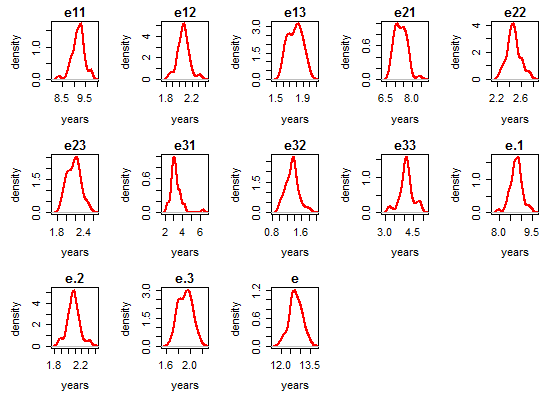
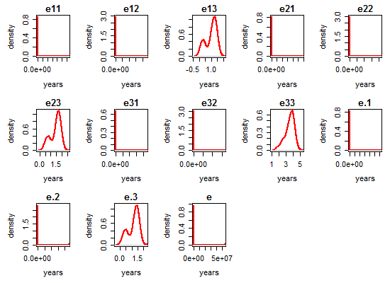
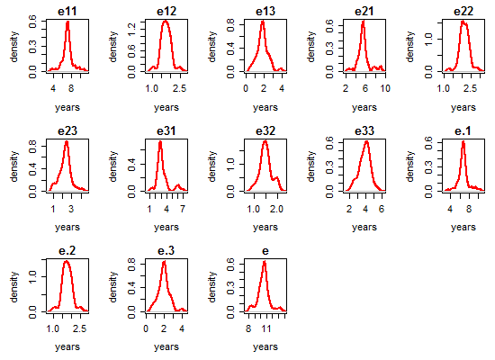

# Life Expectancies

<!-- These two chunks should be added in the beginning of every .Rmd that you want to source an .R script -->
<!--  The 1st mandatory chunck  -->
<!--  Set the working directory to the repository's base directory -->


<!--  The 2nd mandatory chunck  -->
<!-- Set the report-wide options, and point to the external code file. -->


# Load environmet
<!-- Load 'sourced' R files.  Suppress the output when loading packages. --> 

```r
# Attach these packages so their functions don't need to be qualified: http://r-pkgs.had.co.nz/namespace.html#search-path
library(magrittr) #Pipes
library(msm)
# Verify these packages are available on the machine, but their functions need to be qualified: http://r-pkgs.had.co.nz/namespace.html#search-path
requireNamespace("ggplot2", quietly=TRUE)
requireNamespace("dplyr", quietly=TRUE) #Avoid attaching dplyr, b/c its function names conflict with a lot of packages (esp base, stats, and plyr).
requireNamespace("testit", quietly=TRUE)
# requireNamespace("plyr", quietly=TRUE)
```


<!-- Load the sources.  Suppress the output when loading sources. --> 

```r
base::source("http://www.ucl.ac.uk/~ucakadl/ELECT/ELECT.r") # load  ELECT functions
base::source("./scripts/ELECT-utility-functions.R") # ELECT utility functions
```


<!-- Load any Global functions and variables declared in the R file.  Suppress the output. --> 

```r
path_input <- "./data/unshared/derived/dto.rds"
path_output <- "data/unshared/derived/dto.rds"

digits = 2
```

# Load data
<!-- Load the datasets.   -->

```r
# load the product of 0-ellis-island.R,  a list object 
# after it had been augmented by 1-encode-multistate.R script.
dto <- readRDS(path_input)
```

<!-- Inspect the datasets.   -->

```r
names(dto)
```

```
[1] "unitData" "metaData" "ms_mmse" 
```

```r
# 1st element - unit(person) level data
names(dto[["unitData"]])
```

```
  [1] "id"                    "study"                 "scaled_to.x"           "agreeableness"        
  [5] "conscientiousness"     "extraversion"          "neo_altruism"          "neo_conscientiousness"
  [9] "neo_trust"             "openness"              "anxiety_10items"       "neuroticism_12"       
 [13] "neuroticism_6"         "age_bl"                "age_death"             "died"                 
 [17] "educ"                  "msex"                  "race"                  "spanish"              
 [21] "apoe_genotype"         "alco_life"             "q3smo_bl"              "q4smo_bl"             
 [25] "smoke_bl"              "smoking"               "fu_year"               "scaled_to.y"          
 [29] "cesdsum"               "r_depres"              "intrusion"             "neglifeevents"        
 [33] "negsocexchange"        "nohelp"                "panas"                 "perceivedstress"      
 [37] "rejection"             "unsympathetic"         "dcfdx"                 "dementia"             
 [41] "r_stroke"              "cogn_ep"               "cogn_global"           "cogn_po"              
 [45] "cogn_ps"               "cogn_se"               "cogn_wo"               "cts_bname"            
 [49] "catfluency"            "cts_db"                "cts_delay"             "cts_df"               
 [53] "cts_doperf"            "cts_ebdr"              "cts_ebmt"              "cts_idea"             
 [57] "cts_lopair"            "mmse"                  "cts_nccrtd"            "cts_pmat"             
 [61] "cts_read_nart"         "cts_read_wrat"         "cts_sdmt"              "cts_story"            
 [65] "cts_wli"               "cts_wlii"              "cts_wliii"             "age_at_visit"         
 [69] "iadlsum"               "katzsum"               "rosbscl"               "rosbsum"              
 [73] "vision"                "visionlog"             "fev"                   "mep"                  
 [77] "mip"                   "pvc"                   "bun"                   "ca"                   
 [81] "chlstrl"               "cl"                    "co2"                   "crn"                  
 [85] "fasting"               "glucose"               "hba1c"                 "hdlchlstrl"           
 [89] "hdlratio"              "k"                     "ldlchlstrl"            "na"                   
 [93] "alcohol_g"             "bmi"                   "htm"                   "phys5itemsum"         
 [97] "wtkg"                  "bp11"                  "bp2"                   "bp3"                  
[101] "bp31"                  "hypertension_cum"      "dm_cum"                "thyroid_cum"          
[105] "chf_cum"               "claudication_cum"      "heart_cum"             "stroke_cum"           
[109] "vasc_3dis_sum"         "vasc_4dis_sum"         "vasc_risks_sum"        "gait_speed"           
[113] "gripavg"              
```

```r
# 2nd element - meta data, info about variables
names(dto[["metaData"]])
```

```
[1] "name"          "label"         "type"          "name_new"      "construct"     "self_reported" "longitudinal" 
[8] "unit"          "include"      
```

```r
# 3rd element - data for MMSE outcome
names(dto[["ms_mmse"]])
```

```
[1] "missing" "multi"  
```

```r
ds_miss <- dto$ms_mmse$missing # data after encoding missing states (-1, -2)
ds_ms <- dto$ms_mmse$multi # data after encoding multistates (1,2,3,4)
```

# Multistates

```r
# compare before and after ms encoding
view_id <- function(ds1,ds2,id){
  cat("Before ms encoding:","\n")
  print(ds1[ds1$id==id,])
  cat("\nAfter ms encoding","\n")
  print(ds2[ds2$id==id,])
}
# view a random person for sporadic inspections
ids <- sample(unique(ds_miss$id),1)
ids <- c(30597867) #, 50101073, 6804844, 83001827 , 56751351, 13485298, 56751351)
view_id(ds_miss, ds_ms, ids)
```

```
Before ms encoding: 
           id   age_bl  male edu age_at_visit mmse age_death presumed_alive
2110 30597867 75.91513 FALSE  11     75.91513   26  84.55852          FALSE
2111 30597867 75.91513 FALSE  11     76.91170   28  84.55852          FALSE
2112 30597867 75.91513 FALSE  11     77.91376   30  84.55852          FALSE

After ms encoding 
            id   age_bl  male edu      age state presumed_alive
2110  30597867 75.91513 FALSE  11 75.91513     2          FALSE
21111 30597867 75.91513 FALSE  11 76.91170     1          FALSE
2112  30597867 75.91513 FALSE  11 77.91376     1          FALSE
21101 30597867 75.91513 FALSE  11 84.55852     4          FALSE
```

<!-- Tweak the datasets.   -->

```r
# remove the observation with missing age
sum(is.na(ds_ms$age)) # count obs with missing age
```

```
[1] 1
```

```r
# ds_miss %>% 
ds_ms %>% 
  dplyr::group_by(id) %>% 
  dplyr::summarize(n_data_points = n()) %>% 
  dplyr::group_by(n_data_points) %>% 
  dplyr::summarize(n_people=n())
```

```
# A tibble: 17 x 2
   n_data_points n_people
           <int>    <int>
1              1      120
2              2      205
3              3      184
4              4      180
5              5      190
6              6      104
7              7      108
8              8      113
9              9      127
10            10      116
11            11      110
12            12       71
13            13       21
14            14       14
15            15       13
16            16       17
17            17        3
```

```r
remove_ids <- ds_ms %>% 
  dplyr::group_by(id) %>% 
  dplyr::summarize(n_data_points = n()) %>% 
  dplyr::arrange(n_data_points) %>% 
  dplyr::filter(n_data_points==1) %>% 
  dplyr::select(id)
remove_ids <- remove_ids$id
length(remove_ids) # number of ids to remove
```

```
[1] 120
```

```r
ds_clean <- ds_ms %>% 
  dplyr::filter(!(id %in% remove_ids))
```

# Analysis ready data

```r
ds <- ds_clean
ds %>% dplyr::summarise(unique_ids = n_distinct(id)) # subject count
```

```
  unique_ids
1       1576
```

```r
ds %>% dplyr::group_by(state) %>% dplyr::summarize(count = n()) # basic frequiencies
```

```
# A tibble: 6 x 2
  state count
  <dbl> <int>
1    -2    78
2    -1   142
3     1  6629
4     2  1584
5     3  1155
6     4   680
```

```r
cat("\nState table:"); print(msm::statetable.msm(state,id,data=ds)) # transition frequencies
```

```

State table:
```

```
    to
from   -2   -1    1    2    3    4
  -2   32    0    0    0    0    0
  -1    0   25   27   13   27   50
  1    32   59 4855  715  120  251
  2     8   20  534  478  257  146
  3     6   34   24   97  649  233
```

```r
# NOTE: -2 is a right censored value, indicating being alive but in an unknown living state.
```

# Age diagnostic

```r
head(ds)
```

```
     id   age_bl  male edu      age state presumed_alive
1  9121 79.96988 FALSE  12 79.96988     1           TRUE
2  9121 79.96988 FALSE  12 81.08145     1           TRUE
3  9121 79.96988 FALSE  12 81.61259     1           TRUE
4  9121 79.96988 FALSE  12 82.59548     1           TRUE
5  9121 79.96988 FALSE  12 83.62218     1           TRUE
6 33027 81.00753 FALSE  14 81.00753     1           TRUE
```

```r
length(unique(ds$id))
```

```
[1] 1576
```

```r
(N <- length(unique(ds$id)))
```

```
[1] 1576
```

```r
subjects <- as.numeric(unique(ds$id))
# Add first observation indicator
# this creates a new dummy variable "firstobs" with 1 for the first wave
cat("\nFirst observation indicator is added.\n")
```

```

First observation indicator is added.
```

```r
offset <- rep(NA,N)
for(i in 1:N){offset[i] <- min(which(ds$id==subjects[i]))}
firstobs <- rep(0,nrow(ds))
firstobs[offset] <- 1
ds <- cbind(ds,firstobs=firstobs)
head(ds)
```

```
     id   age_bl  male edu      age state presumed_alive firstobs
1  9121 79.96988 FALSE  12 79.96988     1           TRUE        1
2  9121 79.96988 FALSE  12 81.08145     1           TRUE        0
3  9121 79.96988 FALSE  12 81.61259     1           TRUE        0
4  9121 79.96988 FALSE  12 82.59548     1           TRUE        0
5  9121 79.96988 FALSE  12 83.62218     1           TRUE        0
6 33027 81.00753 FALSE  14 81.00753     1           TRUE        1
```

```r
# Time intervals in data:
# the age difference between timepoint for each individual
intervals <- matrix(NA,nrow(ds),2)
for(i in 2:nrow(ds)){
  if(ds$id[i]==ds$id[i-1]){
    intervals[i,1] <- ds$id[i]
    intervals[i,2] <- ds$age[i]-ds$age[i-1]
  }
  intervals <- as.data.frame(intervals)
  colnames(intervals) <- c("id", "interval")
}
head(intervals)
```

```
    id  interval
1   NA        NA
2 9121 1.1115674
3 9121 0.5311430
4 9121 0.9828884
5 9121 1.0266940
6   NA        NA
```

```r
# the age difference between timepoint for each individual
# Remove the N NAs:
intervals <- intervals[!is.na(intervals[,2]),]
cat("\nTime intervals between observations within individuals:\n")
```

```

Time intervals between observations within individuals:
```

```r
print(round(quantile(intervals[,2]),digits))
```

```
   0%   25%   50%   75%  100% 
 0.00  0.96  1.00  1.03 11.87 
```

```r
# Info on age and time between observations:
opar<-par(mfrow=c(1,3), mex=0.8,mar=c(5,5,3,1))
hist(ds$age[ds$firstobs==1],col="red",xlab="Age at baseline in years",main="")
hist(ds$age,col="blue",xlab="Age in data in years",main="")
hist(intervals[,2],col="green",xlab="Time intervals in data in years",main="")
```


```r
opar<-par(mfrow=c(1,1), mex=0.8,mar=c(5,5,2,1))
```

# Estimate multistate models

```r
# load utility functions
source("./scripts/ELECT-utility-functions.R")
# define function for getting a simple multistate output

ds <- ds_clean %>% 
  dplyr::mutate(
    male = as.numeric(male),
    age    = age - 75,
    age_bl = age_bl - 75
  )

q = .01
# qnames <- c("q12", "q13","q14","q21", "q23", "q24","q32", "q34")
qnames = c(
  "Healthy - Mild",  # q12
  "Health - Severe", # q13
  "Healthy - Dead",  # q14
  "Mild - Healthy",  # q21  
  "Mild - Severe",   # q23
  "Mild - Dead",     # q24
  "Severe - Mild",   # q32
  "Severe - Dead"    # q34
  )
(Q <- rbind(c(0,q,q,q), c(q,0,q,q),c(0,q,0,q), c(0,0,0,0))) # verify structure
```

```
     [,1] [,2] [,3] [,4]
[1,] 0.00 0.01 0.01 0.01
[2,] 0.01 0.00 0.01 0.01
[3,] 0.00 0.01 0.00 0.01
[4,] 0.00 0.00 0.00 0.00
```

```r
# turn off estimation lines after the first run 

# models <- list()
# models[["age"]][["msm"]]    <- estimate_multistate(ds, Q, qnames,cov_names = "age")
# models[["age_bl"]][["msm"]] <- estimate_multistate(ds, Q, qnames,cov_names = "age + age_bl")
# models[["male"]][["msm"]]   <- estimate_multistate(ds, Q, qnames,cov_names = "age + age_bl + male")
# models[["edu"]][["msm"]]    <- estimate_multistate(ds, Q, qnames,cov_names = "age + age_bl + male + edu")

# save models estimated by msm() in a external object for faster access in the future

# saveRDS(models, "./data/shared/derived/models.rds")
models <- readRDS("./data/shared/derived/models.rds")
lapply(models, names)
```

```
$age
[1] "msm"

$age_bl
[1] "msm"

$male
[1] "msm"

$edu
[1] "msm"
```

# Estimate Life Expectancies

```r
alive_states <- c(1,2,3)
ds_alive <- ds[ds$state %in% alive_states,]

age_min <- 0
age_max <- 50
age_bl <- 0
male <- 0
edu <- 9

replication_n <- 50
time_scale <- "years"
grid_par <- .5

# turn off estimation lines after the first run 

# for(model_ in names(models)){
#   # determine covariate list
#   if(model_=="age"){covar_list= list(age=age_min)}  
#   if(model_=="age_bl"){covar_list = list(age=age_min, age_bl=age_bl)}  
#   if(model_=="male"){covar_list = list(age=age_min, age_bl=age_bl, male=male)}  
#   if(model_=="edu"){covar_list = list(age=age_min, age_bl=age_bl, male=male, edu=edu)}  
#   # compute LE
#   models[[model_]][["LE"]] <- elect(
#     model=models[[model_]][["msm"]], # fitted msm model
#     b.covariates=covar_list, # list with specified covarites values
#     statedistdata=ds_alive, # data for distribution of living states
#     time.scale.msm=time_scale, # time scale in multi-state model ("years", ...)
#     h=grid_par, # grid parameter for integration
#     age.max=age_max, # assumed maximum age in years
#     S=replication_n # number of simulation cycles
#   )
# }
  
# save models estimated by elect() in a external object for faster access in the future 
# saveRDS(models, "./data/shared/derived/models_LE.rds")
models <- readRDS("./data/shared/derived/models_LE.rds")
lapply(models, names)
```

```
$age
[1] "msm" "LE" 

$age_bl
[1] "msm" "LE" 

$male
[1] "msm" "LE" 

$edu
[1] "msm" "LE" 
```

# Model results

## age
### msm summary

```r
model <- models[["age"]]
examine_multistate(model$msm)
```

```
---------------------------------------
Model ---  with covariates: ~age
and constraints:
NULL
and fixedpars:
named integer(0)
Convergence code = 0 

-2loglik = 13017.83 
AIC = 13049.83 

Parameter estimats and SEs:
---------------------------------------
```

```
                 q      p    se Wald.ChiSq Pr.ChiSq
1   Healthy - Mild -2.092 0.076    757.698    0.000
2  Health - Severe -6.167 0.761     65.672    0.000
3   Healthy - Dead -4.141 0.177    547.348    0.000
4   Mild - Healthy -0.153 0.085      3.240    0.072
5    Mild - Severe -1.528 0.133    131.991    0.000
6      Mild - Dead -3.165 0.404     61.374    0.000
7    Severe - Mild -1.718 0.188     83.508    0.000
8    Severe - Dead -2.163 0.178    147.663    0.000
9   Healthy - Mild  0.078 0.006    169.000    0.000
10 Health - Severe -0.095 0.068      1.952    0.162
11  Healthy - Dead  0.083 0.015     30.618    0.000
12  Mild - Healthy -0.021 0.008      6.891    0.009
13   Mild - Severe  0.046 0.010     21.160    0.000
14     Mild - Dead  0.064 0.027      5.619    0.018
15   Severe - Mild -0.010 0.014      0.510    0.475
16   Severe - Dead  0.064 0.011     33.851    0.000
```

### solution

```r
print(model$msm, showEnv= F)
```

```

Call:
msm(formula = state ~ age, subject = id, data = ds, qmatrix = Q,     covariates = covariates, constraint = constraint, death = TRUE,     censor = c(-1, -2), censor.states = list(c(1, 2, 3), c(1,         2, 3)), fixedpars = fixedpars, center = FALSE, method = method,     control = list(trace = 0, REPORT = 1, maxit = 1000, fnscale = 10000))

Maximum likelihood estimates
Baselines are with covariates set to 0

Transition intensities with hazard ratios for each covariate
                  Baseline                        age                   
State 1 - State 1 -0.141473 (-0.161140,-0.124207)                       
State 1 - State 2  0.123474 ( 0.106340, 0.143368) 1.0814 (1.0678,1.0953)
State 1 - State 3  0.002097 ( 0.000472, 0.009317) 0.9098 (0.7963,1.0394)
State 1 - State 4  0.015903 ( 0.011235, 0.022511) 1.0866 (1.0550,1.1191)
State 2 - State 1  0.858135 ( 0.726751, 1.013270) 0.9796 (0.9651,0.9943)
State 2 - State 2 -1.117308 (-1.283594,-0.972564)                       
State 2 - State 3  0.216966 ( 0.167296, 0.281382) 1.0472 (1.0272,1.0675)
State 2 - State 4  0.042207 ( 0.019130, 0.093123) 1.0656 (1.0099,1.1243)
State 3 - State 2  0.179459 ( 0.124220, 0.259262) 0.9905 (0.9629,1.0190)
State 3 - State 3 -0.294429 (-0.380924,-0.227573)                       
State 3 - State 4  0.114970 ( 0.081176, 0.162831) 1.0663 (1.0434,1.0898)

-2 * log-likelihood:  13017.83 
[Note, to obtain old print format, use "printold.msm"]
```

### ELECT summary 

```r
summary.elect(
  model$LE, # life expectancy estimated by elect()
  probs = c(.025, .5, .975), # numeric vector of probabilities for quantiles
  digits=2, # number of decimals places in output
  print = TRUE # print toggle
)
```

```

-----------------------------
ELECT summary
-----------------------------
Covariates values in the multi-state model:
age 
  0 
Covariates in the state-distribution model:
   age 

Life expectancies:Using simulation with  50 replications

Point estimates, and mean, SEs, and quantiles from simulation:
      pnt    mn   se 0.025q  0.5q 0.975q
e11  9.24  9.23 0.21   8.89  9.23   9.65
e12  2.16  2.15 0.09   1.99  2.15   2.30
e13  1.80  1.81 0.13   1.60  1.79   2.05
e21  7.40  7.42 0.31   6.99  7.38   7.99
e22  2.56  2.54 0.10   2.36  2.53   2.72
e23  2.20  2.19 0.17   1.96  2.18   2.48
e31  3.31  3.24 0.39   2.56  3.24   3.86
e32  1.44  1.41 0.17   1.12  1.41   1.71
e33  4.11  4.10 0.34   3.42  4.08   4.67
e.1  8.81  8.80 0.21   8.46  8.79   9.21
e.2  2.17  2.16 0.09   2.00  2.14   2.31
e.3  1.94  1.95 0.14   1.71  1.93   2.20
e   12.91 12.91 0.28  12.39 12.90  13.34
-----------------------------
```

### plots

```r
plot.elect(
  model$LE, # life expectancy estimated by elect()
  kernel = "gaussian", #character string for smoothing kernal ("gaussian",...)
  col = "red", # color of the curve
  lwd = 2, # line width of the curve
  cex.lab = 1 # magnification to be used for axis-labels
)
```




## age_bl
### msm summary

```r
model <- models[["age_bl"]]
examine_multistate(model$msm)
```

```
---------------------------------------
Model ---  with covariates: ~age + age_bl
and constraints:
NULL
and fixedpars:
named integer(0)
Convergence code = 0 

-2loglik = 12956.72 
AIC = 13004.72 

Parameter estimats and SEs:
---------------------------------------
```

```
                 q      p    se Wald.ChiSq Pr.ChiSq
1   Healthy - Mild -2.006 0.082    598.459    0.000
2  Health - Severe -5.223 0.754     47.984    0.000
3   Healthy - Dead -4.278 0.206    431.268    0.000
4   Mild - Healthy -0.068 0.089      0.584    0.445
5    Mild - Severe -1.521 0.138    121.479    0.000
6      Mild - Dead -3.131 0.383     66.830    0.000
7    Severe - Mild -1.352 0.202     44.797    0.000
8    Severe - Dead -2.289 0.185    153.090    0.000
9   Healthy - Mild  0.036 0.014      6.612    0.010
10 Health - Severe -0.700 0.493      2.016    0.156
11  Healthy - Dead  0.122 0.033     13.668    0.000
12  Mild - Healthy -0.073 0.018     16.448    0.000
13   Mild - Severe  0.035 0.019      3.393    0.065
14     Mild - Dead  0.106 0.051      4.320    0.038
15   Severe - Mild -0.164 0.036     20.753    0.000
16   Severe - Dead  0.101 0.020     25.502    0.000
17  Healthy - Mild  0.051 0.014     13.270    0.000
18 Health - Severe  0.626 0.496      1.593    0.207
19  Healthy - Dead -0.043 0.034      1.599    0.206
20  Mild - Healthy  0.065 0.019     11.704    0.001
21   Mild - Severe  0.015 0.020      0.562    0.453
22     Mild - Dead -0.062 0.055      1.271    0.260
23   Severe - Mild  0.181 0.038     22.688    0.000
24   Severe - Dead -0.044 0.021      4.390    0.036
```

### solution

```r
print(model$msm, showEnv= F)
```

```

Call:
msm(formula = state ~ age, subject = id, data = ds, qmatrix = Q,     covariates = covariates, constraint = constraint, death = TRUE,     censor = c(-1, -2), censor.states = list(c(1, 2, 3), c(1,         2, 3)), fixedpars = fixedpars, center = FALSE, method = method,     control = list(trace = 0, REPORT = 1, maxit = 1000, fnscale = 10000))

Maximum likelihood estimates
Baselines are with covariates set to 0

Transition intensities with hazard ratios for each covariate
                  Baseline                       age                    age_bl                
State 1 - State 1 -0.153730 (-0.176839,-0.13364)                                              
State 1 - State 2  0.134469 ( 0.114569, 0.15783) 1.0370 (1.0093,1.0654) 1.0524 (1.0234,1.0822)
State 1 - State 3  0.005392 ( 0.001230, 0.02363) 0.4963 (0.1888,1.3048) 1.8698 (0.7070,4.9451)
State 1 - State 4  0.013870 ( 0.009268, 0.02076) 1.1294 (1.0584,1.2052) 0.9584 (0.8958,1.0254)
State 2 - State 1  0.934571 ( 0.784735, 1.11302) 0.9294 (0.8980,0.9619) 1.0669 (1.0280,1.1072)
State 2 - State 2 -1.196772 (-1.386339,-1.03313)                                              
State 2 - State 3  0.218519 ( 0.166765, 0.28634) 1.0359 (0.9974,1.0759) 1.0149 (0.9760,1.0553)
State 2 - State 4  0.043681 ( 0.020608, 0.09259) 1.1120 (1.0060,1.2292) 0.9403 (0.8440,1.0475)
State 3 - State 2  0.258689 ( 0.174012, 0.38457) 0.8490 (0.7906,0.9118) 1.1984 (1.1127,1.2906)
State 3 - State 3 -0.360066 (-0.485411,-0.26709)                                              
State 3 - State 4  0.101377 ( 0.070576, 0.14562) 1.1063 (1.0634,1.1508) 0.9568 (0.9180,0.9972)

-2 * log-likelihood:  12956.72 
[Note, to obtain old print format, use "printold.msm"]
```

### ELECT summary 

```r
summary.elect(
  model$LE, # life expectancy estimated by elect()
  probs = c(.025, .5, .975), # numeric vector of probabilities for quantiles
  digits=2, # number of decimals places in output
  print = TRUE # print toggle
)
```

```

-----------------------------
ELECT summary
-----------------------------
Covariates values in the multi-state model:
   age age_bl 
     0      0 
Covariates in the state-distribution model:
   age 

Life expectancies:Using simulation with  50 replications

Point estimates, and mean, SEs, and quantiles from simulation:
      pnt    mn   se 0.025q  0.5q 0.975q
e11  8.80  8.73 0.43   8.12  8.73   9.60
e12  1.70  1.65 0.14   1.40  1.66   1.88
e13  1.33  1.34 0.20   1.06  1.29   1.70
e21  7.06  6.98 0.50   6.08  7.07   7.72
e22  2.11  2.06 0.13   1.79  2.07   2.28
e23  1.75  1.76 0.21   1.43  1.72   2.19
e31  3.15  3.16 0.49   1.98  3.17   3.86
e32  1.20  1.19 0.15   0.94  1.19   1.45
e33  3.81  3.83 0.33   3.29  3.82   4.55
e.1  8.39  8.32 0.43   7.67  8.35   9.15
e.2  1.72  1.67 0.13   1.42  1.68   1.88
e.3  1.47  1.48 0.20   1.20  1.44   1.84
e   11.59 11.48 0.47  10.39 11.48  12.47
-----------------------------
```

### plots

```r
plot.elect(
  model$LE, # life expectancy estimated by elect()
  kernel = "gaussian", #character string for smoothing kernal ("gaussian",...)
  col = "red", # color of the curve
  lwd = 2, # line width of the curve
  cex.lab = 1 # magnification to be used for axis-labels
)
```




## male
### msm summary

```r
model <- models[["male"]]
examine_multistate(model$msm)
```

```
---------------------------------------
Model ---  with covariates: ~age + age_bl + male
and constraints:
NULL
and fixedpars:
named integer(0)
Convergence code = 0 

-2loglik = 12891.03 
AIC = 12955.03 

Parameter estimats and SEs:
---------------------------------------
```

```
                 q      p    se Wald.ChiSq Pr.ChiSq
1   Healthy - Mild -2.110 0.086    601.961    0.000
2  Health - Severe -5.206 0.780     44.547    0.000
3   Healthy - Dead -4.367 0.208    440.798    0.000
4   Mild - Healthy -0.092 0.095      0.938    0.333
5    Mild - Severe -1.379 0.144     91.707    0.000
6      Mild - Dead -3.454 0.464     55.413    0.000
7    Severe - Mild -1.069 0.211     25.668    0.000
8    Severe - Dead -2.503 0.206    147.634    0.000
9   Healthy - Mild  0.038 0.014      7.367    0.007
10 Health - Severe -0.716 0.486      2.170    0.141
11  Healthy - Dead  0.124 0.032     15.016    0.000
12  Mild - Healthy -0.071 0.018     15.559    0.000
13   Mild - Severe  0.037 0.020      3.422    0.064
14     Mild - Dead  0.090 0.055      2.678    0.102
15   Severe - Mild -0.191 0.037     26.648    0.000
16   Severe - Dead  0.118 0.020     34.810    0.000
17  Healthy - Mild  0.050 0.014     12.755    0.000
18 Health - Severe  0.640 0.490      1.706    0.192
19  Healthy - Dead -0.049 0.034      2.077    0.150
20  Mild - Healthy  0.062 0.019     10.648    0.001
21   Mild - Severe  0.011 0.020      0.302    0.582
22     Mild - Dead -0.029 0.060      0.234    0.629
23   Severe - Mild  0.208 0.039     28.444    0.000
24   Severe - Dead -0.061 0.021      8.438    0.004
25  Healthy - Mild  0.347 0.093     13.922    0.000
26 Health - Severe  0.105 1.769      0.004    0.953
27  Healthy - Dead  0.453 0.230      3.879    0.049
28  Mild - Healthy  0.081 0.108      0.562    0.453
29   Mild - Severe -0.413 0.134      9.499    0.002
30     Mild - Dead  0.637 0.335      3.616    0.057
31   Severe - Mild -0.671 0.231      8.438    0.004
32   Severe - Dead  0.460 0.137     11.274    0.001
```

### solution

```r
print(model$msm, showEnv= F)
```

```

Call:
msm(formula = state ~ age, subject = id, data = ds, qmatrix = Q,     covariates = covariates, constraint = constraint, death = TRUE,     censor = c(-1, -2), censor.states = list(c(1, 2, 3), c(1,         2, 3)), fixedpars = fixedpars, center = FALSE, method = method,     control = list(trace = 0, REPORT = 1, maxit = 1000, fnscale = 10000))

Maximum likelihood estimates
Baselines are with covariates set to 0

Transition intensities with hazard ratios for each covariate
                  Baseline                       age                    age_bl                 maleTRUE                
State 1 - State 1 -0.139376 (-0.161866,-0.12001)                                                                       
State 1 - State 2  0.121201 ( 0.102447, 0.14339) 1.0384 (1.0106,1.0670) 1.0518 (1.0227,1.0817) 1.4146 (1.17775, 1.6991)
State 1 - State 3  0.005486 ( 0.001190, 0.02530) 0.4886 (0.1885,1.2667) 1.8971 (0.7259,4.9580) 1.1107 (0.03466,35.5883)
State 1 - State 4  0.012690 ( 0.008441, 0.01908) 1.1319 (1.0622,1.2063) 0.9517 (0.8900,1.0177) 1.5730 (1.00178, 2.4699)
State 2 - State 1  0.911788 ( 0.756877, 1.09840) 0.9314 (0.8997,0.9641) 1.0643 (1.0254,1.1046) 1.0841 (0.87707, 1.3399)
State 2 - State 2 -1.195313 (-1.396675,-1.02298)                                                                       
State 2 - State 3  0.251918 ( 0.190093, 0.33385) 1.0373 (0.9982,1.0779) 1.0107 (0.9715,1.0515) 0.6620 (0.50880, 0.8612)
State 2 - State 4  0.031607 ( 0.012730, 0.07847) 1.0939 (0.9821,1.2184) 0.9716 (0.8634,1.0934) 1.8906 (0.98037, 3.6461)
State 3 - State 2  0.343318 ( 0.227045, 0.51914) 0.8261 (0.7677,0.8889) 1.2307 (1.1396,1.3290) 0.5112 (0.32512, 0.8036)
State 3 - State 3 -0.425150 (-0.597231,-0.30265)                                                                       
State 3 - State 4  0.081832 ( 0.054675, 0.12248) 1.1247 (1.0806,1.1707) 0.9410 (0.9031,0.9803) 1.5848 (1.21046, 2.0748)

-2 * log-likelihood:  12891.03 
[Note, to obtain old print format, use "printold.msm"]
```

### ELECT summary 

```r
summary.elect(
  model$LE, # life expectancy estimated by elect()
  probs = c(.025, .5, .975), # numeric vector of probabilities for quantiles
  digits=2, # number of decimals places in output
  print = TRUE # print toggle
)
```

```

-----------------------------
ELECT summary
-----------------------------
Covariates values in the multi-state model:
   age age_bl   male 
     0      0      0 
Covariates in the state-distribution model:
   age 

Life expectancies:Using simulation with  50 replications

Point estimates, and mean, SEs, and quantiles from simulation:
      pnt    mn   se 0.025q  0.5q 0.975q
e11  9.26  9.12 0.31   8.58  9.19   9.70
e12  1.68  1.67 0.17   1.37  1.65   1.92
e13  1.50  1.45 0.19   1.17  1.45   1.82
e21  7.46  7.30 0.30   6.82  7.27   7.90
e22  2.14  2.12 0.17   1.81  2.11   2.37
e23  2.01  1.95 0.24   1.56  1.94   2.40
e31  3.97  3.87 0.47   3.10  3.87   4.62
e32  1.43  1.41 0.18   1.11  1.42   1.73
e33  3.89  3.83 0.38   3.31  3.82   4.75
e.1  8.86  8.72 0.29   8.24  8.77   9.25
e.2  1.72  1.70 0.17   1.40  1.68   1.94
e.3  1.65  1.60 0.19   1.32  1.62   1.96
e   12.24 12.02 0.42  11.38 12.02  12.70
-----------------------------
```

### plots

```r
plot.elect(
  model$LE, # life expectancy estimated by elect()
  kernel = "gaussian", #character string for smoothing kernal ("gaussian",...)
  col = "red", # color of the curve
  lwd = 2, # line width of the curve
  cex.lab = 1 # magnification to be used for axis-labels
)
```


## edu
### msm summary

```r
model <- models[["edu"]]
examine_multistate(model$msm)
```

```
---------------------------------------
Model ---  with covariates: ~age + age_bl + male + edu
and constraints:
NULL
and fixedpars:
named integer(0)
Convergence code = 0 

-2loglik = 12831.64 
AIC = 12911.64 

Parameter estimats and SEs:
---------------------------------------
```

```
                 q      p     se Wald.ChiSq Pr.ChiSq
1   Healthy - Mild -1.202  0.250     23.117    0.000
2  Health - Severe -3.950 10.931      0.131    0.718
3   Healthy - Dead -3.474  0.525     43.787    0.000
4   Mild - Healthy -0.268  0.244      1.206    0.272
5    Mild - Severe -0.708  0.420      2.842    0.092
6      Mild - Dead -3.687  0.893     17.047    0.000
7    Severe - Mild -0.358  0.394      0.826    0.364
8    Severe - Dead -2.456  0.341     51.874    0.000
9   Healthy - Mild  0.035  0.016      4.785    0.029
10 Health - Severe -0.586  0.571      1.053    0.305
11  Healthy - Dead  0.126  0.033     14.579    0.000
12  Mild - Healthy -0.077  0.018     18.299    0.000
13   Mild - Severe  0.042  0.024      3.062    0.080
14     Mild - Dead  0.094  0.056      2.818    0.093
15   Severe - Mild -0.176  0.038     21.452    0.000
16   Severe - Dead  0.120  0.021     32.653    0.000
17  Healthy - Mild  0.050  0.015     11.111    0.001
18 Health - Severe  0.502  0.677      0.550    0.458
19  Healthy - Dead -0.051  0.035      2.123    0.145
20  Mild - Healthy  0.064  0.019     11.346    0.001
21   Mild - Severe  0.008  0.021      0.145    0.703
22     Mild - Dead -0.035  0.061      0.329    0.566
23   Severe - Mild  0.198  0.039     25.775    0.000
24   Severe - Dead -0.062  0.021      8.717    0.003
25  Healthy - Mild  0.417  0.097     18.481    0.000
26 Health - Severe  0.353  2.211      0.025    0.873
27  Healthy - Dead  0.559  0.232      5.806    0.016
28  Mild - Healthy  0.063  0.112      0.316    0.574
29   Mild - Severe -0.334  0.137      5.944    0.015
30     Mild - Dead  0.617  0.357      2.987    0.084
31   Severe - Mild -0.558  0.233      5.735    0.017
32   Severe - Dead  0.476  0.142     11.237    0.001
33  Healthy - Mild -0.060  0.015     16.000    0.000
34 Health - Severe -0.122  0.568      0.046    0.830
35  Healthy - Dead -0.063  0.033      3.645    0.056
36  Mild - Healthy  0.017  0.018      0.892    0.345
37   Mild - Severe -0.052  0.023      5.112    0.024
38     Mild - Dead  0.015  0.057      0.069    0.792
39   Severe - Mild -0.062  0.029      4.571    0.033
40   Severe - Dead -0.006  0.021      0.082    0.775
```

### solution

```r
print(model$msm, showEnv= F)
```

```

Call:
msm(formula = state ~ age, subject = id, data = ds, qmatrix = Q,     covariates = covariates, constraint = constraint, death = TRUE,     censor = c(-1, -2), censor.states = list(c(1, 2, 3), c(1,         2, 3)), fixedpars = fixedpars, center = FALSE, method = method,     control = list(trace = 0, REPORT = 1, maxit = 1000, fnscale = 10000))

Maximum likelihood estimates
Baselines are with covariates set to 0

Transition intensities with hazard ratios for each covariate
                  Baseline                         age                    age_bl               
State 1 - State 1 -0.35082 (-9.791e-01,-1.257e-01)                                             
State 1 - State 2  0.30059 ( 1.840e-01, 4.910e-01) 1.0356 (1.0044,1.0677) 1.0514 (1.0212,1.082)
State 1 - State 3  0.01925 ( 9.546e-12, 3.880e+07) 0.5567 (0.1819,1.7039) 1.6523 (0.4385,6.226)
State 1 - State 4  0.03098 ( 1.106e-02, 8.677e-02) 1.1340 (1.0630,1.2096) 0.9504 (0.8879,1.017)
State 2 - State 1  0.76511 ( 4.746e-01, 1.233e+00) 0.9261 (0.8938,0.9595) 1.0664 (1.0272,1.107)
State 2 - State 2 -1.28257 (-1.935e+00,-8.500e-01)                                             
State 2 - State 3  0.49240 ( 2.160e-01, 1.122e+00) 1.0427 (0.9957,1.0919) 1.0082 (0.9677,1.050)
State 2 - State 4  0.02505 ( 4.349e-03, 1.443e-01) 1.0985 (0.9847,1.2255) 0.9658 (0.8563,1.089)
State 3 - State 2  0.69935 ( 3.233e-01, 1.513e+00) 0.8390 (0.7789,0.9037) 1.2189 (1.1284,1.317)
State 3 - State 3 -0.78510 (-1.567e+00,-3.934e-01)                                             
State 3 - State 4  0.08575 ( 4.393e-02, 1.674e-01) 1.1278 (1.0830,1.1744) 0.9395 (0.9017,0.979)
                  maleTRUE                 edu                   
State 1 - State 1                                                
State 1 - State 2 1.5180 (1.2563,  1.8341) 0.9415 (0.9143,0.9694)
State 1 - State 3 1.4236 (0.0187,108.3965) 0.8855 (0.2909,2.6952)
State 1 - State 4 1.7496 (1.1094,  2.7594) 0.9387 (0.8791,1.0023)
State 2 - State 1 1.0648 (0.8543,  1.3271) 1.0170 (0.9812,1.0542)
State 2 - State 2                                                
State 2 - State 3 0.7163 (0.5482,  0.9361) 0.9491 (0.9071,0.9930)
State 2 - State 4 1.8529 (0.9204,  3.7301) 1.0156 (0.9085,1.1352)
State 3 - State 2 0.5722 (0.3626,  0.9029) 0.9397 (0.8884,0.9940)
State 3 - State 3                                                
State 3 - State 4 1.6101 (1.2199,  2.1252) 0.9942 (0.9538,1.0364)

-2 * log-likelihood:  12831.64 
[Note, to obtain old print format, use "printold.msm"]
```

### ELECT summary 

```r
summary.elect(
  model$LE, # life expectancy estimated by elect()
  probs = c(.025, .5, .975), # numeric vector of probabilities for quantiles
  digits=2, # number of decimals places in output
  print = TRUE # print toggle
)
```

```

-----------------------------
ELECT summary
-----------------------------
Covariates values in the multi-state model:
   age age_bl   male    edu 
     0      0      0      9 
Covariates in the state-distribution model:
   age 

Life expectancies:Using simulation with  50 replications

Point estimates, and mean, SEs, and quantiles from simulation:
      pnt   mn   se 0.025q  0.5q 0.975q
e11  7.21 5.67 2.17   0.43  6.65   7.74
e12  1.73 1.61 0.18   1.18  1.62   1.95
e13  1.89 2.72 1.33   1.45  2.09   5.55
e21  5.69 4.68 1.47   0.45  5.22   6.06
e22  2.16 2.05 0.21   1.68  2.03   2.45
e23  2.39 2.92 0.96   1.84  2.60   5.21
e31  3.26 2.85 0.79   0.43  3.03   3.85
e32  1.54 1.49 0.20   1.15  1.46   1.85
e33  3.90 4.15 0.71   2.98  4.04   5.55
e.1  6.90 5.45 2.03   0.43  6.36   7.39
e.2  1.77 1.65 0.18   1.24  1.65   1.98
e.3  2.02 2.80 1.26   1.57  2.22   5.52
e   10.69 9.90 1.00   7.30 10.08  11.17
-----------------------------
```

### plots

```r
plot.elect(
  model$LE, # life expectancy estimated by elect()
  kernel = "gaussian", #character string for smoothing kernal ("gaussian",...)
  col = "red", # color of the curve
  lwd = 2, # line width of the curve
  cex.lab = 1 # magnification to be used for axis-labels
)
```



# Session Info

```r
sessionInfo()
```

```
R version 3.3.1 (2016-06-21)
Platform: x86_64-w64-mingw32/x64 (64-bit)
Running under: Windows 10 x64 (build 10586)

locale:
[1] LC_COLLATE=English_United States.1252  LC_CTYPE=English_United States.1252    LC_MONETARY=English_United States.1252
[4] LC_NUMERIC=C                           LC_TIME=English_United States.1252    

attached base packages:
[1] stats     graphics  grDevices utils     datasets  methods   base     

other attached packages:
[1] nnet_7.3-12  msm_1.6.1    magrittr_1.5 knitr_1.13  

loaded via a namespace (and not attached):
 [1] Rcpp_0.12.6        splines_3.3.1      testit_0.5         munsell_0.4.3      colorspace_1.2-6   lattice_0.20-33   
 [7] R6_2.1.2           stringr_1.0.0      plyr_1.8.4         dplyr_0.5.0        tools_3.3.1        grid_3.3.1        
[13] gtable_0.2.0       DBI_0.4-1          htmltools_0.3.5    lazyeval_0.2.0     survival_2.39-4    yaml_2.1.13       
[19] digest_0.6.10      assertthat_0.1     tibble_1.1         Matrix_1.2-6       ggplot2_2.1.0      formatR_1.4       
[25] evaluate_0.9       rmarkdown_0.9.6.14 stringi_1.1.1      scales_0.4.0       expm_0.999-0       mvtnorm_1.0-5     
```


